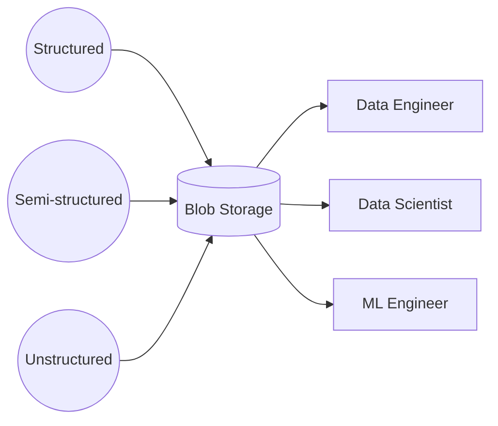

> "Good things aren't supposed to just fall into your lap."
> <cite>— Audrey Hepburn</cite>

---

A **data lake** is a flexible storage pattern used for storing massive amounts of **raw data in its native format** — structured (tabular), semi-structured (JSON, XML), and unstructured (videos, images, audio). Data lakes use cheap, abundant **blob storage** with a compute engine of the user's choice (source: Concepts/Data Architecture/Data Lake.md).

The lake's defining trait: **cheap storage decoupled from compute**. The same files in S3/GCS/ADLS can be read by Spark, Presto, BigQuery, Athena, or Databricks at different times for different purposes.

## Architecture

(source: Concepts/Data Architecture/Data Lake.md)

## Advantages

- **Cheap** — pay only for storage, often <$0.025/GB/month.
- **Flexible** — any data type, no upfront schema.
- **Future-proof** — schema-on-read; transform later.
- **Compute-engine choice** — mix and match Spark, Presto, BigQuery, Trino.
- **Single source** — all stakeholders work from one repo.

## Disadvantages

- **Governance is hard** — without strong metadata + cataloging the lake becomes a "data swamp".
- **Easy to over-store** — storage is so cheap that teams keep things they shouldn't.
- **No ACID** by default — concurrent writers conflict; partial files appear; this is what **lakehouse** formats (Delta/Iceberg/Hudi) fix.

## Cloud reference architectures

- **AWS**: S3 + Glue + Athena + EMR — [Serverless Data Lake](https://docs.aws.amazon.com/prescriptive-guidance/latest/patterns/deploy-and-manage-a-serverless-data-lake-on-the-aws-cloud-by-using-infrastructure-as-code.html)
- **Azure**: ADLS Gen2 + Synapse
- **GCP**: [[Cloud Storage|Cloud Storage]] + [[../../cloud/gcp/analytics/dataflow|Dataflow]] + [[../../cloud/gcp/analytics/bigquery|BigQuery]] (BigLake for federation)

## Lake vs Warehouse vs Lakehouse

| | Lake | Warehouse | Lakehouse |
| --- | --- | --- | --- |
| Storage | Object store | Proprietary columnar | Object store + metadata layer |
| Schema | On-read | On-write | On-write (with evolution) |
| ACID | No | Yes | **Yes** (via Delta/Iceberg/Hudi) |
| Cost | Lowest | Highest | Low–Medium |
| Compute | External (Spark/Presto) | Built-in | Either |

## Interview Questions

1. What's the difference between a data lake and a data swamp?
2. Why combine cheap object storage with separate compute?
3. **Lake → Lakehouse** evolution — what changed?

## Related pages

> [!multi-column]
>
>> [!card] Sister architectures
>> [[data-warehouse|Data Warehouse]], [[medallion-architecture|Medallion Architecture]], [[data-mesh|Data Mesh]]
>
>
>> [!card] Storage layer
>> [[../data-storage/data-storage|Data Storage]], [[../../tools/object-storage|Object Storage]], [[../../tools/file-formats|File Formats]]
>
>
>> [!card] Products
>> [[Cloud Storage|Cloud Storage]], [[../../cloud/databricks/databricks|Databricks]]
>
>
>> [!card] People
>> [[../../../people/doug-cutting|Doug Cutting]], [[../../../people/matei-zaharia|Matei Zaharia]]

