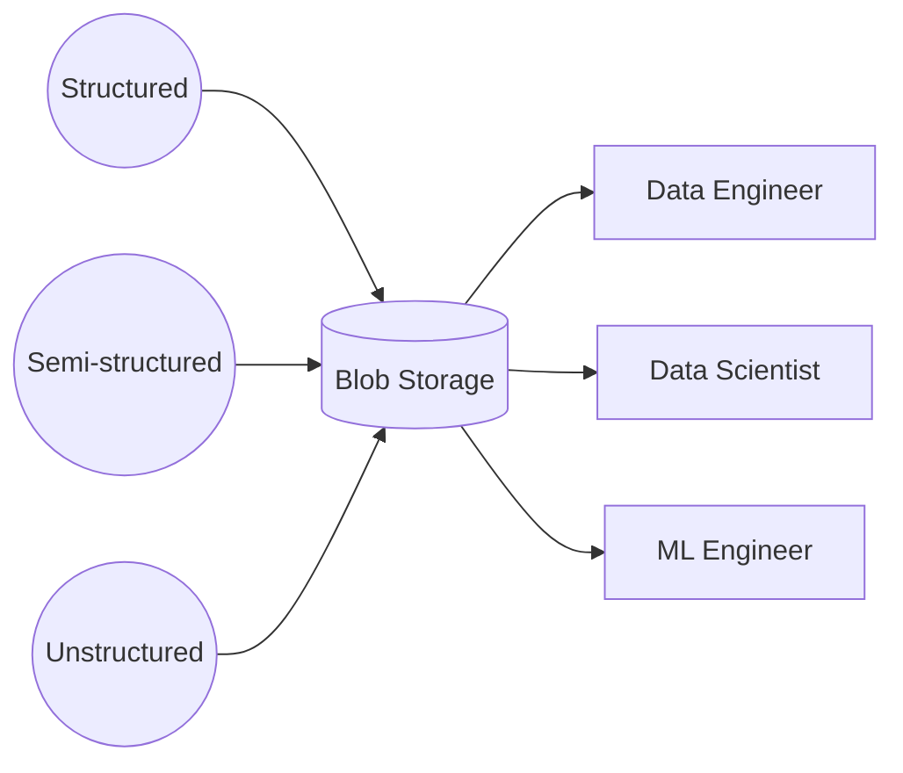

> "Good things aren't supposed to just fall into your lap."
> <cite>— Audrey Hepburn</cite>

---

Data Architecture · Storage Pattern

# Data Lake

A data lake is a flexible storage pattern for massive amounts of raw data in its native format — structured, semi-structured, and unstructured. The lake's defining trait is cheap storage decoupled from compute, with schema imposed on read.

$0.025 per GB/month &nbsp;·&nbsp; Any data type supported &nbsp;·&nbsp; store everything first, impose schema on read — maximum flexibility

> [!tip] When to Use a Lake
> Choose a data lake when you need to store diverse data types cheaply, support multiple compute engines, and preserve raw data for future use cases. Ideal for data science, ML, and exploratory analytics where schemas evolve.

Architecture

## Architecture

(source: Concepts/Data Architecture/Data Lake.md)

Trade-offs

## Advantages

> [!grid|cols2]
>
> > [!card|section] Cost
> > **Cheap** — pay only for storage, often <$0.025/GB/month.
>
> > [!card|section] Flexibility
> > **Any data type**, no upfront schema required.
>
> > [!card|section] Future-proof
> > **Schema-on-read** — transform later when use cases emerge.
>
> > [!card|section] Compute choice
> > **Mix and match** — Spark, Presto, BigQuery, Trino all read the same files.
>
> > [!card|section] Single source
> > All stakeholders work from one unified repository.

## Disadvantages

> [!grid|cols2]
>
> > [!card|section] Governance Challenge
> > Without strong metadata + cataloging, the lake becomes a "data swamp."
>
> > [!card|section] Over-storage
> > Storage is so cheap that teams keep data they shouldn't.
>
> > [!card|section] No ACID
> > By default, concurrent writers conflict — what lakehouse formats (Delta/Iceberg/Hudi) fix.

Cloud Platforms

## Cloud reference architectures

| Platform | Architecture |
| --- | --- |
| **AWS** | S3 + Glue + Athena + EMR — [Serverless Data Lake](https://docs.aws.amazon.com/prescriptive-guidance/latest/patterns/deploy-and-manage-a-serverless-data-lake-on-the-aws-cloud-by-using-infrastructure-as-code.html) |
| **Azure** | ADLS Gen2 + Synapse |
| **GCP** | [[Cloud Storage\|Cloud Storage]] + [[../../cloud/gcp/analytics/dataflow\|Dataflow]] + [[../../cloud/gcp/analytics/bigquery\|BigQuery]] (BigLake for federation) |

Comparisons

## Lake vs Warehouse vs Lakehouse

| | Lake | Warehouse | Lakehouse |
| --- | --- | --- | --- |
| Storage | Object store | Proprietary columnar | Object store + metadata layer |
| Schema | On-read | On-write | On-write (with evolution) |
| ACID | No | Yes | **Yes** (via Delta/Iceberg/Hudi) |
| Cost | Lowest | Highest | Low–Medium |
| Compute | External (Spark/Presto) | Built-in | Either |

Interview Prep

## Interview Questions

1. What's the difference between a data lake and a data swamp?
2. Why combine cheap object storage with separate compute?
3. **Lake → Lakehouse** evolution — what changed?

Continue Reading

## Related pages

> [!grid]
>
>> [!card] Sister architectures
>> [[data-warehouse|Data Warehouse]], [[medallion-architecture|Medallion Architecture]], [[data-mesh|Data Mesh]]
>
>
>> [!card] Storage layer
>> [[../data-storage/data-storage|Data Storage]], [[../../tools/object-storage|Object Storage]], [[../../tools/file-formats|File Formats]]
>
>
>> [!card] Products
>> [[Cloud Storage|Cloud Storage]], [[../../cloud/databricks/databricks|Databricks]]
>
>
>> [!card] People
>> [[../../../people/doug-cutting|Doug Cutting]], [[../../../people/matei-zaharia|Matei Zaharia]]
