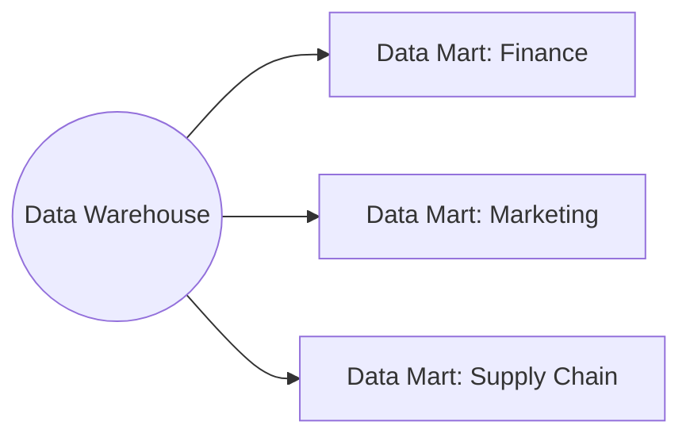

> "Sometimes a change of perspective is all it takes to see the light."
> <cite>— Dan Brown</cite>

---

Data Architecture · Analytics Pattern

# Data Mart

A data mart is a subject-specific database that acts as a partitioned segment of an enterprise data warehouse. Each mart aligns with a particular business unit — finance, marketing, supply chain, sales — providing domain-focused analytics.

Domain focused scope &nbsp;·&nbsp; Better query performance &nbsp;·&nbsp; a subject-area slice of the data warehouse optimized for one team

> [!tip] When to Use a Mart
> Create a data mart when a monolithic warehouse becomes slow to query, confusing to navigate, or hard to permission. Marts slice the warehouse into domain-focused subsets with fewer tables, scoped permissions, and better performance.

Concept

## Why marts exist

A monolithic warehouse with hundreds of tables across all departments becomes:

> [!grid|cols3]
>
> > [!card|section] Slow to query
> > Every query competes for shared resources.
>
> > [!card|section] Confusing
> > Analysts can't find tables relevant to their domain.
>
> > [!card|section] Hard to permission
> > IAM at table level becomes overwhelming.

A mart slices the warehouse into a **domain-focused subset** with fewer tables, scoped permissions, and better query performance.

Trade-offs

## Advantages

> [!grid|cols2]
>
> > [!card|section] Performance
> > Querying a smaller dataset with less resource contention.
>
> > [!card|section] Maintenance
> > Less complex than maintaining a monolithic warehouse.
>
> > [!card|section] Domain focus
> > Flexible, empowers business users with relevant data.
>
> > [!card|section] Security
> > Easier permissions — each domain gets its own ACL.

## Disadvantages

> [!grid|cols2]
>
> > [!card|section] Quality Risk
> > Discrepancies can arise between mart and source warehouse.
>
> > [!card|section] Complexity
> > Poor design leads to inconsistencies that compound over time.

Comparisons

## Mart vs Warehouse vs Mesh

| | Warehouse | Mart | [[data-mesh\|Mesh]] |
| --- | --- | --- | --- |
| Scope | Org-wide | Department | Domain (decentralized) |
| Owner | Central data team | Department-aligned team | Domain team owns end-to-end |
| Schema | Often star/snowflake | Subset of warehouse | Per-domain |
| Governance | Central | Hybrid | Federated |

## Modern thinking

In **data mesh** architecture, marts evolve into **domain-owned data products** with self-serve infrastructure. The mart is the architectural ancestor of the data product.

Interview Prep

## Interview Questions

1. Mart vs warehouse — what changes?
2. **Dependent** vs **independent** data marts (built from warehouse vs directly from sources)?
3. How do you prevent drift between mart and source warehouse?

Continue Reading

## Related pages

> [!grid]
>
>> [!card] Sister architectures
>> [[data-warehouse|Data Warehouse]], [[medallion-architecture|Medallion Architecture]], [[../data-warehousing|Data Warehousing]]
>
>
>> [!card] Modeling + serving
>> [[../data-modeling/dimensional-modeling|Dimensional Modeling]], [[../data-management/semantic-layer|Semantic Layer]]
>
>
>> [!card] Products
>> [[../../cloud/gcp/analytics/bigquery|BigQuery]]
>
>
>> [!card] People
>> [[../../../people/bill-inmon|Bill Inmon]], [[../../../people/ralph-kimball|Ralph Kimball]]
>
>
>> [!card] Books
>> [[../../../books/the-data-warehouse-toolkit|The Data Warehouse Toolkit]]
