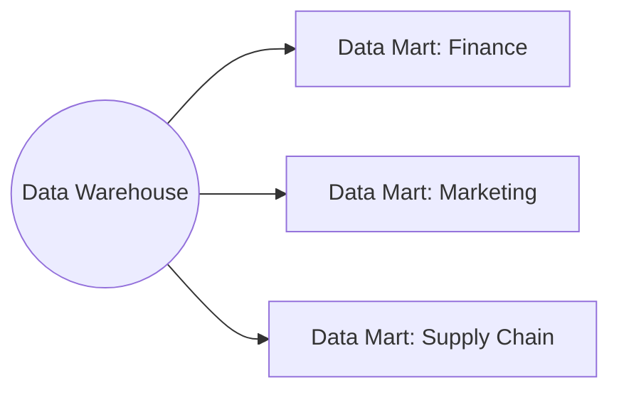

---

A **data mart** is a **subject-specific database** that acts as a partitioned segment of an enterprise data warehouse. Each mart aligns with a particular business unit — separate marts exist for **finance, marketing, supply chain, sales**, etc. (source: Concepts/Data Architecture/Data Mart.md).

## Why marts exist

A monolithic warehouse with hundreds of tables across all departments becomes:

- **Slow to query** — every query competes for shared resources.
- **Confusing** — analysts can't find the tables relevant to their domain.
- **Hard to permission** — IAM at table level becomes overwhelming.

A mart slices the warehouse into a **domain-focused subset** with fewer tables, scoped permissions, and better query performance.

## Advantages

- **Better performance** — querying a smaller dataset; less resource contention.
- **Less maintenance** than a monolithic warehouse.
- **Domain focus** — flexible, empowers business users.
- **Easier permissions** — each domain gets its own ACL.

## Disadvantages

- **Data quality risk** — discrepancies can arise between mart and source warehouse.
- **Implementation complexity** — poor design leads to inconsistencies that compound over time.

## Mart vs Warehouse vs Mesh

| | Warehouse | Mart | [[data-mesh\|Mesh]] |
| --- | --- | --- | --- |
| Scope | Org-wide | Department | Domain (decentralized) |
| Owner | Central data team | Department-aligned team | Domain team owns end-to-end |
| Schema | Often star/snowflake | Subset of warehouse | Per-domain |
| Governance | Central | Hybrid | Federated |

## Modern thinking

In **data mesh** architecture, marts evolve into **domain-owned data products** with self-serve infrastructure. The mart is the architectural ancestor of the data product.

## Interview Questions

1. Mart vs warehouse — what changes?
2. **Dependent** vs **independent** data marts (built from warehouse vs directly from sources)?
3. How do you prevent drift between mart and source warehouse?

## Related pages

> [!multi-column]
>
>> [!card] Sister architectures
>> [[data-warehouse|Data Warehouse]], [[medallion-architecture|Medallion Architecture]], [[../../data-warehousing|Data Warehousing]]
>
>
>> [!card] Modeling + serving
>> [[../data-modeling/dimensional-modeling|Dimensional Modeling]], [[../data-management/semantic-layer|Semantic Layer]]
>
>
>> [!card] Products
>> [[../../../gcp/analytics/bigquery|BigQuery]]
>
>
>> [!card] People
>> [[../../../people/bill-inmon|Bill Inmon]], [[../../../people/ralph-kimball|Ralph Kimball]]
>
>
>> [!card] Books
>> [[../../../books/the-data-warehouse-toolkit|The Data Warehouse Toolkit]]

