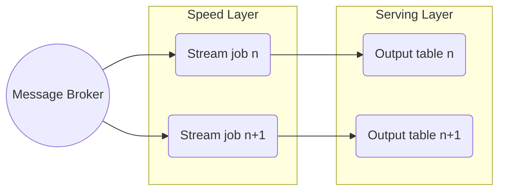

> "Anyone who dreams of an uncommon life eventually discovers there is no choice but to seek an uncommon approach to living it."
> <cite>— Gary Keller</cite>

---

Data Architecture · Streaming Pattern

# Kappa Architecture

Kappa Architecture is a big-data processing pattern that treats all data as a stream. There is no batch layer — only a stream-processing speed layer. Reprocessing is achieved by replaying the event log, not by running a separate batch job.

Single codebase &nbsp;·&nbsp; Stream only processing &nbsp;·&nbsp; simplify Lambda by making streaming the single processing path

> [!tip] When to Use Kappa
> Choose Kappa when real-time SLAs are required, you have a modern stream engine (Flink, Spark Structured Streaming, Beam), and your event log retention covers your longest reprocess window. Ideal for teams that want one codebase instead of Lambda's duplication.

Concept

## Overview

Proposed by **Jay Kreps** (Confluent CTO) in 2014 as a simplification of [[lambda-architecture|Lambda]].

## Key idea

The **append-only event log** (Kafka, [[../../cloud/gcp/analytics/pubsub|Pub/Sub]] with retention, Kinesis with extended retention) is the source of truth. To reprocess history, you simply **start a new stream job from offset zero** — it consumes the same data the original job did, and produces a corrected output.

This eliminates the duplicate code maintained in Lambda's batch and speed layers.

Trade-offs

## Advantages

> [!grid|cols2]
>
> > [!card|section] Single Codebase
> > One job logic; no duplication between batch and stream.
>
> > [!card|section] Simpler Operations
> > Fewer moving parts to maintain and debug.
>
> > [!card|section] Built-in Velocity
> > High data velocity is native to the architecture.

## Disadvantages

> [!grid|cols2]
>
> > [!card|section] Stream Complexity
> > Windowing, exactly-once, late data, schema evolution — all hard at scale.
>
> > [!card|section] Data Loss Risk
> > Higher risk if the event log isn't durable — needs careful storage strategies.
>
> > [!card|section] Replay Storms
> > Full reprocess of weeks of data can overwhelm downstream systems.

Decision Framework

## When prefer Kappa

- Real-time SLAs are required.
- Modern stream engine (Flink, Spark Structured Streaming, Beam) is in use.
- Event log retention is long enough for the longest reprocess window.

## When stick with Lambda

- Existing batch jobs are battle-tested and would be expensive to rewrite.
- Reprocess windows extend beyond your event-log retention.
- Stream engine maturity in your stack is limited.

Implementation

## Implementation on GCP

| Component | Service |
| --- | --- |
| **Event log** | [[../../cloud/gcp/analytics/pubsub\|Pub/Sub]] (or Pub/Sub Lite for Kafka-like semantics) |
| **Stream engine** | [[../../cloud/gcp/analytics/dataflow\|Dataflow]] with Apache Beam |
| **Sink** | [[../../cloud/gcp/analytics/bigquery\|BigQuery]] (via Pub/Sub→BigQuery or Dataflow) |

## Interesting Facts

- Kreps' original [O'Reilly Radar essay](https://www.oreilly.com/radar/questioning-the-lambda-architecture/) is foundational reading for streaming engineers.
- Kappa is the design philosophy behind **Confluent's "streaming-first" architecture**.

Interview Prep

## Interview Questions

1. How does Kappa avoid Lambda's code duplication?
2. What's required of the event log for Kappa to work?
3. Walk through reprocessing 30 days of events without a batch job.

Continue Reading

## Related pages

> [!grid]
>
>> [!card] Sister architectures
>> [[lambda-architecture|Lambda Architecture]], [[medallion-architecture|Medallion]], [[data-lake|Data Lake]]
>
>
>> [!card] Streaming patterns
>> [[../data-processing/stream-data-processing|Stream Processing]], [[../../software-engineering/event-sourcing-pattern|Event Sourcing]], [[../data-ingestion/change-data-capture|CDC]]
>
>
>> [!card] Products
>> [[../../cloud/gcp/analytics/pubsub|Pub/Sub]], [[../../cloud/gcp/analytics/dataflow|Dataflow]]
>
>
>> [!card] People
>> [[../../../people/jay-kreps|Jay Kreps]]
