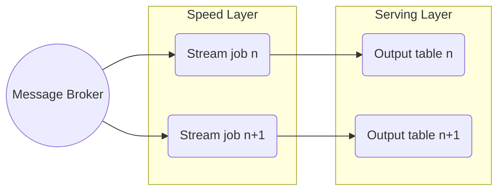

---
title: Kappa Architecture
Created:
  - 2026-04-29
date modified: Wednesday, April 29th 2026, 12:35:00 pm
aliases:
  - Kappa Architecture
category: Computer Science
tags:
  - DataEngineering
  - Architecture
  - Streaming
banner:
dg-publish: true
publish: true
---
---

**Kappa Architecture** is a big-data processing pattern that **treats all data as a stream**. There is **no batch layer** — only a stream-processing speed layer. Reprocessing is achieved by **replaying** the event log, not by running a separate batch job (source: Concepts/Data Architecture/Kappa Architecture.md).

Proposed by **Jay Kreps** (Confluent CTO) in 2014 as a simplification of [[lambda-architecture|Lambda]].

## Key idea

The **append-only event log** (Kafka, [[../../../gcp/analytics/pubsub|Pub/Sub]] with retention, Kinesis with extended retention) is the source of truth. To reprocess history, you simply **start a new stream job from offset zero** — it consumes the same data the original job did, and produces a corrected output.

This eliminates the duplicate code maintained in Lambda's batch and speed layers.

## Advantages

- **Single codebase** — one job logic; no duplication.
- **Simpler ops** — fewer moving parts.
- High **data velocity** built in.

## Disadvantages

- **Stream processing at scale is hard** — windowing, exactly-once, late data, schema evolution.
- **Higher data-loss risk** if the event log isn't durable enough — needs careful storage and replay strategies.
- **Replay storms** — full reprocess of weeks of data can overwhelm downstream systems.

## When prefer Kappa

- Real-time SLAs are required.
- Modern stream engine (Flink, Spark Structured Streaming, Beam) is in use.
- Event log retention is long enough for the longest reprocess window.

## When stick with Lambda

- Existing batch jobs are battle-tested and would be expensive to rewrite.
- Reprocess windows extend beyond your event-log retention.
- Stream engine maturity in your stack is limited.

## Implementation on GCP

- **Event log**: [[../../../gcp/analytics/pubsub|Pub/Sub]] (or Pub/Sub Lite for Kafka-like partitioned semantics).
- **Stream engine**: [[../../../gcp/analytics/dataflow|Dataflow]] with Apache Beam.
- **Sink**: [[../../../gcp/analytics/bigquery|BigQuery]] (via Pub/Sub→BigQuery subscription or Dataflow).

## Interesting Facts

- Kreps' original [O'Reilly Radar essay](https://www.oreilly.com/radar/questioning-the-lambda-architecture/) is foundational reading for streaming engineers.
- Kappa is the design philosophy behind **Confluent's "streaming-first" architecture**.

## Interview Questions

1. How does Kappa avoid Lambda's code duplication?
2. What's required of the event log for Kappa to work?
3. Walk through reprocessing 30 days of events without a batch job.

## Related pages

> [!multi-column]
>
>> [!card] Sister architectures
>> [[lambda-architecture|Lambda Architecture]], [[medallion-architecture|Medallion]], [[data-lake|Data Lake]]
>
>
>> [!card] Streaming patterns
>> [[../data-processing/stream-data-processing|Stream Processing]], [[../software-engineering/event-sourcing-pattern|Event Sourcing]], [[../data-ingestion/change-data-capture|CDC]]
>
>
>> [!card] Products
>> [[../../../gcp/analytics/pubsub|Pub/Sub]], [[../../../gcp/analytics/dataflow|Dataflow]]
>
>
>> [!card] People
>> [[../../../people/jay-kreps|Jay Kreps]]

