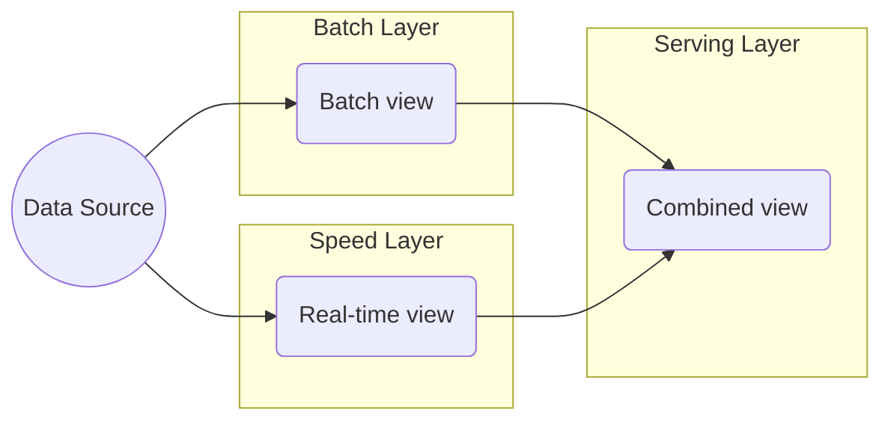

> "Most of us live our lives by accident - we live as it happens. Fulfilment comes when we live our lives on purpose."
> <cite>— Simon Sinek</cite>

---

Data Architecture · Hybrid Pattern

# Lambda Architecture

Lambda Architecture is a data processing pattern designed to balance low latency, high throughput, and fault tolerance by combining a batch layer (accurate, slow) with a speed layer (real-time, approximate). Results merge in a serving layer for unified queries.

2 processing layers &nbsp;·&nbsp; 1 unified view &nbsp;·&nbsp; batch for accuracy, streaming for speed — two layers, one view

> [!tip] When Lambda Still Makes Sense
> Lambda remains relevant for legacy systems with established batch jobs that would be expensive to rewrite. If your reprocess windows exceed event-log retention, or stream engine maturity is limited in your stack, Lambda's dual-layer approach provides fault tolerance.

Concept

## Overview

Coined by **Nathan Marz** (Storm, 2011).

## How it works

> [!grid|cols2]
>
> > [!card|section] 1. Dual Ingestion
> > All incoming events go to **both** layers simultaneously.
>
> > [!card|section] 2. Batch Layer
> > Rebuilds an authoritative view from scratch on a schedule (e.g., nightly with Spark).
>
> > [!card|section] 3. Speed Layer
> > Maintains a **near-real-time** approximation of recent data (last few hours).
>
> > [!card|section] 4. Serving Layer
> > Merges the two views on query.

Trade-offs

## Advantages

> [!grid|cols2]
>
> > [!card|section] Unified Workloads
> > Handles batch + real-time workloads in a single architecture.
>
> > [!card|section] Eventual Correctness
> > Batch view is always eventually correct, recovering from streaming bugs.
>
> > [!card|section] Fault Tolerance
> > Speed layer can fail and be rebuilt from batch.

## Disadvantages

> [!grid|cols2]
>
> > [!card|section] Code Duplication
> > Same business rules implemented twice (batch + speed).
>
> > [!card|section] Operational Complexity
> > Two pipelines to maintain, monitor, and debug.
>
> > [!card|section] Kappa Simplification
> > This duplication is precisely what [[kappa-architecture|Kappa]] eliminates.

Evolution

## Lambda → Kappa transition

Many teams who started with Lambda have moved to [[kappa-architecture|Kappa]] (streams only) because:

- Modern stream engines (Flink, Spark Structured Streaming) match batch correctness.
- One codebase is easier to maintain.
- Storage of full event log (Kafka, Pub/Sub) lets you replay = "batch from streams".

## Interesting Facts

- **Jay Kreps** (Confluent CTO, Kafka creator) wrote the influential 2014 essay "[Questioning the Lambda Architecture](https://www.oreilly.com/radar/questioning-the-lambda-architecture/)" arguing for Kappa.
- Lambda is still relevant for **legacy systems** with established batch jobs.

Interview Prep

## Interview Questions

1. Lambda vs Kappa — pros and cons.
2. Why is the speed layer "approximate"?
3. How would you replace Lambda with Kappa?

Continue Reading

## Related pages

> [!grid]
>
>> [!card] Sister architectures
>> [[kappa-architecture|Kappa Architecture]], [[medallion-architecture|Medallion]], [[data-warehouse|Data Warehouse]]
>
>
>> [!card] Processing
>> [[../data-processing/batch-data-processing|Batch Processing]], [[../data-processing/stream-data-processing|Stream Processing]], [[../data-ingestion/change-data-capture|CDC]]
>
>
>> [!card] People
>> [[../../../people/jay-kreps|Jay Kreps]]
