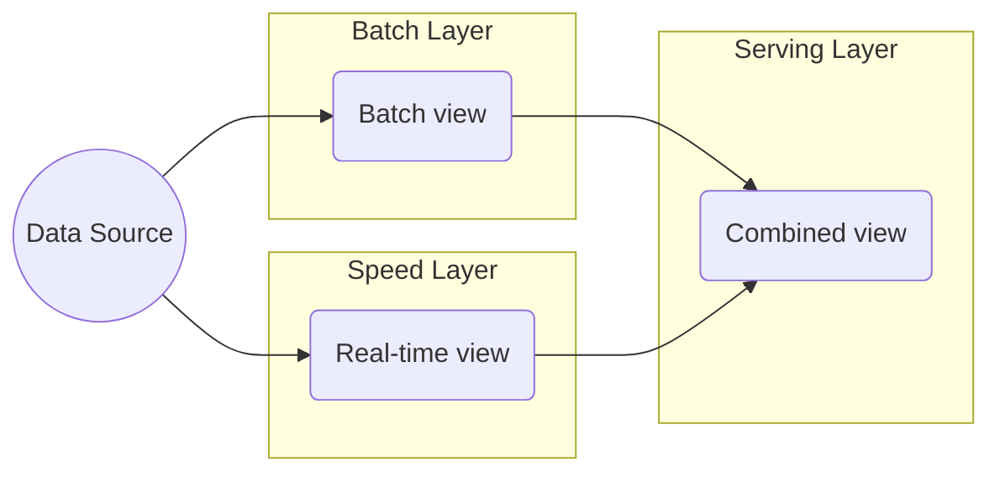

> "Most of us live our lives by accident - we live as it happens. Fulfilment comes when we live our lives on purpose."
> <cite>— Simon Sinek</cite>

---

**Lambda Architecture** is a data processing pattern designed to balance **low latency**, **high throughput**, and **fault tolerance** by combining a **batch layer** (accurate, slow) with a **speed layer** (real-time, approximate). Results from both are merged in a **serving layer** for unified queries (source: Concepts/Data Architecture/Lambda Architecture.md).

Coined by **Nathan Marz** (Storm, 2011).

## How it works

1. All incoming events go to **both** layers simultaneously.
2. **Batch layer** rebuilds an authoritative view from scratch on a schedule (e.g. nightly with Spark).
3. **Speed layer** maintains a **near-real-time** approximation of recent data (last few hours).
4. **Serving layer** merges the two on query.

## Advantages

- Handles **batch + real-time** workloads in a single architecture.
- Batch view is always **eventually correct** (recovers from streaming bugs).
- Fault-tolerant by design — speed layer can fail and be rebuilt from batch.

## Disadvantages

- **Duplicated code/logic** — same business rules implemented twice (batch + speed).
- **Operational complexity** — two pipelines to maintain.
- This duplication is precisely what [[kappa-architecture|Kappa]] eliminates.

## Lambda → Kappa transition

Many teams who started with Lambda have moved to [[kappa-architecture|Kappa]] (streams only) because:

- Modern stream engines (Flink, Spark Structured Streaming) match batch correctness.
- One codebase is easier to maintain.
- Storage of full event log (Kafka, Pub/Sub) lets you replay = "batch from streams".

## Interesting Facts

- **Jay Kreps** (Confluent CTO, Kafka creator) wrote the influential 2014 essay "[Questioning the Lambda Architecture](https://www.oreilly.com/radar/questioning-the-lambda-architecture/)" arguing for Kappa.
- Lambda is still relevant for **legacy systems** with established batch jobs.

## Interview Questions

1. Lambda vs Kappa — pros and cons.
2. Why is the speed layer "approximate"?
3. How would you replace Lambda with Kappa?

## Related pages

> [!grid]
>
>> [!card] Sister architectures
>> [[kappa-architecture|Kappa Architecture]], [[medallion-architecture|Medallion]], [[data-warehouse|Data Warehouse]]
>
>
>> [!card] Processing
>> [[../data-processing/batch-data-processing|Batch Processing]], [[../data-processing/stream-data-processing|Stream Processing]], [[../data-ingestion/change-data-capture|CDC]]
>
>
>> [!card] People
>> [[../../../people/jay-kreps|Jay Kreps]]

