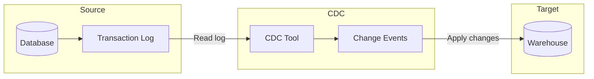

> "A bird does not sing because it has an answer. It sings because it has a song."
> <cite>— Chinese Proverb</cite>

---

<span class="at-kicker">Data Ingestion · Streaming Pattern</span>

# Change Data Capture

<p class="at-lead">
Change Data Capture (CDC) is a specialized incremental ingestion technique that captures changes from a database's transaction log. It tracks inserts, updates, and deletes along with the data itself, and often schema changes as well — the foundation of event-driven pipelines.
</p>

<span class="at-stat">Log-based</span> capture &nbsp;·&nbsp; <span class="at-stat">Near</span> real-time &nbsp;·&nbsp; <span class="at-mark">capture every database change in real time — the foundation of event-driven pipelines</span>

> [!tip] Why Log-Based CDC Wins
> Delta loads miss deletes and intermediate states. The transaction log records every mutation in commit order — INSERT, UPDATE, DELETE, even DDL. By tailing the log, CDC captures the complete history with near-zero load on the source.

<span class="at-kicker">Architecture</span>

## How it works



<span class="at-kicker">Database Logs</span>

## Logs by database

| Database | Log mechanism |
| --- | --- |
| **PostgreSQL** | WAL + logical replication slots |
| **MySQL** | Binary log (binlog) |
| **SQL Server** | CDC tables / Change Tracking |
| **Oracle** | Redo / archive log (LogMiner) |
| **MongoDB** | Oplog |
| **DynamoDB** | DynamoDB Streams |

<span class="at-kicker">Trade-offs</span>

## Advantages

> [!grid|cols2]
>
> > [!card|section] Real-time Replication
> > **Real-time / near-real-time** replication with minimal delay.
>
> > [!card|section] Minimal Source Impact
> > **Minimal source impact** — log already exists; no extra queries.
>
> > [!card|section] Complete Capture
> > **Captures all change types** — INSERT, UPDATE, DELETE, often DDL.
>
> > [!card|section] Commit Order
> > Preserves **commit order** for downstream consistency.

## Disadvantages

> [!grid|cols2]
>
> > [!card|section] Complex Setup
> > **More complex setup** than full or delta loads.
>
> > [!card|section] Elevated Permissions
> > **Requires elevated permissions** — log access is a privileged grant.
>
> > [!card|section] Schema Drift
> > **Schema drift** — DDL changes need handling.
>
> > [!card|section] Infrastructure
> > Higher infrastructure complexity (Kafka, connectors, sinks).

<span class="at-kicker">When to Use</span>

## When to use

> [!grid|cols2]
>
> > [!card|section] Replication
> > Replicate transactional DB into a warehouse or lake for analytics.
>
> > [!card|section] Microservices
> > Feed microservices via [[../../software-engineering/publisher-subscriber-pattern|Pub/Sub]].
>
> > [!card|section] Migrations
> > Database **upgrades / migrations** with minimal downtime.
>
> > [!card|section] Heterogeneous
> > **Migrate** between heterogeneous DBs.

(source: Concepts/Data Ingestion/Change Data Capture.md)

<span class="at-kicker">Tools</span>

## Popular tools

> [!grid|cols3]
>
> > [!card|section] Debezium
> > Open-source, log-based CDC into Kafka. The de-facto standard.
>
> > [!card|section] Confluent
> > Managed Kafka + Debezium connectors.
>
> > [!card|section] AWS DMS
> > AWS managed CDC.
>
> > [!card|section] GCP Datastream
> > Managed CDC into BigQuery and GCS.
>
> > [!card|section] Enterprise
> > Qlik Replicate, Striim, Matillion Data Loader, Fivetran HVR.

## Reference architecture (Postgres → BigQuery)

```
[ Postgres ] --(WAL)--> [ Debezium ] --> [ Kafka ] --> [ Kafka Connect / Dataflow ] --> [ BigQuery ]
```

Or fully managed on GCP:

```
[ Postgres ] --> [ Datastream ] --> [ Cloud Storage / BigQuery ]
```

<span class="at-kicker">Advanced Patterns</span>

## CDC patterns

> [!grid|cols2]
>
> > [!card|section] Outbox Pattern
> > Application writes domain event to an `outbox` table within the same transaction; CDC publishes outbox rows to Kafka. Achieves dual-write consistency without 2PC.
>
> > [!card|section] Event Sourcing
> > Every state change is an event in the log; current state is derived. See [[../../software-engineering/event-sourcing-pattern|Event Sourcing]].

<span class="at-kicker">Context</span>

## Interesting Facts

- Debezium was created at Red Hat by **Randall Hauch** in 2016 and is now used by Netflix, LinkedIn, Slack.
- Postgres logical decoding (added in 9.4, 2014) was a watershed moment for log-based CDC.
- **GCP Datastream** uses Oracle LogMiner internally to read Oracle redo logs without performance impact.

<span class="at-kicker">Interview Prep</span>

## Interview Questions

1. **Log-based CDC** vs **query-based CDC** vs **trigger-based CDC**.
2. How does Debezium handle a Postgres replication slot disconnection?

<span class="at-kicker">Continue Reading</span>

## Related pages

> [!grid]
>
>> [!card] Ingestion patterns
>> [[full-load|Full Load]], [[delta-load|Delta Load]], [[data-ingestion|Data Ingestion]]
>
>
>> [!card] Streaming + event-driven
>> [[../../software-engineering/event-sourcing-pattern|Event Sourcing]], [[../data-architecture/kappa-architecture|Kappa Architecture]], [[../data-processing/stream-data-processing|Stream Processing]]
>
>
>> [!card] Tools
>> [[../../tools/ingestion-tools|Ingestion Tools]]
>
>
>> [!card] People
>> [[../../../people/martin-kleppmann|Martin Kleppmann]], [[../../../people/jay-kreps|Jay Kreps]]
>
>
>> [!card] Books
>> [[../../../books/designing-data-intensive-applications|DDIA]]
