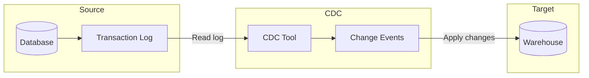

---

**Change Data Capture (CDC)** is a specialized incremental ingestion technique that captures changes from a database's **transaction log** using CDC software. It tracks **inserts, updates, and deletes** along with the data itself, and often **schema changes** as well. CDC is widely used because of its efficiency and minimal impact on source systems (source: Concepts/Data Ingestion/Change Data Capture.md).



## Why log-based wins

[[delta-load|Delta loads]] miss deletes and intermediate states. The **transaction log** records **every** mutation in commit order — INSERT, UPDATE, DELETE, even DDL. By tailing the log, CDC captures the complete history with near-zero load on the source.

Logs by DB:

| Database | Log mechanism |
| --- | --- |
| **PostgreSQL** | WAL + logical replication slots |
| **MySQL** | Binary log (binlog) |
| **SQL Server** | CDC tables / Change Tracking |
| **Oracle** | Redo / archive log (LogMiner) |
| **MongoDB** | Oplog |
| **DynamoDB** | DynamoDB Streams |

## Advantages

- **Real-time / near-real-time** replication.
- **Minimal source impact** — log already exists; no extra queries.
- **Captures all change types** — INSERT, UPDATE, DELETE, often DDL.
- Preserves **commit order** for downstream consistency.

## Disadvantages

- **More complex setup** than full or delta loads.
- **Requires elevated permissions** — log access is a privileged grant.
- **Schema drift** — DDL changes need handling.
- Higher infrastructure complexity (Kafka, connectors, sinks).

## When to use

- Replicate transactional DB into a warehouse or lake for analytics.
- Feed microservices via [[../software-engineering/publisher-subscriber-pattern|Pub/Sub]].
- Database **upgrades / migrations** with minimal downtime.
- **Migrate** between heterogeneous DBs.

(source: Concepts/Data Ingestion/Change Data Capture.md)

## Popular tools

- **Debezium** — open-source, log-based CDC into Kafka. The de-facto standard.
- **Confluent** — managed Kafka + Debezium connectors.
- **Amazon DMS** — AWS managed CDC.
- **GCP Datastream** — managed CDC into BigQuery and GCS.
- **Qlik Replicate**, **Striim**, **Matillion Data Loader**, **Fivetran HVR**.

## Reference architecture (Postgres → BigQuery)

```
[ Postgres ] --(WAL)--> [ Debezium ] --> [ Kafka ] --> [ Kafka Connect / Dataflow ] --> [ BigQuery ]
```

Or fully managed on GCP:

```
[ Postgres ] --> [ Datastream ] --> [ Cloud Storage / BigQuery ]
```

## CDC patterns

- **Outbox pattern** — application writes domain event to an `outbox` table within the same transaction; CDC publishes outbox rows to Kafka. Achieves dual-write consistency without 2PC.
- **Event sourcing** — every state change is an event in the log; current state is derived. See [[../software-engineering/event-sourcing-pattern|Event Sourcing]].

## Interesting Facts

- Debezium was created at Red Hat by **Randall Hauch** in 2016 and is now used by Netflix, LinkedIn, Slack.
- Postgres logical decoding (added in 9.4, 2014) was a watershed moment for log-based CDC.
- **GCP Datastream** uses Oracle LogMiner internally to read Oracle redo logs without performance impact.

## Interview Questions

1. **Log-based CDC** vs **query-based CDC** vs **trigger-based CDC**.
2. How does Debezium handle a Postgres replication slot disconnection?

## Related pages

> [!multi-column]
>
>> [!card] Ingestion patterns
>> [[full-load|Full Load]], [[delta-load|Delta Load]], [[data-ingestion|Data Ingestion]]
>
>
>> [!card] Streaming + event-driven
>> [[../software-engineering/event-sourcing-pattern|Event Sourcing]], [[../data-architecture/kappa-architecture|Kappa Architecture]], [[../data-processing/stream-data-processing|Stream Processing]]
>
>
>> [!card] Tools
>> [[../../tools/ingestion-tools|Ingestion Tools]]
>
>
>> [!card] People
>> [[../../../people/martin-kleppmann|Martin Kleppmann]], [[../../../people/jay-kreps|Jay Kreps]]
>
>
>> [!card] Books
>> [[../../../books/designing-data-intensive-applications|DDIA]]

