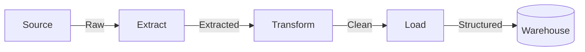
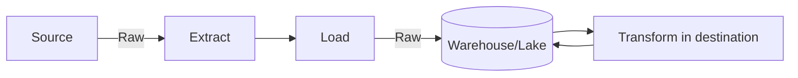

> "Quality is not an act, it is a habit."
> <cite>— Colin R. Davis</cite>

---

**Data ingestion** is the process of extracting and importing data from various sources into a destination system where it can be stored, transformed, and analyzed (source: Concepts/Data Ingestion/Data Ingestion.md). It commonly involves moving data from operational systems, external APIs, or real-time streams into [[../data-architecture/data-warehouse|warehouses]] and [[../data-architecture/data-lake|lakes]].

Two main approaches: **batch** (scheduled intervals) and **streaming** (continuous, real-time).

## Components

### 1. Data Sources

Common sources include:

- **Databases** — PostgreSQL, MySQL, SQL Server.
- **Applications** — SaaS (Hubspot, Salesforce), CRM, ERP.
- **Files** — CSV, JSON, XML, Parquet on SFTP/FTP/cloud storage.
- **APIs** — REST, GraphQL, webhooks.
- **Message queues** — Kafka, RabbitMQ, SQS.
- **Streaming** — IoT devices, clickstreams, social feeds.
- **Cloud** — S3, GCS, ADLS.

### 2. Ingestion Patterns

#### ETL (Extract → Transform → Load)

Traditional pattern: extract, transform during ingestion, then load.

#### ELT (Extract → Load → Transform)

Modern pattern: load **raw** data into the destination first, transform inside it. Storage is cheap and keeping raw data preserves flexibility.

#### Batch ingestion

Discrete chunks at scheduled intervals.

- **Higher latency** (minutes to hours).
- **Efficient for large volumes**.
- Easiest to implement and debug.
- Lower infrastructure costs.

#### Streaming ingestion

Continuous, real-time as data arrives.

- **Low latency** (seconds–milliseconds).
- More complex to implement.
- Higher infrastructure cost.
- Enables real-time analytics.

#### Micro-batch ingestion

Hybrid — small batches every few minutes (5–15 min typical).

- **Near** real-time.
- Balances latency and efficiency.
- Easier than true streaming.
- Good fit for most use cases.

(source: Concepts/Data Ingestion/Data Ingestion.md)

### 3. Ingestion Strategies

| Strategy | What it does | Best for |
| --- | --- | --- |
| [[full-load\|Full Load]] | Reload entire dataset every run | Small datasets; simple sources |
| [[delta-load\|Delta / Incremental Load]] | Pull only new/changed records | Most common pattern |
| [[change-data-capture\|Change Data Capture (CDC)]] | Read database transaction log | Real-time DB replication |

## Common patterns

### API ingestion

Scheduled REST/GraphQL pull → write to data lake.

### Database replication (CDC)

PostgreSQL WAL → **Debezium** → **Kafka** → **Kafka Connect** → warehouse.

### File-based ingestion

External system uploads → cloud storage → event trigger → processing function → warehouse.

(source: Concepts/Data Ingestion/Data Ingestion.md)

## ETL vs ELT — when prefer which

| | ETL | ELT |
| --- | --- | --- |
| Transform location | External engine | In the warehouse |
| Storage cost | Lower (transform first) | Higher (keep raw) |
| Flexibility | Lower (raw discarded) | Higher (raw retained) |
| Modern stack | Less common | dbt, Snowflake, BigQuery |
| Cost of compute | External | Warehouse compute |

ELT has won mindshare since cloud warehouse compute is cheap and elastic. Notable exception: **PII / regulated data** where raw must be transformed before landing.

## GCP service mapping

- **Batch**: [[../../cloud/gcp/analytics/bigquery|BigQuery]] load jobs, [[../../cloud/gcp/analytics/dataflow|Dataflow]] from [[Cloud Storage|GCS]].
- **Streaming**: [[../../cloud/gcp/analytics/pubsub|Pub/Sub]] → [[../../cloud/gcp/analytics/dataflow|Dataflow]] → BigQuery; or Pub/Sub → BigQuery direct subscription.
- **CDC**: **Datastream** for managed CDC into BigQuery / GCS.
- **Visual ETL**: [[../../cloud/gcp/analytics/datafusion|Data Fusion]].

## Popular ingestion tools

- **Open-source**: Airbyte, Meltano, dlt, Debezium.
- **Commercial**: Fivetran, Stitch, Matillion.
- **Cloud-native**: Datastream (GCP), AWS DMS, Azure Data Factory.

See [[../../tools/ingestion-tools|Ingestion Tools]] for the full catalog.

## Interview Questions

1. **ETL** vs **ELT** — explain the trade-off with examples.
2. **Batch** vs **streaming** vs **micro-batch** — when prefer which?
3. **Full load** vs **delta load** vs **CDC** — pros and cons.
4. Walk through replicating a Postgres OLTP DB to BigQuery in real time.
5. How do you handle **schema evolution** during ingestion?

## Related pages

> [!multi-column]
>
>> [!card] Ingestion patterns
>> [[full-load|Full Load]], [[delta-load|Delta Load]], [[change-data-capture|Change Data Capture]]
>
>
>> [!card] Pipelines + tools
>> [[../data-pipeline|Data Pipeline]], [[../../tools/ingestion-tools|Ingestion Tools]], [[../../guides/data-pipeline-best-practices|Pipeline Best Practices]]
>
>
>> [!card] People
>> [[../../../people/martin-kleppmann|Martin Kleppmann]]

