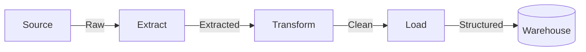
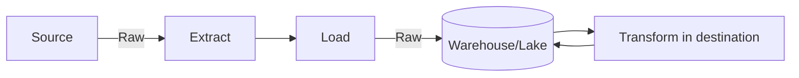

> "Quality is not an act, it is a habit."
> <cite>— Colin R. Davis</cite>

---

Data Engineering · Ingestion

# Data Ingestion

Data ingestion is the process of extracting and importing data from various sources into a destination system where it can be stored, transformed, and analyzed. It commonly involves moving data from operational systems, external APIs, or real-time streams into warehouses and lakes.

Batch + streaming &nbsp;·&nbsp; ETL/ELT patterns &nbsp;·&nbsp; getting data from source to destination reliably is the first engineering challenge

> [!tip] When to Choose Each Pattern
> Two main approaches: **batch** (scheduled intervals) for efficiency and simplicity, and **streaming** (continuous, real-time) for low-latency analytics. ELT has won mindshare in modern stacks — cloud warehouse compute is cheap and elastic, and keeping raw data preserves flexibility.

Data Sources

## Components

### 1. Data Sources

Common sources include:

> [!grid|cols3]
>
> > [!card|section] Databases
> > PostgreSQL, MySQL, SQL Server.
>
> > [!card|section] Applications
> > SaaS (Hubspot, Salesforce), CRM, ERP.
>
> > [!card|section] Files
> > CSV, JSON, XML, Parquet on SFTP/FTP/cloud storage.
>
> > [!card|section] APIs
> > REST, GraphQL, webhooks.
>
> > [!card|section] Message Queues
> > Kafka, RabbitMQ, SQS.
>
> > [!card|section] Streaming
> > IoT devices, clickstreams, social feeds.
>
> > [!card|section] Cloud Storage
> > S3, GCS, ADLS.

Ingestion Patterns

## 2. Ingestion Patterns

### ETL (Extract → Transform → Load)

Traditional pattern: extract, transform during ingestion, then load.

### ELT (Extract → Load → Transform)

Modern pattern: load **raw** data into the destination first, transform inside it. Storage is cheap and keeping raw data preserves flexibility.

### Batch ingestion

Discrete chunks at scheduled intervals.

> [!grid|cols2]
>
> > [!card|section] Higher Latency
> > Minutes to hours between updates.
>
> > [!card|section] Large Volume Efficiency
> > **Efficient for large volumes**.
>
> > [!card|section] Simplest
> > Easiest to implement and debug.
>
> > [!card|section] Lower Cost
> > Lower infrastructure costs.

### Streaming ingestion

Continuous, real-time as data arrives.

> [!grid|cols2]
>
> > [!card|section] Low Latency
> > Seconds–milliseconds.
>
> > [!card|section] Complex
> > More complex to implement.
>
> > [!card|section] Higher Cost
> > Higher infrastructure cost.
>
> > [!card|section] Real-time Analytics
> > Enables real-time analytics.

### Micro-batch ingestion

Hybrid — small batches every few minutes (5–15 min typical).

> [!grid|cols2]
>
> > [!card|section] Near Real-time
> > Good balance of latency and efficiency.
>
> > [!card|section] Easier
> > Easier than true streaming.
>
> > [!card|section] Most Use Cases
> > Good fit for most use cases.

(source: Concepts/Data Ingestion/Data Ingestion.md)

Ingestion Strategies

## 3. Ingestion Strategies

| Strategy | What it does | Best for |
| --- | --- | --- |
| [[full-load\|Full Load]] | Reload entire dataset every run | Small datasets; simple sources |
| [[delta-load\|Delta / Incremental Load]] | Pull only new/changed records | Most common pattern |
| [[change-data-capture\|Change Data Capture (CDC)]] | Read database transaction log | Real-time DB replication |

ETL vs ELT

## ETL vs ELT — when prefer which

| | ETL | ELT |
| --- | --- | --- |
| Transform location | External engine | In the warehouse |
| Storage cost | Lower (transform first) | Higher (keep raw) |
| Flexibility | Lower (raw discarded) | Higher (raw retained) |
| Modern stack | Less common | dbt, Snowflake, BigQuery |
| Cost of compute | External | Warehouse compute |

ELT has won mindshare since cloud warehouse compute is cheap and elastic. Notable exception: **PII / regulated data** where raw must be transformed before landing.

Tools

## Popular ingestion tools

> [!grid|cols3]
>
> > [!card|section] Open-source
> > Airbyte, Meltano, dlt, Debezium.
>
> > [!card|section] Commercial
> > Fivetran, Stitch, Matillion.
>
> > [!card|section] Cloud-native
> > Datastream (GCP), AWS DMS, Azure Data Factory.

See [[../../tools/ingestion-tools|Ingestion Tools]] for the full catalog.

GCP Mapping

## GCP service mapping

| Pattern | Service |
| --- | --- |
| **Batch** | [[../../cloud/gcp/analytics/bigquery\|BigQuery]] load jobs, [[../../cloud/gcp/analytics/dataflow\|Dataflow]] from [[Cloud Storage\|GCS]] |
| **Streaming** | [[../../cloud/gcp/analytics/pubsub\|Pub/Sub]] → [[../../cloud/gcp/analytics/dataflow\|Dataflow]] → BigQuery; or Pub/Sub → BigQuery direct |
| **CDC** | **Datastream** for managed CDC into BigQuery / GCS |
| **Visual ETL** | [[../../cloud/gcp/analytics/datafusion\|Data Fusion]] |

Interview Prep

## Interview Questions

1. **ETL** vs **ELT** — explain the trade-off with examples.
2. **Batch** vs **streaming** vs **micro-batch** — when prefer which?
3. **Full load** vs **delta load** vs **CDC** — pros and cons.
4. Walk through replicating a Postgres OLTP DB to BigQuery in real time.
5. How do you handle **schema evolution** during ingestion?

Continue Reading

## Related pages

> [!grid]
>
>> [!card] Ingestion patterns
>> [[full-load|Full Load]], [[delta-load|Delta Load]], [[change-data-capture|Change Data Capture]]
>
>
>> [!card] Pipelines + tools
>> [[../data-pipeline|Data Pipeline]], [[../../tools/ingestion-tools|Ingestion Tools]], [[../../guides/data-pipeline-best-practices|Pipeline Best Practices]]
>
>
>> [!card] People
>> [[../../../people/martin-kleppmann|Martin Kleppmann]]
