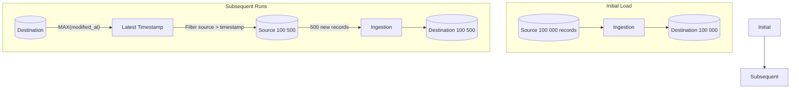

---

A **delta load** (or **incremental load**) extracts only the data that has **changed** since the last extract run. It is typically **query-based** and requires an **incrementing id** or a **`modified_at` timestamp** column to identify new records (source: Concepts/Data Ingestion/Delta Load.md).

Sometimes called **query-based CDC** to distinguish from log-based [[change-data-capture|CDC]].

## Process



Standard steps:

1. Ensure the source has a `modified_at` timestamp **or** an incrementing primary key.
2. **Initial run** — full load the entire dataset.
3. **Subsequent runs** — query destination for `MAX(column)`.
4. Query source filtering for values **greater than** the high-water mark.
5. Insert/upsert into destination.

(source: Concepts/Data Ingestion/Delta Load.md)

## Advantages

- **Resource efficient** — only moves changed data.
- **Easy to implement** with SQL queries.
- Only needs **read permissions** on the source (no privileged log access).

## Disadvantages

- **Doesn't capture deletes** — a deleted row simply disappears; the destination still has it.
- **Requires extra metadata** — uniquely identifying column + timestamp on the source.
- **Misses intermediate changes** — if a row updates 5 times between polls, you only see the latest state.
- **Source query overhead** — each delta scan can hurt OLTP performance.

## When to use

- Source DB exposes timestamps and you can't access transaction logs.
- **Append-only or rarely-deleted** tables (events, transactions, sensor readings).
- You don't need full audit trail of every change.

## When NOT to use

- Need to capture **deletes** → use [[change-data-capture|CDC]].
- Source has no `modified_at` or incrementing key.
- Need intermediate state changes (e.g. for fraud detection).

## Worked example

```sql
-- Find high-water mark
WITH high_water AS (
  SELECT MAX(modified_at) AS last_seen FROM warehouse.orders
)
INSERT INTO warehouse.orders
SELECT *
FROM operational.orders, high_water
WHERE operational.orders.modified_at > high_water.last_seen;
```

In tools: dbt incremental models, Airbyte "Incremental — Append Dedup", AWS DMS "Full Load + CDC", Fivetran's standard pattern.

## Tracking deletes via "soft delete"

Add a `deleted_at` column to the source. Deletes become updates (`UPDATE … SET deleted_at = NOW()`), which delta load can capture. Filter `WHERE deleted_at IS NULL` for live data downstream.

## Interview Questions

1. **Delta load** vs **CDC** — what does each capture and miss?
2. Why doesn't delta load handle deletes?
3. How would you use **soft deletes** to make delta deletes work?
4. What's the impact on the source DB of a poorly-indexed delta query?

## Related pages

> [!multi-column]
>
>> [!card] Ingestion patterns
>> [[full-load|Full Load]], [[change-data-capture|CDC]], [[data-ingestion|Data Ingestion]]
>
>
>> [!card] Reliability
>> [[../software-engineering/idempotence|Idempotence]], [[../software-engineering/indexing|Indexing]], [[../../guides/data-pipeline-best-practices|Pipeline Best Practices]]

