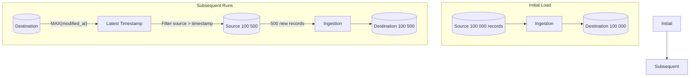

> "It takes half your life before you discover life is a do-it-yourself project."
> <cite>— Napoleon Hill</cite>

---

<span class="at-kicker">Data Ingestion · Load Pattern</span>

# Delta Load

<p class="at-lead">
A delta load (or incremental load) extracts only the data that has changed since the last extract run. It is typically query-based and requires an incrementing id or a modified_at timestamp column to identify new records — efficient, incremental, and scalable.
</p>

<span class="at-stat">Only</span> changed data &nbsp;·&nbsp; <span class="at-stat">High-water</span> mark tracking &nbsp;·&nbsp; <span class="at-mark">only move data that changed — efficient, incremental, scalable</span>

> [!tip] When to Use Delta Load
> Use delta load when the source DB exposes timestamps and you can't access transaction logs. Ideal for append-only or rarely-deleted tables (events, transactions, sensor readings) where you don't need full audit trail of every change.

<span class="at-kicker">Process</span>

## How it works



Standard steps:

> [!grid|cols2]
>
> > [!card|section] 1. Identify Timestamp
> > Ensure the source has a `modified_at` timestamp **or** an incrementing primary key.
>
> > [!card|section] 2. Initial Run
> > **Initial run** — full load the entire dataset.
>
> > [!card|section] 3. Get High-Water Mark
> > Query destination for `MAX(column)`.
>
> > [!card|section] 4. Filter Source
> > Query source filtering for values **greater than** the high-water mark.
>
> > [!card|section] 5. Insert/Upsert
> > Insert/upsert into destination.

(source: Concepts/Data Ingestion/Delta Load.md)

<span class="at-kicker">Trade-offs</span>

## Advantages

> [!grid|cols2]
>
> > [!card|section] Resource Efficient
> > **Resource efficient** — only moves changed data.
>
> > [!card|section] Easy Implementation
> > **Easy to implement** with SQL queries.
>
> > [!card|section] Simple Permissions
> > Only needs **read permissions** on the source (no privileged log access).

## Disadvantages

> [!grid|cols2]
>
> > [!card|section] Misses Deletes
> > **Doesn't capture deletes** — a deleted row simply disappears; the destination still has it.
>
> > [!card|section] Requires Metadata
> > **Requires extra metadata** — uniquely identifying column + timestamp on the source.
>
> > [!card|section] Misses Intermediates
> > **Misses intermediate changes** — if a row updates 5 times between polls, you only see the latest state.
>
> > [!card|section] Source Overhead
> > **Source query overhead** — each delta scan can hurt OLTP performance.

<span class="at-kicker">Decision Framework</span>

## When to use

- Source DB exposes timestamps and you can't access transaction logs.
- **Append-only or rarely-deleted** tables (events, transactions, sensor readings).
- You don't need full audit trail of every change.

## When NOT to use

- Need to capture **deletes** → use [[change-data-capture|CDC]].
- Source has no `modified_at` or incrementing key.
- Need intermediate state changes (e.g., for fraud detection).

<span class="at-kicker">Implementation</span>

## Worked example

```sql
-- Find high-water mark
WITH high_water AS (
  SELECT MAX(modified_at) AS last_seen FROM warehouse.orders
)
INSERT INTO warehouse.orders
SELECT *
FROM operational.orders, high_water
WHERE operational.orders.modified_at > high_water.last_seen;
```

In tools: dbt incremental models, Airbyte "Incremental — Append Dedup", AWS DMS "Full Load + CDC", Fivetran's standard pattern.

## Tracking deletes via "soft delete"

Add a `deleted_at` column to the source. Deletes become updates (`UPDATE … SET deleted_at = NOW()`), which delta load can capture. Filter `WHERE deleted_at IS NULL` for live data downstream.

<span class="at-kicker">Interview Prep</span>

## Interview Questions

1. **Delta load** vs **CDC** — what does each capture and miss?
2. Why doesn't delta load handle deletes?
3. How would you use **soft deletes** to make delta deletes work?
4. What's the impact on the source DB of a poorly-indexed delta query?

<span class="at-kicker">Continue Reading</span>

## Related pages

> [!grid]
>
>> [!card] Ingestion patterns
>> [[full-load|Full Load]], [[change-data-capture|CDC]], [[data-ingestion|Data Ingestion]]
>
>
>> [!card] Reliability
>> [[../../software-engineering/idempotence|Idempotence]], [[../../software-engineering/indexing|Indexing]], [[../../guides/data-pipeline-best-practices|Pipeline Best Practices]]
