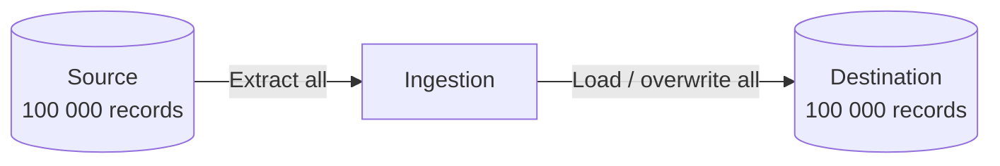

> "Successful people are not without problems. They're simply people who've learned to solve their problems."
> <cite>— Earl Nightingale</cite>

---

With a **full load**, the **entire dataset is dumped** and is then **completely replaced** (deleted and re-inserted) with the new, updated dataset. No additional information (like timestamps or change markers) is required (source: Concepts/Data Ingestion/Full Load.md).

Also known as a **destructive load**.



## Advantages

- **Easy to build and maintain** — no need to manage primary keys or change-tracking.
- **Simple design** — schema mismatches don't propagate; new records replace old ones cleanly.
- **No state required** — every run is independent of the last.

## Disadvantages

- **Resource and time inefficient** — for large datasets, full reloads take long and cost much.
- **Doesn't preserve history** — if the OLTP source overwrites records, the full reload erases history at the destination too.
- **Not scalable** — wasteful when only a few records changed.

## When to use

- **Reference data** (small lookup tables; product catalogs).
- **Simple sources** with no incrementing key or timestamp.
- **Initial loads** before switching to delta or CDC.
- **Datasets with frequent retroactive corrections** that delta wouldn't catch.

## Anti-patterns

- Don't full-load multi-TB warehouses nightly when 99% of records didn't change — use [[delta-load]] or [[change-data-capture]] instead.
- Don't full-load if the source table doesn't fit in memory or batch window.

## Worked example

```sql
-- Truncate destination, reload from source
TRUNCATE TABLE warehouse.products;

INSERT INTO warehouse.products
SELECT * FROM operational.products;
```

In tools: `bq load --replace`, dbt's `materialized='table'` (full refresh), Airbyte's "Full Refresh — Overwrite" sync mode.

## Interview Questions

1. When prefer **full load** over **delta load**?
2. What's the **risk** of full-loading a large fact table nightly?
3. How would you handle a 500 GB table with full-load semantics — cost-wise?

## Related pages

> [!grid]
>
>> [!card] Ingestion patterns
>> [[data-ingestion|Data Ingestion]], [[delta-load|Delta Load]], [[change-data-capture|CDC]]
>
>
>> [!card] Reliability
>> [[../../software-engineering/idempotence|Idempotence]], [[../../tools/ingestion-tools|Ingestion Tools]]

