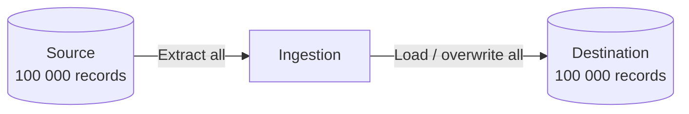

> "Successful people are not without problems. They're simply people who've learned to solve their problems."
> <cite>— Earl Nightingale</cite>

---

<span class="at-kicker">Data Ingestion · Load Pattern</span>

# Full Load

<p class="at-lead">
With a full load, the entire dataset is dumped and is then completely replaced (deleted and re-inserted) with the new, updated dataset. No additional information (like timestamps or change markers) is required — simple, reliable, expensive at scale.
</p>

<span class="at-stat">Truncate</span> + reload &nbsp;·&nbsp; <span class="at-stat">No</span> state required &nbsp;·&nbsp; <span class="at-mark">truncate and reload everything — simple, reliable, expensive at scale</span>

> [!tip] When Full Load Makes Sense
> Use full load for reference data (small lookup tables; product catalogs), simple sources with no incrementing key or timestamp, initial loads before switching to delta or CDC, and datasets with frequent retroactive corrections that delta wouldn't catch. Don't full-load multi-TB warehouses nightly.

<span class="at-kicker">Concept</span>

## How it works



Also known as a **destructive load**.

<span class="at-kicker">Trade-offs</span>

## Advantages

> [!grid|cols2]
>
> > [!card|section] Easy to Build
> > **Easy to build and maintain** — no need to manage primary keys or change-tracking.
>
> > [!card|section] Simple Design
> > **Simple design** — schema mismatches don't propagate; new records replace old ones cleanly.
>
> > [!card|section] Stateless
> > **No state required** — every run is independent of the last.

## Disadvantages

> [!grid|cols2]
>
> > [!card|section] Resource Inefficient
> > **Resource and time inefficient** — for large datasets, full reloads take long and cost much.
>
> > [!card|section] No History
> > **Doesn't preserve history** — if the OLTP source overwrites records, the full reload erases history too.
>
> > [!card|section] Not Scalable
> > **Not scalable** — wasteful when only a few records changed.

<span class="at-kicker">Decision Framework</span>

## When to use

> [!grid|cols2]
>
> > [!card|section] Reference Data
> > Small lookup tables; product catalogs.
>
> > [!card|section] Simple Sources
> > No incrementing key or timestamp available.
>
> > [!card|section] Initial Loads
> > Before switching to delta or CDC.
>
> > [!card|section] Retroactive Corrections
> > Datasets with frequent corrections that delta wouldn't catch.

## Anti-patterns

- Don't full-load multi-TB warehouses nightly when 99% of records didn't change — use [[delta-load]] or [[change-data-capture|CDC]] instead.
- Don't full-load if the source table doesn't fit in memory or batch window.

<span class="at-kicker">Implementation</span>

## Worked example

```sql
-- Truncate destination, reload from source
TRUNCATE TABLE warehouse.products;

INSERT INTO warehouse.products
SELECT * FROM operational.products;
```

In tools: `bq load --replace`, dbt's `materialized='table'` (full refresh), Airbyte's "Full Refresh — Overwrite" sync mode.

<span class="at-kicker">Interview Prep</span>

## Interview Questions

1. When prefer **full load** over **delta load**?
2. What's the **risk** of full-loading a large fact table nightly?
3. How would you handle a 500 GB table with full-load semantics — cost-wise?

<span class="at-kicker">Continue Reading</span>

## Related pages

> [!grid]
>
>> [!card] Ingestion patterns
>> [[data-ingestion|Data Ingestion]], [[delta-load|Delta Load]], [[change-data-capture|CDC]]
>
>
>> [!card] Reliability
>> [[../../software-engineering/idempotence|Idempotence]], [[../../tools/ingestion-tools|Ingestion Tools]]
