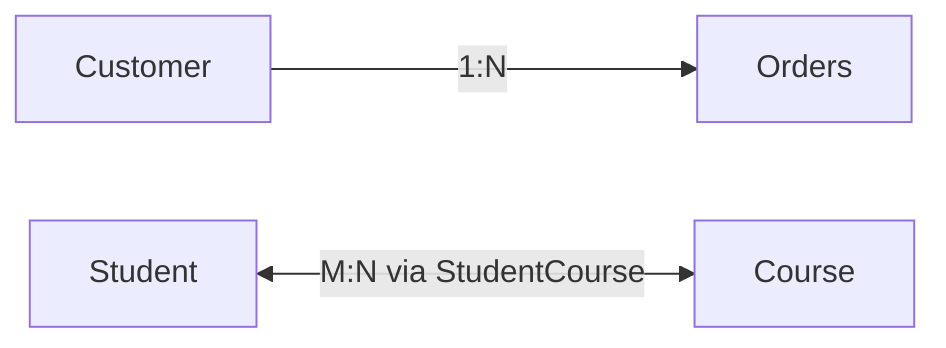

> "When we allow negative messages to fester in our head, they take on a life of their own."
> <cite>— Lolly Daskal</cite>

---

**Cardinality** has two distinct meanings in data engineering depending on context (source: Concepts/Data Modeling/Cardinality.md):

1. **Cardinality (Data Modeling)** — the **relationship** between rows in two tables.
2. **Cardinality (SQL Statements)** — the **number of distinct values** in a column or expression.

## 1. Cardinality (Data Modeling)

The number of rows in one table that relate to rows in another. Common types:

- **One-to-one (1:1)** — one row in A matches exactly one in B (rare; usually means the tables should be merged).
- **One-to-many (1:N)** — one row in A matches many in B (e.g. customer → orders).
- **Many-to-many (M:N)** — multiple rows on each side (e.g. students ↔ courses); usually implemented via a junction table.



Used to **define and analyze relationships** in data models, especially in ERD diagrams.

## 2. Cardinality (SQL Statements)

The number of **distinct values** in a column.

- **Low cardinality** — many repeated values (e.g. `country` column with 200 unique countries across millions of rows).
- **High cardinality** — most values unique (e.g. `user_id`).

The query optimizer uses cardinality estimates to choose efficient query plans:

- High-cardinality columns benefit from **B-tree indexes**.
- Low-cardinality columns benefit from **bitmap indexes** or **bloom filters**.
- Cardinality drives **selectivity** — `WHERE country = 'France'` filters less aggressively than `WHERE user_id = 12345`.

## Why this matters

- **Query optimization** — knowing cardinality helps you index correctly.
- **Storage** — low-cardinality columns compress better (run-length encoding, dictionary encoding).
- **Cost** — in [[../../cloud/gcp/analytics/bigquery|BigQuery]], `COUNT(DISTINCT high_card_col)` can be expensive; use `APPROX_COUNT_DISTINCT` for HyperLogLog estimates.

## Estimating cardinality

```sql
-- Exact (expensive on big data)
SELECT COUNT(DISTINCT user_id) FROM events;

-- Approximate (HyperLogLog, much cheaper)
SELECT APPROX_COUNT_DISTINCT(user_id) FROM events;
```

## Interview Questions

1. **High** vs **low** cardinality — give examples and storage implications.
2. How does cardinality affect index choice?
3. **HyperLogLog** — when prefer over exact distinct count?
4. **One-to-many** vs **many-to-many** — how to model each.

## Related pages

> [!multi-column]
>
>> [!card] Modeling
>> [[data-modeling|Data Modeling]], [[normalization|Normalization]], [[denormalization|Denormalization]]
>
>
>> [!card] Performance
>> [[../../software-engineering/indexing|Indexing]], [[../data-storage/column-oriented-database|Columnar storage]], [[../sargable-expressions|Sargable Expressions]]
>
>
>> [!card] Products
>> [[../../cloud/gcp/analytics/bigquery|BigQuery]]

