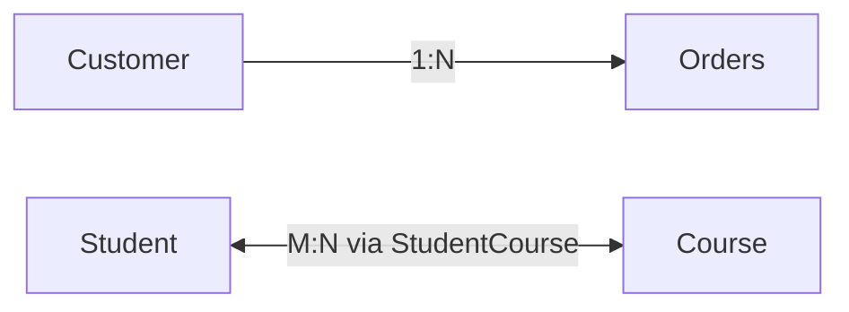

> "When we allow negative messages to fester in our head, they take on a life of their own."
> <cite>— Lolly Daskal</cite>

---

<span class="at-kicker">Data Modeling · Concept</span>

# Cardinality

<p class="at-lead">
Cardinality has two distinct meanings in data engineering: (1) the relationship between rows in two tables, and (2) the number of distinct values in a column. Understanding both prevents the most common query performance mistakes and index selection errors.
</p>

<span class="at-stat">2</span> distinct meanings &nbsp;·&nbsp; <span class="at-stat">High/Low</span> implications &nbsp;·&nbsp; <span class="at-mark">understanding cardinality prevents the most common query performance mistakes</span>

> [!tip] Why Cardinality Matters
> Cardinality drives query optimization decisions. High-cardinality columns benefit from B-tree indexes. Low-cardinality columns benefit from bitmap indexes or bloom filters. Cardinality estimates determine selectivity — crucial for efficient query plans.

<span class="at-kicker">Data Modeling</span>

## 1. Cardinality (Data Modeling)

The number of rows in one table that relate to rows in another. Common types:

> [!grid|cols3]
>
> > [!card|section] One-to-One (1:1)
> > One row in A matches exactly one in B (rare; usually means tables should be merged).
>
> > [!card|section] One-to-Many (1:N)
> > One row in A matches many in B (e.g., customer → orders).
>
> > [!card|section] Many-to-Many (M:N)
> > Multiple rows on each side (e.g., students ↔ courses); implemented via junction table.



Used to **define and analyze relationships** in data models, especially in ERD diagrams.

<span class="at-kicker">SQL Optimization</span>

## 2. Cardinality (SQL Statements)

The number of **distinct values** in a column.

> [!grid|cols2]
>
> > [!card|section] Low Cardinality
> > Many repeated values (e.g., `country` column with 200 unique countries across millions of rows).
>
> > [!card|section] High Cardinality
> > Most values unique (e.g., `user_id`).

The query optimizer uses cardinality estimates to choose efficient query plans:

- High-cardinality columns benefit from **B-tree indexes**.
- Low-cardinality columns benefit from **bitmap indexes** or **bloom filters**.
- Cardinality drives **selectivity** — `WHERE country = 'France'` filters less aggressively than `WHERE user_id = 12345`.

<span class="at-kicker">Implications</span>

## Why this matters

> [!grid|cols3]
>
> > [!card|section] Query Optimization
> > Knowing cardinality helps you index correctly.
>
> > [!card|section] Storage
> > Low-cardinality columns compress better (run-length encoding, dictionary encoding).
>
> > [!card|section] Cost
> > In [[../../cloud/gcp/analytics/bigquery|BigQuery]], `COUNT(DISTINCT high_card_col)` can be expensive; use `APPROX_COUNT_DISTINCT` for HyperLogLog estimates.

<span class="at-kicker">Estimation</span>

## Estimating cardinality

```sql
-- Exact (expensive on big data)
SELECT COUNT(DISTINCT user_id) FROM events;

-- Approximate (HyperLogLog, much cheaper)
SELECT APPROX_COUNT_DISTINCT(user_id) FROM events;
```

<span class="at-kicker">Interview Prep</span>

## Interview Questions

1. **High** vs **low** cardinality — give examples and storage implications.
2. How does cardinality affect index choice?
3. **HyperLogLog** — when prefer over exact distinct count?
4. **One-to-many** vs **many-to-many** — how to model each.

<span class="at-kicker">Continue Reading</span>

## Related pages

> [!grid]
>
>> [!card] Modeling
>> [[data-modeling|Data Modeling]], [[normalization|Normalization]], [[denormalization|Denormalization]]
>
>
>> [!card] Performance
>> [[../../software-engineering/indexing|Indexing]], [[../data-storage/column-oriented-database|Columnar storage]], [[../sargable-expressions|Sargable Expressions]]
>
>
>> [!card] Products
>> [[../../cloud/gcp/analytics/bigquery|BigQuery]]
