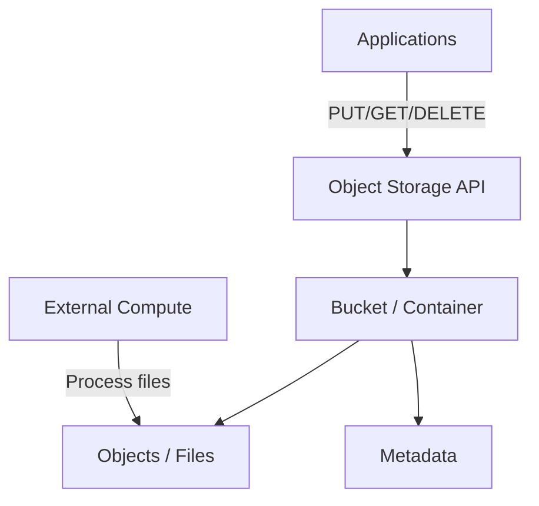

---

**Data storage** covers the technologies and systems used to store and retrieve data in various formats and structures. Modern storage divides into two categories (source: Concepts/Data Storage/Data Storage.md):

1. **[[database|Databases]]** — managed storage *with* built-in compute (queries via SQL or DB API).
2. **Object / Blob Storage** — raw storage requiring *external* compute.

## 1. Databases

Provide both storage and built-in compute with structured query interfaces.

### [[relational-database|Relational Database]]

Traditional structured storage using tables, rows, columns + ACID. See [[../../../databases/acid-properties|ACID Properties]].

### [[non-relational-database|Non-Relational (NoSQL)]]

Flexible formats: documents, key-value, graphs, columns. Designed for scalability and schema-less.

Types:

- [[document-database|Document]]
- [[key-value-database|Key-Value]]
- [[graph-database|Graph]]
- [[wide-column-database|Wide-column]]
- [[column-oriented-database|Column-oriented]] (often used in warehouses)
- [[in-memory-database|In-memory]]
- [[timeseries-database|Time-series]]
- Search-engine (Elasticsearch, OpenSearch)

## 2. Object / Blob Storage

Raw data persistence without compute — external engines (Spark, Presto, Dataflow, BigQuery) read the data on demand.

Cloud examples:

- **AWS S3**, **S3 Glacier** (archival)
- **Azure Blob Storage**, **ADLS Gen2**
- **[[../../../gcp/storage/cloud-storage|GCP Cloud Storage]]**

## Choosing the right storage

| Need | Pick |
| --- | --- |
| ACID transactions, complex joins | [[relational-database\|Relational]] |
| Flexible schema, document-oriented | [[document-database\|Document]] |
| Cache, simple lookups | [[key-value-database\|Key-Value]] |
| Relationships at scale | [[graph-database\|Graph]] |
| IoT / sensor / metrics | [[timeseries-database\|Time-series]] |
| Massive write throughput, sparse rows | [[wide-column-database\|Wide-column]] |
| Analytics aggregations | [[column-oriented-database\|Columnar]] (in warehouse) |
| Cheap raw blobs | Object storage |
| Full-text search | Search engine (Elasticsearch) |

## Storage in cloud platforms

| GCP | AWS | Azure |
| --- | --- | --- |
| [[../../../gcp/storage/cloud-storage\|Cloud Storage]] | S3 | Blob Storage |
| [[../../../gcp/storage/persistent-disk\|Persistent Disk]] | EBS | Disk Storage |
| [[../../../gcp/storage/filestore\|Filestore]] | EFS | Files |
| [[../../../gcp/databases/cloud-sql\|Cloud SQL]] | RDS / Aurora | SQL DB |
| [[../../../gcp/databases/cloud-spanner\|Spanner]] | Aurora Global / DynamoDB Global | Cosmos DB |
| [[../../../gcp/databases/cloud-bigtable\|Bigtable]] | DynamoDB / Keyspaces | Cosmos DB |
| [[../../../gcp/databases/cloud-datastore\|Firestore]] | DynamoDB | Cosmos DB |
| [[../../../gcp/databases/memorystore\|Memorystore]] | ElastiCache | Cache for Redis |
| [[../../../gcp/analytics/bigquery\|BigQuery]] | Redshift | Synapse |

## Interview Questions

1. **Database** vs **object storage** — fundamental difference.
2. Walk through choosing storage for: a SaaS app, IoT telemetry, analytics warehouse, real-time leaderboard.
3. **SQL** vs **NoSQL** — when prefer which?

## Related pages

> [!multi-column]
>
>> [!card] Storage hub
>> [[database|Database]], [[relational-database|Relational Database]], [[non-relational-database|Non-relational / NoSQL]]
>
>
>> [!card] NoSQL families
>> [[document-database|Document Database]], [[key-value-database|Key-Value Database]], [[graph-database|Graph Database]], [[wide-column-database|Wide-column Database]]
>
>
>> [!card] Specialty stores
>> [[column-oriented-database|Column-oriented Database]], [[in-memory-database|In-memory Database]], [[timeseries-database|Time-series Database]]
>
>
>> [!card] Tools + theory
>> [[../../tools/databases-overview|Databases Overview]], [[../../tools/object-storage|Object Storage]], [[../../../databases/acid-properties|ACID Properties]]

