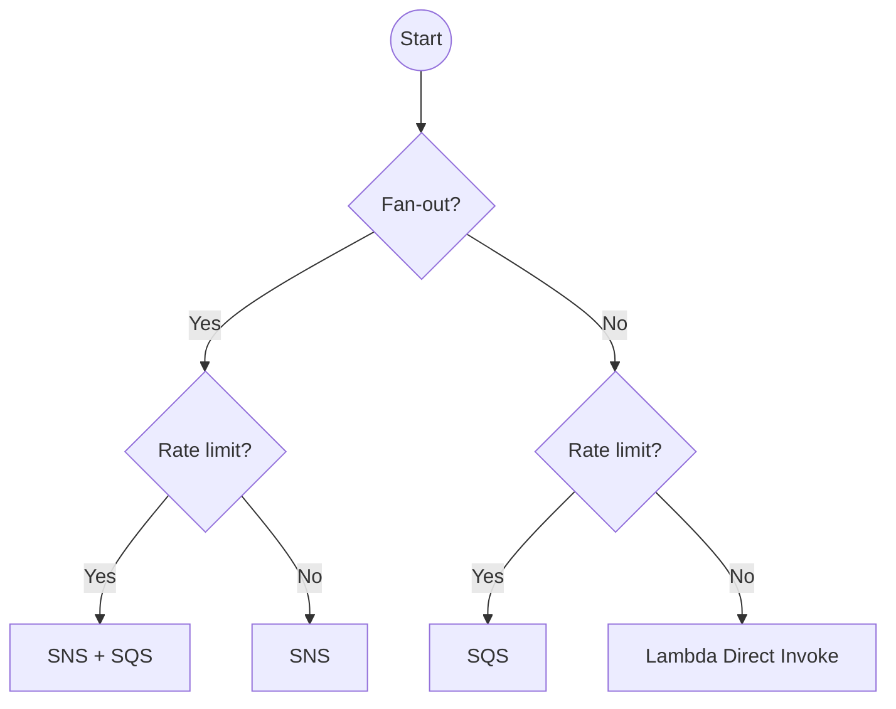

---

A short decision guide for choosing **messaging services** across the major clouds (source: Guides/Choosing your optimal messaging service.md).

## AWS

| Need | AWS service |
| --- | --- |
| **Fan-out + rate limit** | SNS + SQS (subscribers buffer) |
| **Fan-out, no rate limit** | SNS |
| **Point-to-point + rate limit** | SQS |
| **Point-to-point, low latency, no rate limit** | Lambda Direct Invoke |

Source: [AWS re:Invent 2020 — Scalable serverless event-driven architectures with SNS, SQS & Lambda](https://www.youtube.com/watch?v=8zysQqxgj0I&t=1887s)

## Azure

| Need | Azure service |
| --- | --- |
| Pub/Sub | **Event Grid** |
| Queue (point-to-point) | **Queue Storage** or **Service Bus Queues** |
| Enterprise messaging (transactions, ordering, dead-letter) | **Service Bus** |
| Event streaming (Kafka-like) | **Event Hubs** |

## GCP

| Need | GCP service |
| --- | --- |
| Pub/Sub fan-out | **[[../../gcp/analytics/pubsub\|Pub/Sub]]** |
| Kafka-compatible, lower cost | **Pub/Sub Lite** |
| Queue with task delivery + retries | **Cloud Tasks** |
| Workflow orchestration of services | **Cloud Workflows** |
| Event routing | **Eventarc** |

## Cross-cloud comparison

| Concept | AWS | Azure | GCP |
| --- | --- | --- | --- |
| **Pub/Sub** | SNS | Event Grid | Pub/Sub |
| **Queue** | SQS | Queue Storage / Service Bus | Cloud Tasks / Pub/Sub |
| **Event streaming** | Kinesis / MSK | Event Hubs | Pub/Sub / Pub/Sub Lite |
| **Direct invoke** | Lambda Direct | Function trigger | Functions trigger |

## Decision framework

Ask yourself:

1. **Fan-out** (one event → many consumers)?
2. **Rate-limiting** needed (slow consumers)?
3. **Persistent queue** for retries / DLQ?
4. **Ordering** required?
5. **Throughput**: K/s, K/min, M/s?
6. **Latency**: ms? sec? min?
7. **Multi-region**?
8. **Replay** support needed?

## Open-source alternatives

| Need | Tool |
| --- | --- |
| Distributed event log | **Apache Kafka** |
| Lightweight queue | **RabbitMQ** |
| High-perf messaging | **NATS** |
| Pub/Sub on Redis | **Redis** |
| Streaming + analytics | **Apache Pulsar** |

## Patterns to combine

- **[[../concepts/software-engineering/fan-out|Fan-out]]** — pub/sub topic + multiple subscriptions.
- **Dead-letter queue (DLQ)** — capture poison messages for inspection.
- **Idempotent consumers** — see [[../concepts/software-engineering/idempotence|Idempotence]].
- **[[../concepts/software-engineering/claim-check-pattern|Claim-check]]** — for large payloads.

## Interview Questions

1. **SNS** vs **SQS** vs **EventBridge** — when each?
2. **Pub/Sub** vs **Pub/Sub Lite** on GCP.
3. **Kafka** vs cloud-native messaging — pros/cons.
4. **DLQ** strategy and design.

## Related pages

> [!multi-column]
>
>> [!card] Patterns
>> [[../concepts/software-engineering/publisher-subscriber-pattern|Pub/Sub Pattern]], [[../concepts/software-engineering/fan-out|Fan-out]], [[../concepts/software-engineering/claim-check-pattern|Claim Check]], [[../concepts/software-engineering/idempotence|Idempotence]]
>
>
>> [!card] Products
>> [[../../gcp/analytics/pubsub|GCP Pub/Sub]], [[../../aws/aws|AWS]], [[../../azure/azure|Azure]]
>
>
>> [!card] Sister guides
>> [[cloud-services-map|Cloud Services Map]]
>
>
>> [!card] People
>> [[../../people/jay-kreps|Jay Kreps]]

