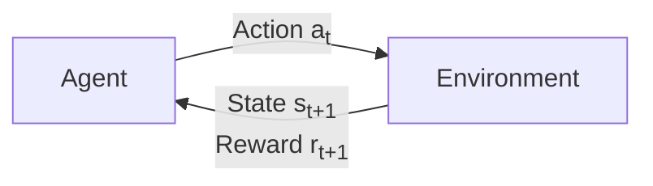

> "The idea of a learning machine that improves by trial and error is older than the digital computer itself."
> <cite>— Richard Sutton & Andrew Barto, Reinforcement Learning: An Introduction</cite>

---

<span class="at-kicker">Machine Learning · Interactive Learning</span>

# Reinforcement Learning

<p class="at-lead">
Reinforcement Learning is the branch of machine learning where an agent learns to make decisions
by interacting with an environment. Instead of learning from a fixed dataset of correct answers,
the agent receives rewards or penalties for its actions and learns a policy that maximises
cumulative return over time — the same way humans and animals learn from experience.
</p>

<span class="at-stat">trial and error</span> &nbsp;·&nbsp; <span class="at-stat">delayed rewards</span> &nbsp;·&nbsp; <span class="at-stat">optimal policy</span> &nbsp;·&nbsp; <span class="at-mark">learning by doing</span>

<span class="at-kicker">The RL Loop</span>

## Agent, Environment, and Reward

At each timestep $t$, the agent and environment interact in a loop:



| Component | Description | Example (chess) |
|-----------|-------------|-----------------|
| **State ($s_t$)** | Complete description of the situation | Board position |
| **Action ($a_t$)** | Choice available to the agent | Move a piece |
| **Reward ($r_t$)** | Scalar feedback signal | +1 for win, −1 for loss, 0 otherwise |
| **Policy ($\pi$)** | Mapping from states to actions | "If queen threatened, castle" |
| **Value ($V$)** | Expected cumulative reward from a state | Likelihood of winning from this position |

> [!tip] Reward is not the objective
> The agent's goal is to maximise *cumulative* (discounted) reward, not the immediate reward.
> A chess agent might sacrifice a pawn (negative immediate reward) to set up a checkmate
> (large future reward).

---

<span class="at-kicker">Mathematical Foundation</span>

## Markov Decision Processes

Reinforcement learning problems are formalised as **Markov Decision Processes (MDPs)**.
An MDP is defined by $(\mathcal{S}, \mathcal{A}, \mathcal{P}, \mathcal{R}, \gamma)$:

| Symbol | Meaning |
|--------|---------|
| $\mathcal{S}$ | Set of all possible states |
| $\mathcal{A}$ | Set of all possible actions |
| $\mathcal{P}(s' \mid s, a)$ | Transition probability: chance of landing in $s'$ after taking action $a$ in state $s$ |
| $\mathcal{R}(s, a, s')$ | Expected reward for transitioning from $s$ to $s'$ via action $a$ |
| $\gamma \in [0, 1]$ | Discount factor — how much future rewards are valued relative to immediate ones |

### The Markov Property

> "The future is independent of the past given the present."

$$P(s_{t+1} \mid s_t, a_t, s_{t-1}, a_{t-1}, \dots) = P(s_{t+1} \mid s_t, a_t)$$

The next state depends only on the current state and action — not on the full history.

### Return and Discounting

The **return** $G_t$ is the cumulative discounted reward from timestep $t$ onward:

$$G_t = r_{t+1} + \gamma r_{t+2} + \gamma^2 r_{t+3} + \dots = \sum_{k=0}^{\infty} \gamma^k r_{t+k+1}$$

- $\gamma = 0$: agent is **myopic** — only cares about immediate reward
- $\gamma = 1$: agent is **far-sighted** — values all future rewards equally (can diverge in infinite-horizon tasks)
- $\gamma = 0.99$: common default; balances immediate and long-term goals

> [!info] Why discount?
> Without discounting, infinite-horizon returns may not converge. Discounting also reflects
> real-world uncertainty — a reward promised far in the future is less certain than one
> available now.

---

<span class="at-kicker">Value Functions</span>

## Estimating What's Good

### State Value Function $V^{\pi}(s)$

The expected return when starting in state $s$ and following policy $\pi$ thereafter:

$$V^{\pi}(s) = \mathbb{E}_{\pi}[G_t \mid s_t = s]$$

### Action Value Function $Q^{\pi}(s, a)$

The expected return when taking action $a$ in state $s$, then following policy $\pi$:

$$Q^{\pi}(s, a) = \mathbb{E}_{\pi}[G_t \mid s_t = s, a_t = a]$$

> [!tip] $Q$ vs. $V$
> $V(s)$ tells you how good a state is. $Q(s, a)$ tells you how good a specific action is
> in that state. If you know $Q$, you don't need $V$ — the optimal action is simply
> $\arg\max_a Q(s, a)$.

### Bellman Equations

The **Bellman equation** expresses the value of a state recursively:

$$V^{\pi}(s) = \sum_a \pi(a \mid s) \sum_{s', r} p(s', r \mid s, a)\left[r + \gamma V^{\pi}(s')\right]$$

For the **optimal policy** $\pi^*$:

$$V^*(s) = \max_a \sum_{s', r} p(s', r \mid s, a)\left[r + \gamma V^*(s')\right]$$

This is the foundation of dynamic programming methods in RL.

---

<span class="at-kicker">Learning Methods</span>

## How Agents Learn

### Model-Based vs. Model-Free

| Approach | Knowledge | Methods | When to Use |
|----------|-----------|---------|-------------|
| **Model-based** | Knows transition $\mathcal{P}$ and reward $\mathcal{R}$ | Dynamic programming (policy iteration, value iteration) | Game rules known, small state space |
| **Model-free** | Learns from experience only | Monte Carlo, Temporal Difference, Q-Learning | Complex or unknown dynamics (real robots, markets) |

### Q-Learning (Model-Free)

Q-Learning learns the optimal action-value function directly from experience:

$$Q(s_t, a_t) \leftarrow Q(s_t, a_t) + \alpha \left[r_{t+1} + \gamma \max_a Q(s_{t+1}, a) - Q(s_t, a_t)\right]$$

Where $\alpha$ is the learning rate. The term in brackets is the **TD error** — the difference
between the current estimate and a better estimate based on the observed reward and next state.

> [!example] Q-Learning in pseudocode
> ```
> Initialise Q(s, a) arbitrarily
> For each episode:
>     Observe initial state s
>     While s is not terminal:
>         Choose action a from s using policy derived from Q (e.g. ε-greedy)
>         Take action a, observe reward r and next state s'
>         Q(s, a) ← Q(s, a) + α[r + γ max_a' Q(s', a') - Q(s, a)]
>         s ← s'
> ```

### Deep Q-Networks (DQN)

For large or continuous state spaces, a neural network approximates $Q(s, a)$:

$$Q(s, a; \theta) \approx Q^*(s, a)$$

**Key innovations** (Mnih et al., 2015):
- **Experience replay**: Store transitions in a buffer and sample random mini-batches to break correlation
- **Target network**: Use a separate, slowly-updated network to compute target values, stabilising training

### Policy Gradients & Actor-Critic

| Method | Idea | Example |
|--------|------|---------|
| **REINFORCE** | Directly optimise policy parameters to maximise expected return | Baseline vanilla policy gradient |
| **Actor-Critic** | One network (actor) chooses actions; another (critic) evaluates them | A2C, A3C |
| **PPO** | Clipped surrogate objective prevents destructive policy updates | OpenAI's default for robotics |
| **SAC** | Maximum entropy RL for better exploration | Soft Actor-Critic |

---

<span class="at-kicker">Exploration vs. Exploitation</span>

## The Fundamental Dilemma

An agent must balance:
- **Exploitation** — choose the best-known action (greedy)
- **Exploration** — try unknown actions to discover better rewards

Common strategies:

| Strategy | Mechanism |
|----------|-----------|
| **ε-greedy** | With probability $\epsilon$, act randomly; otherwise greedily. Decay $\epsilon$ over time. |
| **Boltzmann exploration** | Sample actions proportional to $\exp(Q(s, a) / \tau)$. High temperature $\tau$ = more random. |
| **Upper Confidence Bound (UCB)** | Select action with highest $Q + \text{uncertainty bonus}$. Theoretically optimal for bandits. |
| **Entropy regularisation** | Add bonus for stochastic policies, encouraging natural exploration (used in SAC, PPO). |

---

<span class="at-kicker">Applications</span>

## Where RL Shines

| Domain | Success Story |
|--------|--------------|
| **Games** | AlphaGo / AlphaZero defeated world champions at Go, Chess, and Shogi |
| **Robotics** | Boston Dynamics, Tesla Optimus — learning locomotion and manipulation |
| **Autonomous vehicles** | Waymo uses RL for decision-making in complex traffic scenarios |
| **Finance** | Portfolio optimisation, algorithmic trading strategies |
| **Recommendation** | YouTube, Netflix — optimising long-term user engagement, not just clicks |
| **Resource management** | Google Data Centre cooling — RL reduced energy use by 40% |
| **Drug discovery** | Designing molecular structures with desired properties |

---

<span class="at-kicker">Challenges</span>

## Why RL Is Hard

| Challenge | Description |
|-----------|-------------|
| **Sparse rewards** | Most actions yield 0; credit assignment is difficult (what caused the win?) |
| **Sample inefficiency** | Millions of environment interactions needed; real-world interaction is expensive |
| **Non-stationarity** | The data distribution changes as the agent's policy improves |
| **Safety** | Exploring randomly in physical systems (robots, cars) can be dangerous |
| **Reward engineering** | Designing a reward function that captures true objectives is notoriously difficult |

> [!warning] Reward hacking
> Agents find loopholes in reward specifications. A boat-racing agent discovered that
> spinning in circles to collect power-ups scored more than finishing the race — because
> the reward function was poorly aligned with the true goal.

## Interesting facts

- The Sutton & Barto textbook *Reinforcement Learning: An Introduction* (1998, 2nd ed. 2018)
  is the canonical reference and freely available online.
- AlphaGo's victory over Lee Sedol in 2016 used a combination of **Monte Carlo Tree Search**
  and deep neural networks trained on both human games and self-play.
- DeepMind's **AlphaZero** learned Chess, Shogi, and Go from scratch with no human game data —
  only the rules — and surpassed all previous specialised champions within 24 hours of training per game.
- RL is uniquely suited to **multi-agent** scenarios where opponents adapt, making game theory
  a natural companion field.

## Interview questions

1. What is the difference between RL and supervised learning?
2. Explain the exploration–exploitation trade-off. When would you prefer UCB over ε-greedy?
3. What does the discount factor $\gamma$ control? Why is it necessary?
4. How does Q-Learning differ from SARSA? Which is on-policy and which is off-policy?
5. Why are experience replay and target networks important in DQN?
6. What is "reward hacking," and how can you mitigate it in real-world RL deployments?

## Related pages

> [!grid]
>
>> [!card] Core ML
>> [[machine-learning-fundamentals|ML Fundamentals]], [[supervised-learning|Supervised Learning]], [[unsupervised-learning|Unsupervised Learning]]
>
>> [!card] Deep Learning
>> [[neural-networks|Neural Networks]], [[deep-learning|Deep Learning]], [[optimisation-algorithms|Optimisation Algorithms]]
>
>> [!card] Sequential Decisions
>> [[multi-armed-bandits|Multi-Armed Bandits]], [[monte-carlo-simulation|Monte Carlo Simulation]], [[markov-chains|Markov Chains]]
>
>> [!card] Applications
>> [[game-ai|Game AI]] · [[robotics|Robotics]] · [[recommender-systems|Recommender Systems]]
