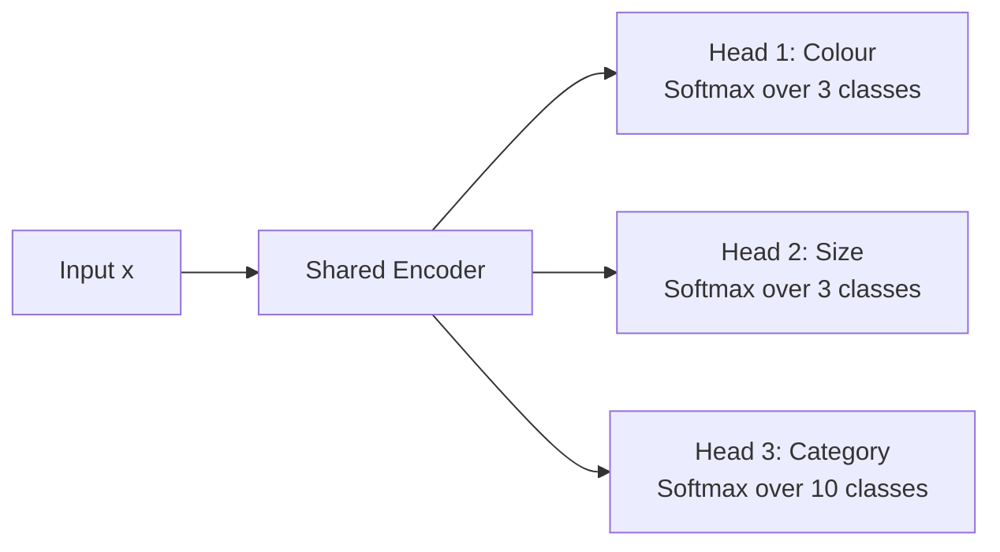
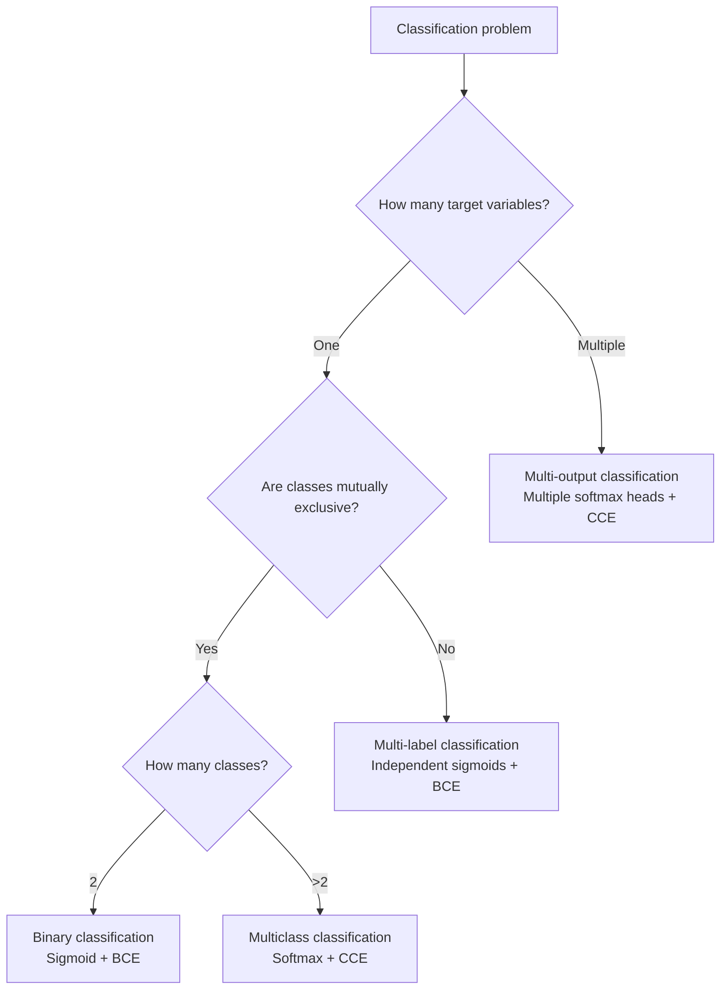

> "The first step in solving any classification problem is to understand exactly what type of classification you are facing."
> <cite>— ML practitioner's aphorism</cite>

---

<span class="at-kicker">Supervised Learning · Taxonomy</span>

# Classification Types

<p class="at-lead">
Not all classification problems are the same. A model that predicts whether an email is spam
or not (binary) requires a fundamentally different architecture than one that tags a photo with
multiple labels simultaneously (multi-label) or predicts several distinct target variables at
once (multi-output). Understanding the taxonomy prevents architectural mismatches and evaluation
errors.
</p>

<span class="at-stat">binary</span> &nbsp;·&nbsp; <span class="at-stat">multiclass</span> &nbsp;·&nbsp; <span class="at-stat">multi-label</span> &nbsp;·&nbsp; <span class="at-mark">one problem, many faces</span>

<span class="at-kicker">The Four Types</span>

## Classification Problem Taxonomy

| Type | Targets per sample | Classes per target | Example |
|------|-------------------|-------------------|---------|
| **Binary** | 1 | 2 (mutually exclusive) | Spam detection: spam / not spam |
| **Multiclass** | 1 | $K > 2$ (mutually exclusive) | Digit recognition: 0–9 |
| **Multi-label** | 1 | $K \geq 2$ (independent) | Photo tags: {beach, sunset, person} |
| **Multi-output** | $M > 1$ | $K_m \geq 2$ per target | Predict colour AND size from image |

> [!info] Key distinction
> **Multiclass**: exactly one label per sample. **Multi-label**: any subset of labels per sample.
> **Multi-output**: multiple independent prediction tasks in one model.

---

<span class="at-kicker">Binary & Multiclass</span>

## Standard Classification

### Binary classification

The simplest case: two mutually exclusive classes.

$$\hat{y} = \sigma(w^T x + b) \in [0, 1]$$

**Output**: single probability. **Loss**: binary cross-entropy.
**Decision threshold**: typically 0.5 (tune for precision–recall trade-off).

### Multiclass classification

$K$ mutually exclusive classes. The model outputs a probability distribution over all classes.

$$\hat{y} = \text{softmax}(W x + b) \in \mathbb{R}^K$$

**Output**: $K$ probabilities summing to 1. **Loss**: categorical cross-entropy.
**Prediction**: $\arg\max_k \hat{y}_k$.

> [!tip] Multiclass strategies
> Some algorithms naturally handle multiclass (decision trees, neural networks). Others need
> adaptation:
> - **One-vs-Rest (OvR)**: Train $K$ binary classifiers, each class vs. all others
> - **One-vs-One (OvO)**: Train $\frac{K(K-1)}{2}$ classifiers, one per pair
>
> SVMs traditionally use OvO; logistic regression uses OvR. Most modern deep-learning
> frameworks use softmax natively.

---

<span class="at-kicker">Multi-Label</span>

## Independent Binary Decisions

In **multi-label classification**, each sample can belong to **multiple classes simultaneously**.
The labels are not mutually exclusive — they are independent binary decisions.

### Problem formulation

For $K$ possible labels, the target is a binary vector:

$$y = [y_1, y_2, \dots, y_K], \quad y_i \in \{0, 1\}$$

**Example**: A news article might be tagged with {politics, economics, europe}.

### Architecture approaches

| Approach | How it works | When to use |
|----------|-------------|-------------|
| **Binary relevance** | Train $K$ independent binary classifiers | Baseline; works well when labels are uncorrelated |
| **Classifier chains** | Chain classifiers, feeding previous predictions as features | When labels have strong dependencies |
| **Label powerset** | Treat every label combination as a single class | Only when combinations are few |
| **Neural multi-head** | Shared backbone + $K$ independent sigmoid heads | Deep learning default; most flexible |

> [!example] Multi-label in PyTorch
> ```python
> import torch.nn as nn
>
> class MultiLabelClassifier(nn.Module):
>     def __init__(self, input_dim, num_labels):
>         super().__init__()
>         self.backbone = nn.Sequential(
>             nn.Linear(input_dim, 256),
>             nn.ReLU(),
>             nn.Linear(256, 128),
>             nn.ReLU(),
>         )
>         self.heads = nn.ModuleList([
>             nn.Linear(128, 1) for _ in range(num_labels)
>         ])
>
>     def forward(self, x):
>         features = self.backbone(x)
>         return torch.sigmoid(torch.stack([h(features) for h in self.heads], dim=1))
>
> # Loss: binary cross-entropy per label, averaged
> criterion = nn.BCELoss()
> ```

### Evaluation

| Metric | Formula / Description | Best For |
|--------|----------------------|----------|
| **Hamming loss** | Fraction of wrong labels | Per-label accuracy |
| **Exact match ratio** | Fraction of samples with all labels correct | Strict evaluation |
| **F1-macro** | Average F1 across labels | Balanced per-label performance |
| **F1-micro** | Global TP/FP/FN across all labels | When label frequencies vary |
| **Label ranking average precision** | Ranking quality of predicted labels | Probabilistic outputs |

> [!warning] Do not use accuracy
> "Accuracy" (exact match ratio) is punishingly strict in multi-label settings. A model that
> correctly predicts 9 out of 10 labels gets 0% accuracy. Prefer Hamming loss or F1 metrics.

---

<span class="at-kicker">Multi-Output</span>

## Predicting Multiple Target Variables

**Multi-output classification** predicts **multiple independent target variables** from a single
input. Unlike multi-label (one variable with multiple binary labels), each target variable can have
its own set of classes.

### Problem formulation

$$\hat{y} = [\hat{y}^{(1)}, \hat{y}^{(2)}, \dots, \hat{y}^{(M)}]$$

Where each $\hat{y}^{(m)}$ is a categorical variable with its own class set $\mathcal{C}_m$.

**Example**: Predict both the **colour** (red, green, blue) and **size** (S, M, L) of a product
from its image and description.

### Architecture

A shared representation feeds into separate output heads, one per target variable:



> [!example] Multi-output in scikit-learn
> ```python
> from sklearn.multioutput import MultiOutputClassifier
> from sklearn.ensemble import RandomForestClassifier
>
> # Y is a matrix: each column is a different target variable
> clf = MultiOutputClassifier(RandomForestClassifier())
> clf.fit(X_train, Y_train)
> predictions = clf.predict(X_test)  # Matrix of shape (n_samples, n_targets)
> ```

### Loss function

Sum the cross-entropy losses for each output head:

$$\mathcal{L} = \sum_{m=1}^{M} \text{CE}(y^{(m)}, \hat{y}^{(m)})$$

Optionally weight heads by importance or difficulty.

---

<span class="at-kicker">Summary</span>

## Choosing the Right Approach



| Scenario | Type | Output layer | Loss |
|----------|------|--------------|------|
| Email spam detection | Binary | 1 sigmoid unit | Binary cross-entropy |
| Handwritten digits | Multiclass | $K$ softmax units | Categorical cross-entropy |
| Image tagging | Multi-label | $K$ sigmoid units | Binary cross-entropy (per label) |
| Predict colour + size | Multi-output | $M$ softmax heads | Sum of categorical cross-entropies |

## Interview questions

1. What is the difference between multiclass and multi-label classification?
2. Why can accuracy be misleading for multi-label problems? What metric would you use instead?
3. Describe three approaches to multi-label classification. When would you prefer classifier
   chains over binary relevance?
4. How does the loss function differ between multi-label and multi-output classification?
5. Can a problem be both multi-label and multi-output? Give an example.

## Related pages

> [!grid]
>
>> [!card] Core Concepts
>> [[supervised-learning|Supervised Learning]] · [[evaluation-metrics|Evaluation Metrics]] · [[cross-validation|Cross Validation]]
>
>> [!card] Algorithms
>> [[logistic-regression|Logistic Regression]] · [[decision-trees|Decision Trees]] · [[random-forest|Random Forest]] · [[neural-networks|Neural Networks]]
>
>> [!card] Deep Learning
>> [[deep-learning|Deep Learning]] · [[transformers|Transformers]] · [[optimisation-algorithms|Optimisation Algorithms]]
>
>> [!card] Imbalanced Data
>> [[imbalanced-classification|Imbalanced Classification]] · [[data-cleaning|Data Cleaning]] · [[feature-engineering|Feature Engineering]]
