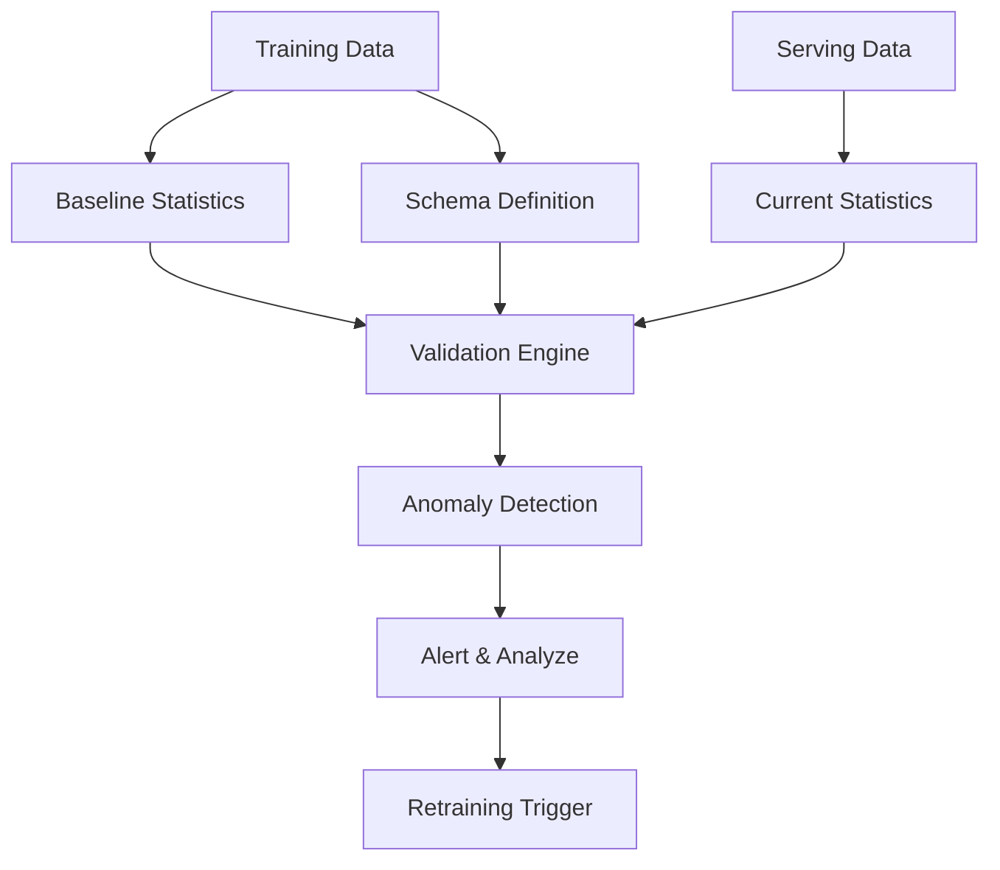

> "The only constant in life is change."
> <cite>— Heraclitus</cite>

---

<span class="at-kicker">ML Fundamentals · Model Monitoring</span>

# Concept Drift & Data Drift

<p class="at-lead">
Concept drift occurs when the statistical properties of the model's target variable change over time — the relationship between inputs and outputs shifts. Data drift occurs when the input feature distribution changes while the target relationship remains constant. Together they are the leading causes of model degradation in production ML systems.
</p>

<span class="at-stat">P(y|x)</span> changes &nbsp;·&nbsp; <span class="at-stat">P(x)</span> shifts &nbsp;·&nbsp; <span class="at-stat">4 types</span> of drift &nbsp;·&nbsp; <span class="at-mark">the silent killer of production models</span>

<span class="at-kicker">Understanding Drift</span>

## Concept Drift

> In concept drift we have to correct the target data `y`

**Concept drift** occurs when the statistical properties of the model output (target value) change over time. The patterns the model learned no longer hold because the underlying relationship between inputs and outputs has evolved.

> [!info] When concept drift occurs
> The model's learned decision boundary becomes obsolete because $P(y|x)$ has changed — the same input features now map to different outputs.

### Real-world examples

| Scenario | What changed | Impact on model |
|----------|-----------|-----------------|
| **Competitors launch new products** | Consumer choices increase, behavior shifts | Sales forecasting models need retraining |
| **Macroeconomic conditions evolve** | Credit risk is redefined as borrowers default | Credit scoring models must adapt |
| **Mechanical wear of equipment** | Process parameters produce different patterns | Quality prediction models degrade |
| **Fashion trends shift** | Customer preferences change seasonally | Recommendation systems become stale |
| **Business expands to new geos** | Regional differences in behavior emerge | Global models need localization |

### Types of concept drift

> [!grid|cols2]
>
>> [!card|section]
>> ###### SUDDEN DRIFT
>> ### *Sudden* Drift
>> Abrupt change occurring at a specific point in time. Often caused by external shocks, policy changes, or system updates. Requires immediate model retraining.
>
>> [!card|section]
>> ###### GRADUAL DRIFT
>> ### *Gradual* Drift
>> Slow, steady evolution of the concept over an extended period. Trends and seasonality often cause gradual drift. Detected through continuous monitoring.
>
>> [!card|section]
>> ###### INCREMENTAL DRIFT
>> ### *Incremental* Drift
>> Step-wise changes occurring at intervals. Each step is small but cumulative effect is significant. Common in systems with periodic updates.
>
>> [!card|section]
>> ###### RECURRING DRIFT
>> ### *Recurring* Drift
>> Cyclical patterns that return to previous states. Seasonal effects and cyclical business patterns. Models may need to incorporate time-based features.

---

## Data Drift

> In Data Drift, we have to correct for `x`, the predictor

**Data drift** (also called **feature drift**, **population drift**, or **covariate shift**) occurs when the underlying input data distribution shifts. The model sees inputs it was never trained on.

$$P_{train}(x) \neq P_{serve}(x)$$

> [!warning] Data drift degrades performance
> Models trained on a specific dataset will no longer give correct results when data distribution changes. Even if $P(y|x)$ is unchanged, the model may perform poorly on out-of-distribution inputs.

### Common causes of data drift

| Category | Examples |
|----------|----------|
| **Trend & Seasonality** | Time-based patterns in features |
| **Feature distribution changes** | Mean, variance shifts in inputs |
| **Relative importance shifts** | Feature correlations change |
| **World changes** | Fashion, competitors, scope expansion |
| **Technical changes** | Sensor upgrades, software updates |

### Example: Computer vision drift

Consider a CV model trained on mobile photos from 1.2 MP cameras:

1. **Training era**: Low-resolution images, specific noise patterns
2. **Hardware evolution**: New phones have 48+ MP cameras
3. **Data drift**: Higher resolution, different quality characteristics
4. **Result**: Model performance degrades on modern images

---

## Training-Serving Skew

**Training-serving skew** occurs when training data and production data differ drastically. This is a severe form of data drift that leads to major performance issues.

> [!example] Sources of training-serving skew
> - Different preprocessing pipelines between training and serving
> - Data leakage in training features not available at serving time
> - Different data sources with incompatible schemas
> - Time-based features computed differently

---

<span class="at-kicker">Detection Methods</span>

## Drift Detection Techniques

### Statistical methods

| Method | Best for | Description |
|--------|----------|-------------|
| **Population Stability Index (PSI)** | Overall distribution shift | Measures how much a distribution has shifted between two samples |
| **Kolmogorov-Smirnov Test** | Continuous features | Non-parametric test comparing two distributions |
| **Chi-Squared Test** | Categorical features | Tests if observed frequencies match expected |
| **Page-Hinkley Test** | Sequential detection | Online change detection with cumulative sum |
| **Wasserstein Distance** | Multivariate drift | Earth mover's distance between distributions |
| **Maximum Mean Discrepancy (MMD)** | Kernel-based detection | Tests if two samples come from same distribution |

### PSI interpretation

| PSI Value | Interpretation | Action |
|-----------|----------------|--------|
| < 0.1 | Negligible drift | No action needed |
| 0.1 – 0.25 | Moderate drift | Monitor closely |
| > 0.25 | Significant drift | Investigate and retrain |

### Python implementation sketch

```python
from scipy import stats
import numpy as np

def detect_ks_drift(reference, current, threshold=0.05):
    """Kolmogorov-Smirnov test for drift detection."""
    statistic, p_value = stats.ks_2samp(reference, current)
    return p_value < threshold  # True if drift detected

def calculate_psi(expected, actual, buckets=10):
    """Calculate Population Stability Index."""
    def scale_range(input, min_val, max_val):
        return (input - min_val) / (max_val - min_val)
    
    breakpoints = np.linspace(0, 1, buckets + 1)
    expected_scaled = scale_range(expected, min(expected), max(expected))
    actual_scaled = scale_range(actual, min(actual), max(actual))
    
    expected_counts, _ = np.histogram(expected_scaled, breakpoints)
    actual_counts, _ = np.histogram(actual_scaled, breakpoints)
    
    # Add small constant to avoid division by zero
    expected_percents = expected_counts / len(expected) + 1e-10
    actual_percents = actual_counts / len(actual) + 1e-10
    
    psi = np.sum((expected_percents - actual_percents) 
                 * np.log(expected_percents / actual_percents))
    return psi
```

---

<span class="at-kicker">Monitoring Strategies</span>

## Production Monitoring Framework

> [!grid|cols3]
>
>> [!card|section]
>> ###### INPUT MONITORING
>> ### Input *Monitoring*
>> Track feature distributions in real-time. Alert on PSI, KS statistic, or custom thresholds. Monitor for missing values, range violations, and schema changes.
>
>> [!card|section]
>> ###### OUTPUT MONITORING
>> ### Output *Monitoring*
>> Monitor prediction distributions. Detect shifts in class probabilities, regression outputs, or ranking scores. Compare to training-time distributions.
>
>> [!card|section]
>> ###### PERFORMANCE MONITORING
>> ### Performance *Monitoring*
>> When ground truth is available, track accuracy, precision, recall, or business metrics. The ultimate indicator of drift impact.

### Drift detection design



### Best practices

> [!tip] Drift management guidelines
> 1. **Establish baselines** — Compute statistics on clean training data
> 2. **Set appropriate thresholds** — Balance false positives vs. missed drift
> 3. **Monitor at multiple levels** — Individual features, feature groups, and global
> 4. **Track business metrics** — Model performance is the ground truth
> 5. **Automate retraining** — Trigger pipelines when drift exceeds thresholds
> 6. **Version everything** — Data, models, and monitoring configurations

---

<span class="at-kicker">Mathematical Formulation</span>

## Formal Definitions

### Dataset shift taxonomy

| Type | Mathematical definition | Description |
|------|------------------------|-------------|
| **Dataset Shift** | $P_{train}(y, x) \neq P_{serve}(y,x)$ | Any joint distribution change |
| **Data Drift** | $P_{train}(x) \neq P_{serve}(x)$ | Covariate shift; feature distribution changes |
| **Concept Drift** | $P_{train}(y|x) \neq P_{serve}(y|x)$ | Conditional changes; same $P(x)$ but different $P(y|x)$ |

### Drift detection as hypothesis testing

$$\begin{aligned}
H_0 &: P_{ref} = P_{curr} \quad \text{(no drift)} \\
H_1 &: P_{ref} \neq P_{curr} \quad \text{(drift detected)}
\end{aligned}$$

---

<span class="at-kicker">Interview Questions</span>

## Interview Questions

1. What is the difference between concept drift and data drift?
2. How does $P(y|x)$ change in concept drift vs. $P(x)$ in data drift?
3. What are the four types of concept drift? Give examples of each.
4. When would you use PSI vs. KS test for drift detection?
5. How do you handle training-serving skew in production?
6. What monitoring signals would trigger a model retraining?
7. How would you detect drift in high-dimensional feature spaces?

---

## Related pages

> [!grid]
>
>> [!card] MLOps Lifecycle
>> [[../mlops/mlops|MLOps]] · [[../mlops/model-lifecycle|Model Lifecycle]] · [[../mlops/deployment-patterns|Deployment Patterns]]
>
>> [!card] Model Monitoring
>> [[../mlops/monitoring|ML Monitoring]] · [[../mlops/model-lifecycle|Model Degradation]]
>
>> [!card] Statistical Methods
>> [[../statistics/hypothesis-testing|Hypothesis Testing]] · [[../statistics/probability-distributions|Distributions]]
>
>> [!card] Production Systems
>> [[../../cloud/gcp/vertex-ai|Vertex AI]] · [[../../cloud/aws/sagemaker|SageMaker]]
