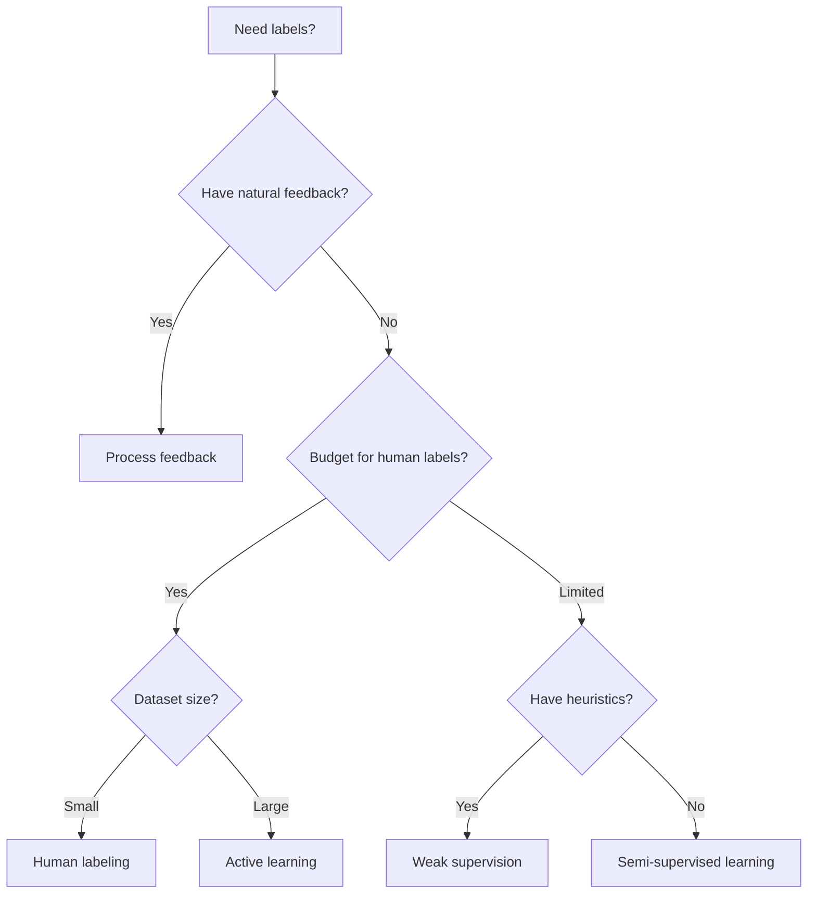

> "Data is the new oil, but unlike oil, data is not valuable in its raw state. It must be refined — and labels are the refinery."
> <cite>— Clive Humby (paraphrased)</cite>

---

<span class="at-kicker">MLOps · Data Quality</span>

# Data Labeling

<p class="at-lead">
Data labeling is the process of assigning ground-truth annotations to raw data so that machine
learning models can learn from examples. In supervised learning, the quality and quantity of
labels directly determine model performance. Yet labeling is expensive, slow, and error-prone.
Modern pipelines combine human expertise, automated heuristics, and semi-supervised techniques
to scale annotation without sacrificing quality.
</p>

<span class="at-stat">human-in-the-loop</span> &nbsp;·&nbsp; <span class="at-stat">weak supervision</span> &nbsp;·&nbsp; <span class="at-stat">active learning</span> &nbsp;·&nbsp; <span class="at-mark">labels are the bottleneck</span>

<span class="at-kicker">Labeling Strategies</span>

## The Labeling Spectrum

| Strategy | Effort | Quality | Best For |
|----------|--------|---------|----------|
| **Process feedback** | Zero | High | Systems with natural feedback loops (clicks, purchases, ratings) |
| **Human labeling** | High | Highest | Critical decisions, safety, small datasets |
| **Semi-supervised** | Medium | Medium | Large pools of unlabeled data with a small labeled seed |
| **Active learning** | Medium | High | Expensive experts; intelligently select what to label |
| **Weak supervision** | Low | Noisy (denoisable) | Rapid prototyping, domain-heuristic abundance |

---

<span class="at-kicker">Process Feedback</span>

## Direct Labeling from Systems

When an application naturally generates outcomes, labels emerge without explicit human effort:

- **E-commerce**: Purchase = positive label for recommendation; cart abandonment = negative signal
- **Search engines**: Click-through rate (CTR) and dwell time indicate relevance
- **Autonomous vehicles**: Human takeover events flag uncertain scenarios

**Advantages**
- Continuous, automatic label creation
- Labels evolve with real-world behaviour
- Captures strong, behaviourally-grounded signals

**Risks**
- **Delayed feedback**: Loan defaults take months to materialise
- **Noisy feedback**: A click does not always mean satisfaction
- **Selection bias**: Users only see recommendations the system already serves

---

<span class="at-kicker">Human Labeling</span>

## Expert Annotations

The gold standard for accuracy, but expensive and slow. Best practices:

### Label consistency

> [!info] Consistency is more important than speed
> Two labelers who disagree 30% of the time create a ceiling on model performance. Standardisation
> matters more than throughput.

**Ensuring agreement**:
- **Multiple labelers** per sample + majority voting
- **Borderline class** for ambiguous cases rather than forced choices
- **MLE review** of disagreements to establish ground truth
- **Standardised guidelines** with examples and edge cases
- **Merge classes** when two categories are semantically indistinguishable

---

<span class="at-kicker">Semi-Supervised Labeling</span>

## Learning from Unlabeled Data

**Semi-supervised learning** combines a small labeled dataset with a large unlabeled one. The model
propagates label information from labeled to unlabeled examples based on similarity.

### Label propagation

A graph-based approach where data points are nodes and edges represent similarity:

1. Build a **similarity graph** (k-nearest neighbours or RBF kernel)
2. Label known nodes
3. Let labels **diffuse** across the graph until convergence
4. Unlabeled nodes adopt the majority label of their neighbours

> [!example] Label propagation in scikit-learn
> ```python
> from sklearn.semi_supervised import LabelPropagation
>
> # Labels: -1 means unlabeled
> labels = np.array([0, 1, -1, -1, -1, 0, 1])
>
> lp = LabelPropagation(kernel='knn', n_neighbors=7)
> lp.fit(X, labels)
> predicted_labels = lp.transduction_
> ```

**When to use**: Medical imaging (100 labeled scans + 10,000 unlabeled), web classification
(large crawl, small editorial set).

---

<span class="at-kicker">Active Learning</span>

## Intelligent Label Selection

**Active learning** reduces labeling cost by asking the human to annotate only the most
informative samples — those the model is most uncertain about.

### Query strategies

| Strategy | Selection criterion | Intuition |
|----------|---------------------|-----------|
| **Uncertainty sampling** | Lowest prediction confidence | Label what the model is unsure about |
| **Entropy sampling** | Highest class entropy | Label samples with most uniform probability distribution |
| **Query-by-committee** | Highest disagreement among ensemble | Label where experts disagree |
| **Expected model change** | Largest gradient update | Label what would most change the model |

> [!tip] Active learning loop
> 1. Train model on current labeled set
> 2. Score unlabeled pool with query strategy
> 3. Label top-K most informative samples
> 4. Retrain and repeat
>
> Often achieves 80% of full-dataset performance with 20% of labels.

See [[active-learning|Active Learning]] for a deeper dive.

---

<span class="at-kicker">Weak Supervision</span>

## Heuristic Labeling at Scale

**Weak supervision** applies noisy, heuristic rules to label large unlabeled datasets quickly.
Unlike human labels, these are imperfect — but modern frameworks can **denoise** them.

### Labeling functions

Each function is a heuristic that votes on a sample's label:

```python
# Example: Product review sentiment
@labeling_function()
def keyword_positive(x):
    return POSITIVE if "excellent" in x.text else ABSTAIN

@labeling_function()
def keyword_negative(x):
    return NEGATIVE if "terrible" in x.text else ABSTAIN

@labeling_function()
def regex_price_complaint(x):
    return NEGATIVE if re.search(r"overpriced|expensive", x.text) else ABSTAIN
```

### The Snorkel framework

**Snorkel** combines multiple labeling functions into probabilistic labels:

1. **Label model**: Learns the accuracy and correlation of each function
2. **Generative model**: Aggregates votes into a single probabilistic label per sample
3. **Discriminative model**: Trains a standard classifier on the probabilistic labels

> [!info] Weak supervision workflow
> Write 10–50 labeling functions → Snorkel denoises them → Train a standard model on the
> generated labels. Often matches hand-labeled performance with a fraction of the cost.

**When to use**: Spam detection (regex rules), entity extraction (dictionary matching),
document classification (keyword heuristics).

---

<span class="at-kicker">Trade-offs</span>

## Choosing a Labeling Approach



| Approach | Label cost | Quality | Time to model |
|----------|------------|---------|---------------|
| Human only | $$$$ | Highest | Slowest |
| Active learning | $$$ | High | Medium |
| Semi-supervised | $$ | Medium | Fast |
| Weak supervision | $ | Medium (after denoising) | Fastest |
| Process feedback | $ | Variable | Continuous |

> [!warning] The labeling paradox
> The most valuable labels are often the hardest to obtain (rare diseases, edge cases,
adversarial examples). Budget your labeling effort toward these high-uncertainty regions
rather than easy majority-class examples.

## Interesting facts

- The ImageNet dataset (14M labeled images) was created by Amazon Mechanical Turk workers
  over 2.5 years at a cost of ~$10M. It catalysed the deep-learning revolution.
- Snorkel (Stanford, 2016) demonstrated that weakly supervised models can match hand-labeled
  models on biomedical and web tasks with 100x less human effort.
- In medical imaging, active learning can reduce radiologist annotation time by 60–80%
  while maintaining diagnostic accuracy.

## Interview questions

1. What is the difference between semi-supervised and weakly supervised learning?
2. How does active learning reduce annotation cost? What query strategy would you use for
   an imbalanced classification problem?
3. Describe the Snorkel pipeline: labeling functions, generative model, discriminative model.
4. What are the risks of using process feedback as implicit labels?
5. How would you handle label inconsistency among multiple human annotators?

## Related pages

> [!grid]
>
>> [!card] Learning Paradigms
>> [[supervised-learning|Supervised Learning]] · [[unsupervised-learning|Unsupervised Learning]] · [[active-learning|Active Learning]]
>
>> [!card] MLOps & Quality
>> [[data-cleaning|Data Cleaning]] · [[data-leakage|Data Leakage]] · [[model-monitoring|Model Monitoring]]
>
>> [!card] Production
>> [[mlops|MLOps]] · [[experiment-tracking|Experiment Tracking]] · [[cross-validation|Cross Validation]]
>
>> [!card] Concepts
>> [[bias-variance-tradeoff|Bias-Variance Tradeoff]] · [[evaluation-metrics|Evaluation Metrics]]
