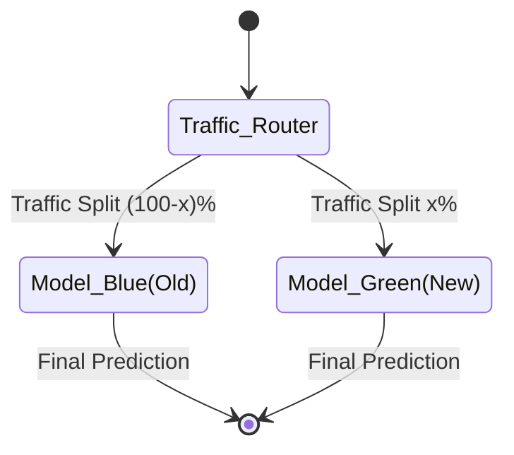
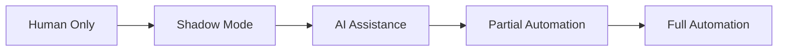

> "Deploying ML models is not like deploying software — the data changes, the world changes, and your model degrades silently."

---

<span class="at-kicker">MLOps · Deployment</span>

# ML Deployment Patterns

<p class="at-lead">
Deploying machine learning models to production requires strategies that minimize risk while enabling validation of model performance on real data. Five core patterns — Blue-Green, Canary, Shadow, Champion-Challenger, and Rolling — provide different trade-offs between safety, resource usage, and speed of deployment. Understanding when to use each is essential for production MLOps.
</p>

<span class="at-stat">5 patterns</span> &nbsp;·&nbsp; <span class="at-stat">gradual</span> rollout &nbsp;·&nbsp; <span class="at-stat">risk</span> mitigation &nbsp;·&nbsp; <span class="at-mark">safe model releases</span>

<span class="at-kicker">Pattern Overview</span>

## The Five Deployment Patterns

> [!grid|cols3]
>
>> [!card|hero dark spanfull]
>> ###### BLUE-GREEN
>> ### *Blue-Green*
>> Two identical environments; instant cutover
>> 
>> **Risk**: Low | **Complexity**: Medium | **Best for**: Critical systems
>
>> [!card|hero dark spanfull]
>> ###### CANARY
>> ### *Canary*
>> Gradual traffic shift to new version
>> 
>> **Risk**: Low | **Complexity**: Medium | **Best for**: Most ML use cases
>
>> [!card|hero dark spanfull]
>> ###### SHADOW
>> ### *Shadow*
>> New model runs alongside; no user impact
>> 
>> **Risk**: None | **Complexity**: High | **Best for**: Validation before release
>
>> [!card|hero dark spanfull]
>> ###### CHAMPION-CHALLENGER
>> ### *Champion-Challenger*
>> A/B testing for model comparison
>> 
>> **Risk**: Controlled | **Complexity**: Medium | **Best for**: Model selection
>
>> [!card|hero dark spanfull]
>> ###### ROLLING
>> ### *Rolling*
>> Incremental update across servers
>> 
>> **Risk**: Medium | **Complexity**: Low | **Best for**: Distributed systems

---

<span class="at-kicker">Detailed Patterns</span>

## 1. Blue-Green Deployment

Blue-Green deployment is an application release model that gradually transfers user traffic from a previous version (Blue) to a nearly identical new release (Green) — both running in production.



### How it works

| Phase | Blue (Old) | Green (New) | Traffic |
|-------|-----------|-------------|---------|
| **Initial** | Active | Idle | 100% → Blue |
| **Testing** | Active | Warm, tested | 100% → Blue |
| **Cutover** | Standby | Active | 100% → Green |
| **Rollback** | Can activate | Can deactivate | Instant switch back |

### Advantages

> [!tip] When to use Blue-Green
> - Instant rollback capability (zero downtime)
- Complete environment parity for final testing
- Critical systems where downtime is unacceptable

### Trade-offs

- **Resource cost**: Double infrastructure required
- **Data synchronization**: Shared databases must handle both versions
- **Complexity**: Traffic routing and state management

---

## 2. Canary Deployment

Canary deployments are a pattern for rolling out releases to a subset of users or servers. The idea is to first deploy the change to a small subset, test it, then gradually ramp up traffic.

> [!info] Canary concept
> Like the "canary in a coal mine" — a small group tests for danger before full deployment.

### Traffic progression

```
Time →
0%    5%     25%     50%     100%
│     │      │       │       │
▓▓▓▓▓▓▓▓▓▓▓▓▓▓▓▓▓▓▓▓▓▓▓▓▓▓▓▓▓▓▓▓  Blue (Old)
░░                              Green (New)
░░░░░░                          (5% test)
░░░░░░░░░░░░░░                  (25% ramp)
░░░░░░░░░░░░░░░░░░░░            (50% ramp)
░░░░░░░░░░░░░░░░░░░░░░░░░░░░░░  (100% complete)
```

### Canary for ML models

| Metric | Check | Action |
|--------|-------|--------|
| **Prediction distribution** | Compare to training | Halt if drift detected |
| **Latency** | P95, P99 | Rollback if SLA breached |
| **Error rate** | HTTP 5xx | Immediate rollback |
| **Business metrics** | Conversion, engagement | Gradual ramp based on KPIs |

### Decision criteria for ramping

```python
def should_promote_canary(metrics):
    if metrics.error_rate > 0.01:
        return False  # Rollback
    if metrics.latency_p99 > 100:
        return False  # Performance issue
    if metrics.prediction_drift > 0.1:
        return False  # Model behaving differently
    return True  # Safe to increase traffic
```

---

## 3. Shadow Deployment

In shadow deployment, the new model runs alongside the production model, processing real requests but **without affecting users**. Responses are logged for comparison but not returned.

```
User Request
     │
     ▼
┌─────────────┐
│  Production │ ──────┐
│    Model    │       │
└─────────────┘       │
     │                │
     ▼                ▼
 Response          Shadow Model
 (to user)            │
                       ▼
                 Log comparison
                 (for analysis)
```

### Shadow deployment flow

1. **Production model** serves users and returns responses
2. **Shadow model** receives same inputs, returns predictions to logs only
3. **Comparison** — Metrics computed: latency, prediction distribution, (if available) accuracy
4. **Decision** — Promote shadow to canary if validated

> [!example] When shadow helps
> - Validating a new model architecture before any user impact
- Testing infrastructure changes (new hardware, framework versions)
- Comparing model versions on identical real-world data

### Trade-offs

| Pros | Cons |
|------|------|
| Zero user risk | Double compute cost |
| Real data validation | Latency impact from parallel inference |
| Full comparison possible | Complex to implement (async required) |

---

## 4. Champion-Challenger

Champion-Challenger is a method that allows different approaches to testing operational decisions in production. Similar to A/B testing but specifically designed for model comparison.

### The setup

| Role | Description | Traffic |
|------|-------------|---------|
| **Champion** | Current best model | Majority (e.g., 90%) |
| **Challenger(s)** | New candidate models | Minority (e.g., 10% split) |

### Comparison methodology

$$Uplift = Performance_{Challenger} - Performance_{Champion}$$

If $Uplift > threshold$ for sustained period, Challenger becomes new Champion.

> [!info] Champion-Challenger vs A/B Testing
> - Champion-Challenger: Continuous, can have multiple challengers
> - A/B Testing: Fixed duration, usually binary comparison
> - Both: Statistical significance required for promotion

---

## 5. Rolling Deployment

In rolling deployment, if multiple servers exist, only one server is updated at a time. Old and new versions coexist during the transition.

```
Server 1    Server 2    Server 3    Server 4
   │           │           │           │
   ▼           ▼           ▼           ▼
┌─────┐     ┌─────┐     ┌─────┐     ┌─────┐
│ OLD │     │ OLD │     │ OLD │     │ OLD │  Start
└─────┘     └─────┘     └─────┘     └─────┘
   │           │           │           │
┌─────┐     ┌─────┐     ┌─────┐     ┌─────┐
│ NEW │     │ OLD │     │ OLD │     │ OLD │  Step 1
└─────┘     └─────┘     └─────┘     └─────┘
   │           │           │           │
┌─────┐     ┌─────┐     ┌─────┐     ┌─────┐
│ NEW │     │ NEW │     │ NEW │     │ OLD │  Step 3
└─────┘     └─────┘     └─────┘     └─────┘
   │           │           │           │
┌─────┐     ┌─────┐     ┌─────┐     ┌─────┐
│ NEW │     │ NEW │     │ NEW │     │ NEW │  Complete
└─────┘     └─────┘     └─────┘     └─────┘
```

### Best for

- Distributed systems with many identical instances
- Stateless services where version mixing is safe
- Gradual rollouts without complex routing infrastructure

---

<span class="at-kicker">Pattern Comparison</span>

## Choosing the Right Pattern

| Pattern | Risk Level | Infrastructure Cost | Rollback Speed | Best For |
|---------|-----------|-------------------|----------------|----------|
| **Blue-Green** | Low | High (2x) | Instant | Critical systems, compliance needs |
| **Canary** | Low | Medium | Fast (min) | Most ML deployments |
| **Shadow** | None | High (2x compute) | N/A | Validation before any release |
| **Champion-Challenger** | Controlled | Medium | Moderate | Continuous model improvement |
| **Rolling** | Medium | Low | Slow | Distributed, stateless services |

---

<span class="at-kicker">Best Practices</span>

## Deployment Checklist

> [!tip] Pre-deployment
> 1. Define rollback criteria (error rate, latency, drift thresholds)
> 2. Set up monitoring for both old and new versions
> 3. Prepare automated rollback procedures
> 4. Document expected behavior changes

> [!tip] During deployment
> 1. Monitor key metrics continuously
> 2. Have human on-call for intervention
> 3. Log all predictions for comparison
> 4. Be ready to halt traffic increase

> [!tip] Post-deployment
> 1. Compare metrics to baseline
> 2. Monitor for delayed issues (drift, feedback loops)
> 3. Document learnings for next deployment

---

<span class="at-kicker">Spectrum of Automation</span>

## Automation Maturity



| Level | Description | Example |
|-------|-------------|---------|
| **Human Only** | All decisions manual | Manual review of all predictions |
| **Shadow Mode** | Model runs parallel, human decides | Shadow deployment with daily review |
| **AI Assistance** | Model suggests, human approves | Recommendation systems with human override |
| **Partial Automation** | Automated for low-risk, human for high-risk | Auto-approve standard cases, flag edge cases |
| **Full Automation** | No human in the loop | Real-time bidding, fraud detection |

---

<span class="at-kicker">Interview Questions</span>

## Interview Questions

1. What is the difference between Blue-Green and Canary deployment?
2. When would you use Shadow deployment for an ML model?
3. How do you decide when to promote a Canary to full traffic?
4. What metrics would you monitor during a model deployment?
5. What is the trade-off with Champion-Challenger patterns?
6. When is Rolling deployment appropriate vs other patterns?
7. How would you handle a model that performs well in testing but poorly in canary?

---

## Related pages

> [!grid]
>
>> [!card] MLOps Core
>> [[mlops|MLOps Hub]] · [[ci-cd-ml|CI/CD for ML]] · [[model-lifecycle|Model Lifecycle]]
>
>> [!card] Monitoring
>> [[monitoring|ML Monitoring]] · [[../ml-fundamentals/concept-drift|Drift Detection]]
>
>> [!card] Experimentation
>> [[../statistics/multi-armed-bandits|Multi-Armed Bandits]] · [[../statistics/ab-testing|A/B Testing]]
>
>> [!card] Platforms
>> [[kubeflow|Kubeflow]] · [[../../cloud/gcp/vertex-ai|Vertex AI]]
