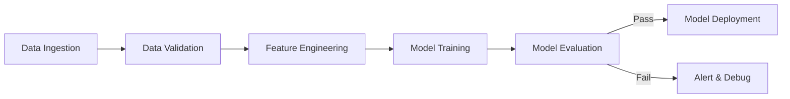

> [!infobox|right]
> # Kubeflow
> ###### MLOps Platform
> | | |
> | --- | --- |
> | **Developer** | Google |
> | **Type** | MLOps platform |
> | **Initial Release** | 2018 |
> | **License** | Apache 2.0 |
> | **Runs On** | Kubernetes |
> | **Website** | kubeflow.org |

---

> "Kubeflow is the Kubernetes native platform for machine learning workloads."

---

<span class="at-kicker">MLOps · Tools</span>

# Kubeflow

<p class="at-lead">
Kubeflow is a tool for orchestrating complicated ML workflows running on Kubernetes. Every step of a Kubeflow pipeline executes as a separate container, enabling reproducible, scalable, and portable machine learning pipelines. It is the front-runner in the open-source MLOps space because it leverages Kubernetes for resource management while providing ML-specific abstractions for training, tuning, and serving.
</p>

<span class="at-stat">Kubernetes-native</span> &nbsp;·&nbsp; <span class="at-stat">container-based</span> &nbsp;·&nbsp; <span class="at-stat">scalable</span> &nbsp;·&nbsp; <span class="at-mark">orchestrating ML on Kubernetes</span>

<span class="at-kicker">Architecture</span>

## Kubeflow Components

> [!grid|cols3]
>
>> [!card|section]
>> ###### PIPELINES
>> ### Kubeflow *Pipelines*
>> Orchestrate end-to-end ML workflows as DAGs of containerized steps. Define pipelines in Python, execute on Kubernetes, track experiments and artifacts.
>
>> [!card|section]
>> ###### NOTEBOOKS
>> ### Jupyter *Notebooks*
>> Managed notebook servers with custom images, resource configurations, and persistent storage. Seamlessly transition from experimentation to production.
>
>> [!card|section]
>> ###### TRAINING
>> ### Distributed *Training*
>> TFJob, PyTorchJob, MPIJob, XGBoostJob operators for distributed training. Automatic resource scheduling and elastic scaling.
>
>> [!card|section]
>> ###### KATIB
>> ### Hyperparameter *Tuning*
>> Automated hyperparameter optimization with Bayesian optimization, random search, and early stopping. Katib integrates with training jobs.
>
>> [!card|section]
>> ###### SERVING
>> ### Model *Serving*
>> KFServing (now KServe) for serverless model inference. Scale-to-zero, canary rollouts, and A/B testing built-in.
>
>> [!card|section]
>> ###### FEATURE STORE
>> ### Feature *Store*
>> Feast integration for feature storage and serving. Consistent features between training and inference.

---

<span class="at-kicker">Kubeflow Pipelines</span>

## Pipeline Architecture

**Kubeflow Pipelines (KFP)** is a description of an ML workflow with all its components. Each component is responsible for different steps in the ML process — data processing, transformation, model training, validation.

### Pipeline structure



### Key capabilities

| Feature | Description |
|---------|-------------|
| **Python SDK** | Define pipelines programmatically |
| **Container-based** | Each step is a container microservice |
| **Artifact tracking** | Automatic input/output artifact lineage |
| **Experiment management** | Compare runs, track metrics |
| **Recurring runs** | Schedule pipelines on cron |
| **Caching** | Skip unchanged steps for efficiency |

### Pipeline component example

```python
from kfp import dsl
from kfp.dsl import component

@component(
    base_image="python:3.9",
    packages_to_install=["pandas", "scikit-learn"]
)
def preprocess_data(input_path: str, output_path: str):
    import pandas as pd
    from sklearn.preprocessing import StandardScaler
    
    df = pd.read_csv(input_path)
    scaler = StandardScaler()
    df_scaled = scaler.fit_transform(df)
    pd.DataFrame(df_scaled).to_csv(output_path, index=False)

@dsl.pipeline(
    name='ML Training Pipeline',
    description='End-to-end ML workflow'
)
def ml_pipeline(input_data: str):
    preprocess_task = preprocess_data(
        input_path=input_data,
        output_path='/tmp/processed.csv'
    )
    # ... more steps
```

---

<span class="at-kicker">Why Kubeflow</span>

## Why Kubeflow Leads MLOps

> [!info] Kubernetes advantage
> Kubeflow is the front-runner in the MLOps space because it:
> 1. Leverages Kubernetes for resource orchestration
> 2. Provides ML-specific abstractions on top of K8s
> 3. Enables portability across cloud providers
> 4. Scales from single-node experiments to distributed training

### Comparison with alternatives

| Platform | Deployment | Best For | Vendor |
|----------|-----------|----------|--------|
| **Kubeflow** | Self-hosted, K8s | Full control, multi-cloud | Open source |
| **Vertex AI** | Managed GCP | GCP-native, minimal ops | Google |
| **SageMaker** | Managed AWS | AWS-native, broad features | Amazon |
| **Azure ML** | Managed Azure | Azure-native, enterprise | Microsoft |
| **MLflow** | Self-hosted | Experiment tracking | Databricks |

---

<span class="at-kicker">Key Features</span>

## Core Capabilities

> [!grid|cols2]
>
>> [!card|section]
>> ###### REPRODUCIBILITY
>> ### *Reproducible* Pipelines
>> Container-based steps ensure identical execution environments. Version-controlled pipeline definitions with artifact lineage tracking.
>
>> [!card|section]
>> ###### SCALABILITY
>> ### *Scalable* Execution
>> Kubernetes handles resource scheduling. Scale from single-node to distributed training across hundreds of GPUs.
>
>> [!card|section]
>> ###### PORTABILITY
>> ### *Portable* Workloads
>> Run on any Kubernetes cluster — on-premise, GKE, EKS, AKS, or Minikube for local development.
>
>> [!card|section]
>> ###### EXTENSIBILITY
>> ### *Extensible* Design
>> Custom components, custom images, integration with any ML framework. Plugin architecture for new capabilities.

---

<span class="at-kicker">When to Use</span>

## Use Cases

| Scenario | Kubeflow Fit |
|----------|--------------|
| **Multi-cloud strategy** | Excellent — portable across K8s |
| **On-premise ML** | Excellent — brings cloud patterns on-prem |
| **GCP-native** | Good, but Vertex AI more integrated |
| **Small team, quick start** | Challenging — requires K8s expertise |
| **Enterprise compliance** | Good — self-hosted, full control |

---

<span class="at-kicker">Best Practices</span>

## Working with Kubeflow

> [!tip] Pipeline design
> 1. Keep components focused and single-purpose
> 2. Use artifact passing between steps
> 3. Enable caching for expensive operations
> 4. Version container images explicitly
> 5. Use resource requests/limits appropriately

> [!tip] Development workflow
> 1. Start with local pipeline development
> 2. Test on small data subsets
> 3. Use recurring runs for production workloads
> 4. Monitor pipeline execution in UI
> 5. Track metrics and artifacts for comparison

---

<span class="at-kicker">Interview Questions</span>

## Interview Questions

1. What is Kubeflow and what problem does it solve?
2. How does Kubeflow Pipelines differ from Airflow for ML?
3. What are the advantages of container-based pipeline steps?
4. When would you choose Kubeflow over managed alternatives?
5. How does Kubeflow leverage Kubernetes for ML workloads?
6. What is the difference between a pipeline and a component in KFP?
7. How would you handle secrets and credentials in Kubeflow pipelines?

---

## Related pages

> [!grid]
>
>> [!card] MLOps Platform
>> [[mlops|MLOps Hub]] · [[../../cloud/gcp/vertex-ai|Vertex AI]] · [[../../cloud/aws/sagemaker|SageMaker]]
>
>> [!card] Infrastructure
>> [[../../devops/kubernetes|Kubernetes]] · [[../../devops/docker|Docker]] · [[../../cloud/gcp/gke|GKE]]
>
>> [!card] Pipelines
>> [[ci-cd-ml|CI/CD for ML]] · [[deployment-patterns|Deployment Patterns]]
>
>> [!card] Experimentation
>> [[../../data-engineering/airflow|Airflow]] · [[../../data-engineering/prefect|Prefect]]
