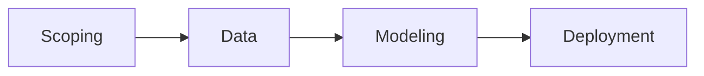
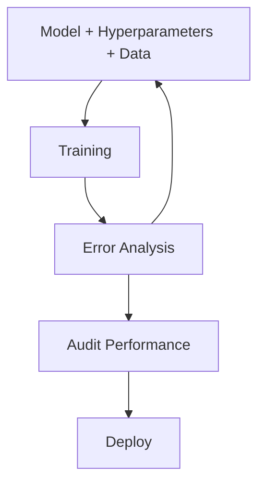

> "MLOps is to ML what DevOps is to software engineering."

---

<span class="at-kicker">MLOps · ML Platform</span>

# MLOps

<p class="at-lead">
MLOps comprises a set of tools and principles to support progress through the machine learning project lifecycle. It enables teams to build integrated ML systems, operate them continuously in production, handle changing data, and optimize compute resources — bridging the gap between data science experimentation and production-grade ML engineering.
</p>

<span class="at-stat">4 phases</span> &nbsp;·&nbsp; <span class="at-stat">CI/CD</span> &nbsp;·&nbsp; <span class="at-stat">monitoring</span> &nbsp;·&nbsp; <span class="at-mark">production ML at scale</span>

<span class="at-kicker">MLOps Hierarchy of Needs</span>

## The Foundation Stack

```
         ┌─────────────────┐
         │    MLOps        │  ← ML-specific workflows
         ├─────────────────┤
         │ Platform Auto.  │  ← Infrastructure abstraction
         ├─────────────────┤
         │  Data Auto.     │  ← Data pipelines, validation
         ├─────────────────┤
         │    DevOps       │  ← CI/CD, containers, infra
         └─────────────────┘
```

| Layer | Purpose | Key Technologies |
|-------|---------|-------------------|
| **DevOps** | Infrastructure, deployment | Docker, Kubernetes, CI/CD |
| **Data Automation** | Data pipelines, quality | Airflow, dbt, Great Expectations |
| **Platform Automation** | ML infrastructure | Feature stores, model registries |
| **MLOps** | ML-specific workflows | Kubeflow, MLflow, TFX |

---

<span class="at-kicker">ML Lifecycle</span>

## The Four Phases



> [!grid|cols2]
>
>> [!card|hero dark spanfull]
>> ###### SCOPING
>> ### 1. *Scoping*
>> **Define the problem and establish baseline.**
>> 
>> - Identification of the problem statement
>> - Decide key metrics (accuracy, latency, throughput)
>> - Establish baselines via:
>>   - Human-level performance comparison
>>   - Literature search for state-of-the-art
>>   - Quick-and-dirty implementation
>>   - Performance of older system
>
>> [!card|hero dark spanfull]
>> ###### DATA
>> ### 2. *Data*
>> **Define, label, and organize data.**
>> 
>> - Data collection and ingestion
>> - Data formatting and validation
>> - Feature engineering and extraction
>> - Feature selection
>> - Data provenance and lineage tracking
>> - Data-centric approach: focus on data quality
>
>> [!card|hero dark spanfull]
>> ###### MODELING
>> ### 3. *Modeling*
>> **Select, train, and validate models.**
>> 
>> - Algorithm selection
>> - Hyperparameter tuning
>> - Data quality verification
>> - Error analysis and audit
>> - Iterate: training → error analysis → refinement
>> 
>> Focus on hyperparameters and data over algorithm choice.
>
>> [!card|hero dark spanfull]
>> ###### DEPLOYMENT
>> ### 4. *Deployment*
>> **Deploy, monitor, and maintain.**
>> 
>> - Production deployment (real-time or batch)
>> - Handle concept drift and data drift
>> - Experiment tracking
>> - Model monitoring and alerting
>> - Retraining pipelines

---

<span class="at-kicker">Challenges in Production ML</span>

## Production-Grade ML Difficulties

> [!grid|cols2]
>
>> [!card|section]
>> ###### INTEGRATION
>> ### Build Integrated *Systems*
>> ML models don't exist in isolation — they require data pipelines, feature stores, model serving infrastructure, monitoring, and feedback loops. Integration complexity scales with organizational size.
>
>> [!card|section]
>> ###### OPERATIONS
>> ### Operate *Continuously*
>> Unlike batch software deployments, ML systems require constant monitoring for drift, degradation, and data quality issues. The world changes; models must adapt.
>
>> [!card|section]
>> ###### DATA
>> ### Handle Changing *Data*
>> [[../ml-fundamentals/concept-drift|Concept drift]] and [[../ml-fundamentals/concept-drift|data drift]] are constant threats. Data pipelines break. Schemas evolve. Monitoring must catch these before they impact users.
>
>> [!card|section]
>> ###### COST
>> ### Optimize *Resources*
>> Training large models is expensive. Inference at scale requires careful resource management. Auto-scaling, model compression, and efficient serving are critical.

---

<span class="at-kicker">Approaches</span>

## Data-Centric vs Model-Centric

| Approach | Focus | When to Use |
|----------|-------|-------------|
| **Data-Centric** | Improve data quality, consistency, labeling | When baseline model is adequate but data is noisy |
| **Model-Centric** | Improve architecture, hyperparameters, ensembles | When data is clean but model capacity limits performance |

> [!tip] Modern MLOps wisdom
> Focus more on hyperparameters and data over algorithm choice. A well-tuned simple model on quality data often beats a complex model on messy data.

---

<span class="at-kicker">Error Analysis</span>

## The Modeling Loop



### Error analysis framework

1. **Identify improvement areas** — Where can system performance improve?
2. **Prioritize** — Which changes give the best gains?
3. **Address skewed data** — Handle class imbalance appropriately
4. **Develop baselines** — Put complex models in context

### Audit framework

> [!info] Fairness and robustness auditing
> 1. Identify ways a system may go wrong (different demographics, edge cases)
> 2. Establish metrics to assess performance on appropriate data slices
> 3. Ensure model is fair and consistent across subgroups

---

<span class="at-kicker">Requirements & KPIs</span>

## Qualitative Requirements

### The 5 W's + H

| Question | Considerations |
|----------|---------------|
| **Who** | Users, developers, stakeholders |
| **What** | System capabilities, main features |
| **Why** | Why is the system needed? |
| **When** | User needs timeline, developer capacity |
| **How** | System architecture, scale (users, data volume) |

### Roles & Personas

- **Roles**: Specific parts users can play
- **Personas**: Built on roles to understand user journeys

### KPI Categories

| Business KPIs | Software KPIs |
|--------------|---------------|
| Return on Investment (ROI) | Page Views |
| Earnings before interest/taxes (EBIT) | User Registration |
| Employee Turnover | Clickthrough Rate |
| Customer Churn | Session Duration |

> [!warning] KPIs ≠ Goals
> KPIs are decided based on goals. Example: Goal = increase turnover; KPI = conversion percentage.

---

<span class="at-kicker">ML Pipelines</span>

## Pipeline Infrastructure

**ML pipelines** are infrastructure for automating, monitoring, and maintaining model training and deployment end-to-end.

### Characteristics

- Usually **DAGs** (Directed Acyclic Graphs)
- Encapsulate the full ML lifecycle
- Enable reproducibility and versioning

> [!example] TFX — TensorFlow Extended
> Google's production ML platform for deploying pipelines with components for data validation, transform, model training, evaluation, and serving.

### Pipeline components

| Component | Purpose |
|-----------|---------|
| **Data ingestion** | Extract data from sources |
| **Data validation** | Check for drift, anomalies, schema changes |
| **Data transformation** | Feature engineering, preprocessing |
| **Trainer** | Model training with experiment tracking |
| **Tuner** | Hyperparameter optimization |
| **Evaluator** | Model validation against baseline |
| **Pusher** | Deploy approved models to serving |

---

<span class="at-kicker">Maturity Levels</span>

## MLOps Maturity Model

| Level | Characteristics | Automation |
|-------|-----------------|------------|
| **1. Manual** | All steps manual, ad-hoc | None |
| **2. DevOps** | Automated CI/CD for code | Training, deployment manual |
| **3. Automated Training** | Automated training pipeline | Data → model automated |
| **4. Automated Operations** | Full CI/CD/CT/CM | End-to-end automated |
| **5. Full MLOps** | Continuous monitoring, automatic retraining | Self-healing systems |

---

<span class="at-kicker">Interview Questions</span>

## Interview Questions

1. What are the four phases of the ML lifecycle?
2. What is the difference between data-centric and model-centric ML?
3. What are the main challenges in production-grade ML?
4. How do you establish a baseline for a new ML project?
5. What is an ML pipeline and why does it matter?
6. What are the KPI categories for ML projects?
7. How would you approach error analysis in modeling?

---

## Related pages

> [!grid]
>
>> [!card] Deployment
>> [[deployment-patterns|Deployment Patterns]] · [[ci-cd-ml|CI/CD for ML]] · [[model-lifecycle|Model Lifecycle]]
>
>> [!card] Monitoring
>> [[monitoring|ML Monitoring]] · [[../ml-fundamentals/concept-drift|Drift Detection]]
>
>> [!card] Platforms
>> [[kubeflow|Kubeflow]] · [[../../cloud/gcp/vertex-ai|Vertex AI]] · [[../../cloud/aws/sagemaker|SageMaker]]
>
>> [!card] Foundations
>> [[devops-sre|CI/CD]] · [[../../data-engineering/pipelines|Data Pipelines]] · [[../ml-fundamentals/evaluation-metrics|Evaluation]]
