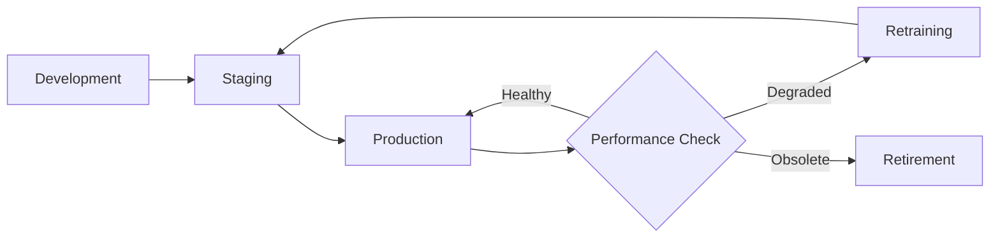

> "All models are wrong, but some are useful — until they're not."
> <cite>— Adapted from George Box</cite>

---

<span class="at-kicker">MLOps · Model Management</span>

# Model Lifecycle Management

<p class="at-lead">
Machine learning models degrade over time — data changes, the world changes, and patterns the model learned no longer hold. Model lifecycle management covers detecting degradation, deciding when to scale model complexity, and orchestrating the full journey from training to retirement. Understanding slow problems (drift) and fast problems (system failures) is essential for sustainable production ML.
</p>

<span class="at-stat">degradation</span> &nbsp;·&nbsp; <span class="at-stat">scaling</span> &nbsp;·&nbsp; <span class="at-stat">refresh</span> &nbsp;·&nbsp; <span class="at-mark">managing model entropy</span>

<span class="at-kicker">Model Degradation</span>

## Types of Degradation

Model degradation comes in two forms:

> [!grid|cols2]
>
>> [!card|hero dark spanfull]
>> ###### SLOW PROBLEMS
>> ### *Slow* Problems
>> Gradual performance decline over time
>> 
>> **Causes**:
>> - [[../ml-fundamentals/concept-drift|Concept drift]] — $P(y|x)$ changes
>> - [[../ml-fundamentals/concept-drift|Data drift]] — $P(x)$ changes
>> - Trend and seasonality shifts
>> - Feature distribution changes
>> - Relative feature importance changes
>
>> [!card|hero dark spanfull]
>> ###### FAST PROBLEMS
>> ### *Fast* Problems
>> Sudden, acute performance drops
>> 
>> **Causes**:
>> - Bad sensor/camera data
>> - Bad software updates
>> - Network connectivity loss
>> - Bad credentials or auth failures
>> - Moved or disabled sensors

---

## Causes of Slow Degradation

### Data changes

| Category | Examples | Detection |
|----------|----------|-----------|
| **Trend & Seasonality** | Economic cycles, weather patterns | Time-series analysis |
| **Feature distribution changes** | User demographics shift | PSI, KS test |
| **Feature importance changes** | New product features dominate | SHAP value tracking |

### World changes

| Change | Impact | Example |
|--------|--------|---------|
| **Fashion change** | Consumer preferences evolve | Fashion retail models |
| **Scope/process change** | Business operations shift | Supply chain optimization |
| **Competitor change** | Market dynamics alter | Pricing models |
| **Geographic expansion** | New regions with different patterns | Global recommendation systems |

---

## Causes of Fast Degradation

### Data collection problems

| Issue | Symptom | Response |
|-------|---------|----------|
| **Bad sensor/camera** | Missing or corrupted features | Failover to redundant sources |
| **Bad log data** | Schema changes, parsing errors | Schema validation, circuit breakers |
| **Disabled sensors** | Feature not available | Default value strategies, model fallback |

### Systems problems

| Issue | Symptom | Response |
|-------|---------|----------|
| **Bad software update** | Sudden prediction changes | Rollback, blue-green deployment |
| **Network loss** | Timeout errors, failed requests | Retry logic, cached predictions |
| **Bad credentials** | Auth failures | Automated credential refresh |
| **System down** | Complete outage | Circuit breaker, default responses |

---

<span class="at-kicker">Model Scaling</span>

## When to Scale Models

**Model scaling** refers to the decision of increasing model size or complexity for better accuracy.

### Scaling dimensions

| Dimension | Scale Up | Trade-off |
|-----------|----------|-----------|
| **Parameters** | More layers, wider layers | Accuracy ↑, Inference cost ↑ |
| **Data** | More training examples | Generalization ↑, Training cost ↑ |
| **Features** | Richer feature set | Signal ↑, Complexity ↑ |
| **Ensemble** | Multiple models combined | Accuracy ↑, Latency ↑ |

### When to scale

> [!info] Scaling decision criteria
> Scale up when:
> - Current model is underfitting (high bias)
> - Error analysis shows model capacity limits performance
> - Business impact justifies increased inference cost
> - Latency requirements can accommodate larger model

> [!warning] When NOT to scale
> - Overfitting is the problem (add regularization instead)
> - Data quality is the issue (fix data first)
> - Inference cost would exceed value generated
> - Latency SLAs would be violated

### Scaling strategies

| Approach | Method | Use Case |
|----------|--------|----------|
| **Horizontal** | Ensemble, model soup | High-stakes predictions |
| **Vertical** | Deeper/wider architecture | Complex pattern learning |
| **Distillation** | Teacher-student training | Maintain accuracy, reduce inference cost |
| **Pruning** | Remove redundant weights | Reduce size with minimal accuracy loss |
| **Quantization** | Lower precision weights | Faster inference, lower memory |

---

<span class="at-kicker">Lifecycle Stages</span>

## Model Lifecycle Stages



### Stage definitions

| Stage | Description | Actions |
|-------|-------------|---------|
| **Development** | Training and validation | Experimentation, hyperparameter tuning |
| **Staging** | Pre-production testing | Shadow deployment, integration tests |
| **Production** | Serving live traffic | Monitoring, canary deployment |
| **Retraining** | Refresh with new data | Automated or triggered retraining |
| **Retirement** | Deprecation and removal | Gradual traffic shift, archive |

---

<span class="at-kicker">Monitoring for Degradation</span>

## Detection Strategies

### Input monitoring (data drift)

| Metric | Threshold | Action |
|--------|-----------|--------|
| **PSI** | > 0.25 | Alert, investigate |
| **KS statistic** | p < 0.05 | Alert, investigate |
| **Feature null rate** | > 2x baseline | Alert, investigate |
| **Feature range** | Outside training range | Clamp or reject |

### Output monitoring (prediction drift)

| Metric | Purpose | Threshold |
|--------|---------|-----------|
| **Prediction distribution** | Detect concept drift | KL divergence > threshold |
| **Class distribution** | Classification imbalance | Chi-squared test |
| **Confidence scores** | Model uncertainty shift | Mean confidence change > 10% |

### Performance monitoring (ground truth)

| Metric | When Available | Alert Threshold |
|--------|---------------|-----------------|
| **Accuracy** | Immediate feedback | < 95% of baseline |
| **Precision/Recall** | Delayed labels | Per-class degradation |
| **Business metrics** | Full funnel | Revenue/conversion drop |

---

<span class="at-kicker">Response Strategies</span>

## Handling Degradation

| Severity | Response | Timeline |
|----------|----------|----------|
| **Critical** | Automatic rollback | Immediate (< 1 min) |
| **High** | Human alert, manual rollback | < 15 min |
| **Medium** | Schedule retraining | < 24 hours |
| **Low** | Add to backlog | Next sprint |

### Automated responses

```python
def handle_degradation(metrics):
    if metrics.error_rate_spike:
        return "ROLLBACK_IMMEDIATE"
    elif metrics.drift_psi > 0.3:
        return "ALERT_AND_RETRAIN"
    elif metrics.accuracy_decline > 0.05:
        return "SCHEDULE_RETRAINING"
    else:
        return "MONITOR"
```

---

<span class="at-kicker">Best Practices</span>

## Model Lifecycle Best Practices

> [!tip] Prevention
> 1. Establish drift baselines during training
> 2. Design features that are stable over time
> 3. Use ensemble methods for robustness
> 4. Implement circuit breakers for upstream failures

> [!tip] Detection
> 1. Monitor at multiple time granularities (hourly, daily, weekly)
> 2. Track both statistical and business metrics
> 3. Set up automated alerting with runbooks
> 4. Compare to champion model in shadow mode

> [!tip] Response
> 1. Automate rollback for critical degradation
> 2. Maintain hot-standby fallback models
> 3. Document retraining procedures
> 4. Version all models for easy rollback

> [!info] Visual reference
> A canvas diagram of the full data-science project lifecycle is available in `[[../../../attachments/data science project lifecycle.canvas|Data Science Project Lifecycle Canvas]]`.

---

<span class="at-kicker">Interview Questions</span>

## Interview Questions

1. What is the difference between slow and fast model degradation?
2. What are the common causes of concept drift?
3. When would you scale up a model vs. improving data quality?
4. How do you decide when to retire a model?
5. What metrics would trigger an automatic rollback?
6. How would you handle a bad sensor in production?
7. What is the trade-off between model complexity and inference cost?

---

## Related pages

> [!grid]
>
>> [!card] MLOps Core
>> [[mlops|MLOps Hub]] · [[deployment-patterns|Deployment Patterns]] · [[monitoring|ML Monitoring]]
>
>> [!card] Drift & Degradation
>> [[../ml-fundamentals/concept-drift|Drift Detection]] · [[ci-cd-ml|CI/CD for ML]]
>
>> [!card] Model Management
>> [[kubeflow|Kubeflow]] · [[../../cloud/gcp/vertex-ai|Vertex AI Model Registry]]
>
>> [!card] Operations
>> [[../../devops/incident-response|Incident Response]] · [[../../devops/sre|SRE Practices]]
