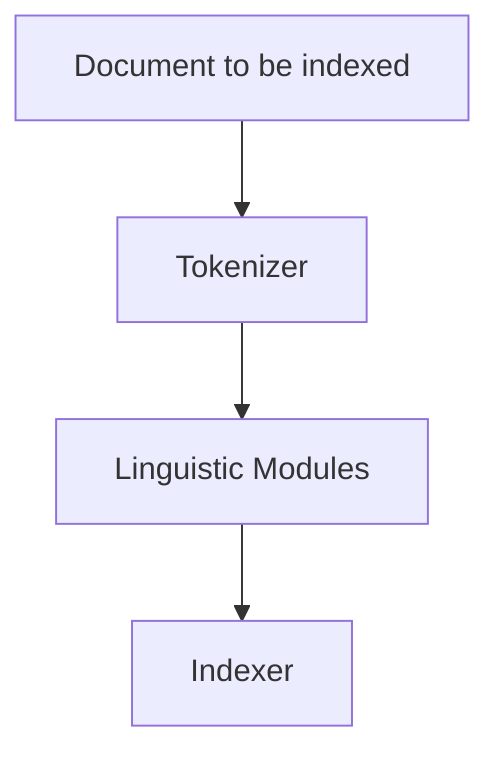

> "Language is the most powerful tool we have for connecting with each other."

---

NLP · Fundamentals

# NLP Fundamentals

Natural Language Processing bridges human communication and machine understanding. The field spans text preprocessing pipelines that clean and normalize raw text, statistical methods like TF-IDF for representing documents, distributed word embeddings that capture semantic meaning, and topic modeling techniques that discover hidden thematic structures. Mastering these foundations is essential before tackling modern deep learning approaches.

tokenize &nbsp;·&nbsp; embed &nbsp;·&nbsp; model topics &nbsp;·&nbsp; from text to understanding

Basic Terminology

## Core NLP Concepts

| Term | Definition | Example |
|------|------------|---------|
| **Corpus** | Collection of documents | All Wikipedia articles |
| **Vocabulary** | All unique words in corpus | { "the", "cat", "sat", ... } |
| **Term Frequency (TF)** | Count of word in document | "the" appears 5 times in doc |
| **Document Frequency (DF)** | Number of docs containing word | "the" appears in 90% of docs |
| **Bag of Words (BoW)** | Document as word multiset | { "the": 5, "cat": 2, ... } |
| **Word Vector/Embedding** | Dense numerical representation | 300-dim vector for "cat" |

### Inverse Document Frequency (IDF)

$$IDF(t, D) = \log \frac{N}{|\{d \in D : t \in d\}|}$$

Where:
- $N$ = total number of documents
- $t$ = term
- $d$ = document

Rare words across documents get higher IDF scores.

---

Bag of Words & One-Hot Encoding

## Bag of Words (BoW)

**Bag of Words** represents a document as an unordered collection of word frequencies. It discards grammar, word order, and syntax — only the vocabulary and per-document word counts matter.

### Building a BoW representation

1. **Tokenise** each document into individual words.
2. **Build a vocabulary** of all unique words across the corpus.
3. **Create a Document-Term Matrix (DTM)**: each row is a document, each column is a vocabulary word, and each cell is the word count in that document.

> [!example] BoW in action
> | Vocabulary | the | cat | chased | mouse | was | caught |
> |------------|-----|-----|--------|-------|-----|--------|
> | Sentence 1: "The cat chased the mouse" | 2 | 1 | 1 | 1 | 0 | 0 |
> | Sentence 2: "The mouse was caught" | 1 | 0 | 0 | 1 | 1 | 1 |

### Pros and cons

| Strength | Weakness |
|----------|----------|
| Simple to implement and interpret | Loses word order and syntax |
| Works for classification, retrieval, topic modelling | Produces high-dimensional, sparse vectors |
| Fast to compute | No semantic relationships between words |

> [!tip] Sparsity handling
> With large vocabularies, BoW vectors are >99% zeros. Store and compute efficiently using **sparse matrices** (CSR, CSC formats) rather than dense numpy arrays.

## One-Hot Encoding for NLP

**One-hot encoding** takes BoW one step further: instead of raw counts, each word is represented by a binary vector of length $|V|$ (vocabulary size) with a single 1 at the word's index and 0 everywhere else.

- Vocabulary: `["the", "cat", "chased", "mouse", "was", "caught"]`
- "cat" → `[0, 1, 0, 0, 0, 0]`
- "mouse" → `[0, 0, 0, 1, 0, 0]`

### Orthogonality

One-hot vectors are **mutually orthogonal**: the dot product between any two distinct word vectors is zero. This means the model receives no signal about word similarity — "cat" and "kitten" are as different as "cat" and "quantum". This limitation motivates the move to **dense embeddings** like [[word2vec|Word2Vec]].

> [!warning] The dimensionality explosion
> A vocabulary of 50,000 words yields 50,000-dimensional one-hot vectors. For document-level one-hot (as opposed to word-level), the matrices become enormous and extremely sparse. In practice, TF-IDF is preferred over raw one-hot for document representation.

---

TF-IDF

## Term Frequency-Inverse Document Frequency

**TF-IDF** combines term frequency (how often a word appears in a document) with inverse document frequency (how rare the word is across documents):

$$TF\text{-}IDF(t, d, D) = TF(t, d) \times IDF(t, D)$$

### Key insight

> [!info] What TF-IDF captures
> - **High TF-IDF**: Words frequent in this document but rare in corpus (distinctive)
> - **Low TF-IDF**: Words frequent everywhere or rare in this document (not distinctive)

### Example calculation

| Document | "machine" | "learning" | "the" |
|----------|-----------|------------|-------|
| Doc 1 (ML article) | TF=5, IDF=3 | TF=5, IDF=3 | TF=10, IDF=0.1 |
| TF-IDF | 15 | 15 | 1 |

> [!tip] "machine" and "learning" are more important for characterizing this document than "the".

---

Preprocessing Pipeline

## Text Processing Steps

> [!grid|cols3]
>
>> [!card|hero dark spanfull]
>> ###### 1. TOKENIZATION
>> ### *Tokenization*
>> Split text into smaller units (tokens). Can be words, subwords, or characters.
>> 
>> **Example**: "Hello world!" → ["Hello", "world", "!"]
>> 
>> **Challenges**: "New York" (one concept), "don't" (split?), URLs, mentions
>> 
>> **Modern**: Byte Pair Encoding (BPE), WordPiece for subword tokenization
>
>> [!card|hero dark spanfull]
>> ###### 2. NORMALIZATION
>> ### *Normalization*
>> Convert text to canonical form.
>> 
>> **Operations**:
>> - Lowercasing (optional, context-dependent)
>> - Removing accents: "café" → "cafe"
>> - Expanding contractions: "don't" → "do not"
>> - Standardizing entities: "U.S.A" → "USA"
>
>> [!card|hero dark spanfull]
>> ###### 3. STOPWORDS
>> ### *Stopwords*
>> Filter common words with little semantic value.
>> 
>> **Examples**: "the", "is", "at", "which", "on"
>> 
>> **When to remove**: Information retrieval, basic classification
>> 
>> **When to keep**: Sentiment analysis ("not" is important), modern deep learning
>
>> [!card|hero dark spanfull]
>> ###### 4. STEMMING
>> ### *Stemming*
>> Crude heuristic to chop word endings.
>> 
>> **Algorithm**: Porter, Snowball, Lancaster
>> 
>> **Example**: "running" → "run", "better" → "better"
>> 
>> **Limitation**: "university"/"universal" both stem to "univers"
>
>> [!card|hero dark spanfull]
>> ###### 5. LEMMATIZATION
>> ### *Lemmatization*
>> Dictionary-based reduction to canonical form (lemma).
>> 
>> **Considers**: Part of speech, context, vocabulary
>> 
>> **Example**: "running" (verb) → "run", "better" (adj) → "good"
>> 
>> **Trade-off**: More accurate than stemming but slower

### Tokenization challenges

| Challenge | Example | Solution |
|-----------|---------|----------|
| **OOV (Out of Vocabulary)** | New words at test time | Subword tokenization (BPE) |
| **Ambiguous boundaries** | "San Francisco" | Named entity recognition |
| **Punctuation** | "U.S." vs "end." | Language-specific rules |

> [!example] OOV handling
> Build vocabulary with top-K frequent words. Replace rare words with `<UNK>` token. This helps model learn OOV representations through context.

---

Word Embeddings

## From Sparse to Dense Representations

**Word embeddings** encode word meaning as dense vectors in a lower-dimensional space. Words with similar meanings have similar vectors.

### Why embeddings matter

| Representation | "cat" | "dog" | Relationship captured? |
|---------------|-------|-------|----------------------|
| **One-hot** | [1,0,0,...] | [0,1,0,...] | No |
| **TF-IDF** | Sparse counts | Sparse counts | Weak |
| **Embedding** | [0.2, -0.5, ...] | [0.3, -0.4, ...] | Strong |

### Classic: Word2Vec

[[word2vec|Word2Vec]] learns embeddings by predicting words from context (CBOW) or context from words (Skip-gram):

> [!grid|cols2]
>
>> [!card|section]
>> ###### CBOW
>> ### *CBOW*
>> **Continuous Bag of Words**
>> 
>> Predict target word from surrounding context.
>> 
>> **Faster training, better for frequent words**
>
>> [!card|section]
>> ###### SKIP-GRAM
>> ### *Skip-Gram*
>> **Skip-Gram Model**
>> 
>> Predict surrounding context from target word.
>> 
>> **Better for rare words, larger datasets**

### Semantic relationships

Word embeddings capture analogies through vector arithmetic:

$$\vec{king} - \vec{man} + \vec{woman} \approx \vec{queen}$$

---

Information Retrieval

## Search and Indexing

### Inverted index construction

**Indexing steps**:
1. **Tokenization** — Cut sequence to word tokens
2. **Normalization** — Map text to canonical form
3. **Stemming/Lemmatization** — Reduce to root form
4. **Stopword removal** — Filter common words (optional)
5. **Sorting** — Alphabetic sort, merge duplicates
6. **Postings list** — Document frequency + posting locations

### Retrieval metrics

| Metric | Definition | Formula |
|--------|------------|---------|
| **Precision** | Retrieved documents that are relevant | $\frac{|\{relevant\} \cap \{retrieved\}|}{|\{retrieved\}|}$ |
| **Recall** | Relevant documents that are retrieved | $\frac{|\{relevant\} \cap \{retrieved\}|}{|\{relevant\}|}$ |

### Levenshtein distance

**Levenshtein distance** measures the minimum number of single-character edits (insertions, deletions, substitutions) required to change one word into another.

| Word 1 | Word 2 | Distance | Edits |
|--------|--------|----------|-------|
| "kitten" | "sitting" | 3 | k→s, e→i, +g |
| "book" | "back" | 2 | oo→ac |

Useful for spell checking, fuzzy matching, and search suggestions.

---

Topic Modeling

## Discovering Hidden Themes

**Topic modeling** represents documents as mixtures of topics, where each topic is a distribution over words. It's unsupervised clustering for text.

### Why topic modeling?

| Application | Value |
|-------------|-------|
| **Organization** | Automatically categorize document collections |
| **Discovery** | Find hidden themes in large corpora |
| **Summarization** | Understand key subjects without reading everything |
| **Search** | Improve retrieval by topic matching |

### Methods

| Model | Approach | Best For |
|-------|----------|----------|
| **LSA** | SVD on term-document matrix | Fast baseline |
| **LDA** | Generative probabilistic model | Interpretable topics |
| **NMF** | Non-negative matrix factorization | When non-negativity matters |

> [!example] LDA intuition
> Each document is a mixture of topics. Each topic is a mixture of words. [[latent-dirichlet-allocation|LDA]] learns these distributions from data using Bayesian inference.

### Topic coherence

**Topic coherence** measures how interpretable discovered topics are to humans. Higher coherence = more meaningful topic words.

> [!warning] Topic quality
> Topic modeling gives no guarantee on interpretability of output. Always validate topics with domain experts and coherence metrics.

---

Best Practices

## NLP Pipeline Design

> [!tip] Preprocessing decisions
> 1. **Lowercasing**: Usually yes, but preserve case for NER
> 2. **Stopwords**: Remove for IR, keep for sentiment/NN
> 3. **Stemming vs Lemmatization**: Prefer lemmatization for accuracy
> 4. **Tokenization**: Use subword (BPE) for modern deep learning

> [!tip] Feature engineering
> 1. **TF-IDF**: Good baseline for traditional ML
> 2. **Embeddings**: Use pre-trained (GloVe, FastText) when possible
> 3. **Contextual**: BERT embeddings for context-dependent meaning
> 4. **Domain adaptation**: Fine-tune embeddings on your corpus

---

Interview Questions

## Interview Questions

1. What is the difference between stemming and lemmatization?
2. How does TF-IDF differ from simple term frequency?
3. What is the OOV problem and how is it addressed?
4. Why are word embeddings better than one-hot encoding?
5. What is the difference between precision and recall in IR?
6. What is an inverted index and how is it constructed?
7. What is topic coherence and why does it matter?
8. Explain the Bag of Words representation and its main limitation.
9. Why is the one-hot encoding of a 50,000-word vocabulary inefficient?
10. How does TF-IDF improve over raw BoW counts?

---

## Related pages

> [!grid]
>
>> [!card] Embeddings
>> [[word2vec|Word2Vec]] · [[glove|GloVe]] · [[fasttext|FastText]] · [[../deep-learning/bert|BERT]]
>
>> [!card] Topic Modeling
>> [[latent-dirichlet-allocation|LDA]] · [[non-negative-matrix-factorization|NMF]] · [[latent-semantic-analysis|LSA]]
>
>> [!card] Deep Learning
>> [[../deep-learning/transformers|Transformers]] · [[../deep-learning/rnn-lstm-gru|RNNs & LSTMs]] · [[../deep-learning/attention-mechanism|Attention]] · [[sequence-models|Sequence Models]]
>
>> [!card] Language Modeling
>> [[n-gram-model|N-Gram Models]] · [[word2vec|Word2Vec]] · [[language-models|Language Models]]
>
>> [!card] Applications
>> [[sentiment-analysis|Sentiment Analysis]] · [[named-entity-recognition|NER]] · [[text-classification|Text Classification]] · [[machine-translation|Machine Translation]]
>
>> [!card] NLP Techniques
>> [[autocorrect|Autocorrect]] · [[backtranslation|Backtranslation]] · [[beam-search|Beam Search]] · [[dialogue-systems|Dialogue Systems]]
