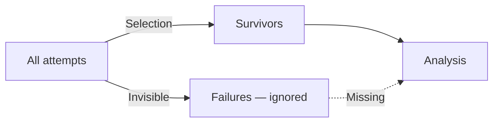

> "The cemetery of failed startups is much larger than the garden of unicorns, but only the
> latter has a Wikipedia page."
> <cite>— Modern paraphrase of Wald's insight</cite>

---

Statistics · Cognitive Bias

# Survivorship Bias

Survivorship bias is the logical error of concentrating on the people, companies, or things that
"survived" some process while overlooking those that did not — typically because failures are
invisible, discarded, or forgotten. It produces over-optimistic conclusions and systematically
distorts data, making success appear more common and replicable than it actually is.

invisible failures &nbsp;·&nbsp; selection effects &nbsp;·&nbsp; over-optimism &nbsp;·&nbsp; the winners write history

Definition

## What Is Survivorship Bias?

**Survivorship bias** is a form of **selection bias** where the dataset only includes
observations that have passed a selection filter, while excluded observations are hidden from
analysis.

The result: conclusions drawn only from survivors overestimate success rates, underestimate
risks, and misattribute causes.

---

Historical Example

## Abraham Wald & the Bombers

During WWII, the US military studied returning bombers to determine where to add armour.
The data showed concentrated bullet holes in the fuselage and wings — engines and cockpits
were relatively unscathed.

The initial recommendation: reinforce the areas with the most holes.

**Wald's insight**: The bombers that returned *survived* hits to the fuselage and wings.
The bombers that did *not* return were likely hit in the engines and cockpit — precisely
where there were no data points. Armour should go where the survivors had *no* holes.

> [!info] The missing data problem
> The most important data is often the data you cannot see. In A/B tests, users who churn
> before converting are invisible in conversion-rate calculations. In medical trials, patients
> who drop out may be the ones who experienced side effects.

---

Manifestations

## Where Survivorship Bias Hides

| Domain | Survivors visible | Failures hidden | Distorted conclusion |
|--------|-------------------|-----------------|----------------------|
| **Finance** | Successful hedge funds | Failed/closed funds | "Active management beats the market" |
| **Startups** | Unicorn companies | 90%+ of startups that fail | "Follow this playbook to succeed" |
| **Scientific research** | Published significant results | Unpublished null results | "Most hypotheses are true" |
| **Fitness & health** | People with visible results | Those who quit or saw no change | "This diet guarantees results" |
| **Music / art** | Classic works still performed | Forgotten contemporaries | "Old music was objectively better" |
| **WWII bombers** | Planes that returned | Planes shot down | "Reinforce where the holes are" |

### The mutual fund illusion

Morningstar and Bloomberg list only funds still operating today. Funds that underperformed
and closed are removed from databases. An analysis of "surviving" funds shows strong
performance — but if you include the dead funds, the average return drops significantly.

> [!warning] Backtesting and overfitting
> Quantitative strategies often "survive" backtesting because hundreds of variants were
> tested and only the best-performing ones were kept. Forward performance rarely matches.

---

In Data Science

## How It Corrupts Models

### Dropped customers

A churn model trained only on current customers misses the features that drove churned
customers away. The model sees only "survivors" and learns a distorted retention signal.

### File-drawer problem (publication bias)

Studies with positive results are published; studies with null results are filed away.
Meta-analyses that only include published studies overestimate effect sizes.

### Feature selection

Running 1,000 models with different feature subsets and reporting only the best is a form
of survivorship bias. The "winning" model overfits to the specific noise patterns of the
sample.

### Training data curation

Removing "low-quality" training examples without documenting the criteria can introduce
survivorship bias. The model learns from a curated subset that does not represent real-world
diversity.

---

Mitigation

## Fighting Invisible Failures

| Strategy | Action |
|----------|--------|
| **Track everything** | Record all attempts, not just successes — experiments, trades, startups |
| **Include dropouts** | In medical trials, analyse intent-to-treat, not just completers |
| **Look at the cemetery** | Study failed companies, rejected papers, dead funds |
| **Pre-registration** | Register hypotheses before conducting experiments to prevent selective reporting |
| **Holdout testing** | Validate on truly unseen data; never use test-set performance for model selection |
| **Bootstrapping** | Resample from the full dataset, not just observed successes |

> [!tip] The counterfactual question
> When analysing success, always ask: "What happened to everyone who tried the same thing
> and failed?" If you cannot answer, your analysis is biased.

## Interesting facts
- The term "survivorship bias" was popularised by statistician Joseph Berkson in 1946, though
  the concept was known earlier.
- In music, the "oldies" radio paradox: songs from the 1960s-70s seem better than modern music
  because only the good songs are still played. The mediocre songs of that era are forgotten.
- A study of startup advice books found that 94% cited only successful founders. The advice
  often contradicted the actual strategies of those founders — a double layer of bias.

## Interview questions
1. What is survivorship bias, and why is it a form of selection bias?
2. Explain Abraham Wald's bomber problem. What was the counter-intuitive recommendation?
3. How does survivorship bias affect mutual fund performance rankings?
4. In ML, how can cross-validation help mitigate survivorship bias in model selection?
5. What is the "file-drawer problem," and how does it distort meta-analyses?
6. Give an example of survivorship bias in a domain not mentioned above.

## Related pages

> [!grid]
>
>> [!card] Statistical Biases
>> [[law-of-large-numbers|Law of Large Numbers]] · [[bias-variance-tradeoff|Bias-Variance Tradeoff]] · [[../ml-fundamentals/data-leakage|Data Leakage]]
>
>> [!card] Data Quality
>> [[../ml-fundamentals/data-cleaning|Data Cleaning]] · [[../ml-fundamentals/evaluation-metrics|Evaluation Metrics]] · [[../ml-fundamentals/cross-validation|Cross Validation]]
>
>> [!card] Cognitive Biases
>> [[benfords-law|Benford's Law]] · [[../ml-fundamentals/imbalanced-classification|Imbalanced Classification]]
>
>> [!card] Research Methods
>> [[ab-testing|A/B Testing]] · [[sampling|Sampling]] · [[hypothesis-testing|Hypothesis Testing]]
>
>> [!card] Paradoxes
>> [[../../../../paradoxes/statistical-paradoxes|Survivorship Bias]] — the statistical twin in paradox form
