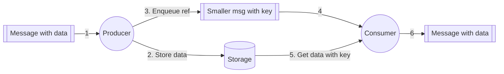

---

The **Claim-Check Pattern** reduces the **cost and size** of large messages by storing the actual data in **external storage** and sending only a **reference (key)** to consumers (source: Concepts/Software Engineering/Claim Check Pattern.md).

## How it works

1. Producer receives or generates a large message.
2. Producer **stores the payload** in external storage (S3 / GCS / Azure Blob).
3. Producer enqueues a **small reference** (key/path/URL) to the message bus.
4. Consumer reads the reference.
5. Consumer **fetches the payload** from storage using the key.
6. Consumer processes the message.

## Advantages

- **Reduces messaging cost** — storage is cheaper than message broker memory.
- **Protects the bus** from being overwhelmed by large messages.
- **Asynchronous** processing — scalable and decoupled.
- **Retention flexibility** — payload can outlive the message bus.

## Disadvantages

- **External storage dependency** — if the storage service fails, the message is unprocessable.
- **Additional latency** — extra round trip to storage.
- **Cleanup** — need to garbage-collect orphaned payloads.

## Examples

(source: Concepts/Software Engineering/Claim Check Pattern.md)

### Kafka + S3

A Kafka producer writes a payload to S3, then publishes a notification message containing the S3 key. The consumer reads the message, fetches the payload from S3, and processes it.

### Airflow XCom

Airflow's [XComs](https://airflow.apache.org/docs/apache-airflow/stable/core-concepts/xcoms.html) have a **48 KB size limit** by default. For larger inter-task data, use claim-check: write payload to GCS/S3, pass the URI as XCom value.

### Pub/Sub on GCP

[[../../../gcp/analytics/pubsub|Pub/Sub]] has a **10 MB message limit**. For larger payloads, write to GCS and pass the GCS URI in the message.

## When to use

- Message size **> 256 KB** consistently (most brokers degrade above this).
- **Cost-sensitive** workloads where broker storage is expensive.
- **Audio/video/large images** flowing through pipelines.
- Workflows where **payload retention** outlives message processing.

## Implementation tip

Always **encode** the storage location with:

- **Bucket / container name**
- **Object key**
- **Version / ETag** (idempotence)
- **Expiry** (for cleanup)
- **Content type / size hint**

Don't pass just a string key — give consumers everything they need.

## Sources

- [Microsoft — Claim-Check pattern](https://learn.microsoft.com/en-us/azure/architecture/patterns/claim-check)
- [Enterprise Integration Patterns — Store In Library](https://www.enterpriseintegrationpatterns.com/patterns/messaging/StoreInLibrary.html)

## Interview Questions

1. Why use claim-check instead of just sending the full message?
2. What's the **cleanup** problem and how to solve it?
3. **Storage** vs **broker** cost — typical ratio?

## Related pages

> [!multi-column]
>
>> [!card] Sister patterns
>> [[publisher-subscriber-pattern|Pub/Sub Pattern]], [[fan-out|Fan-out]], [[event-sourcing-pattern|Event Sourcing]]
>
>
>> [!card] Products
>> [[../../../gcp/analytics/pubsub|GCP Pub/Sub]], [[../../tools/object-storage|Object Storage]]

