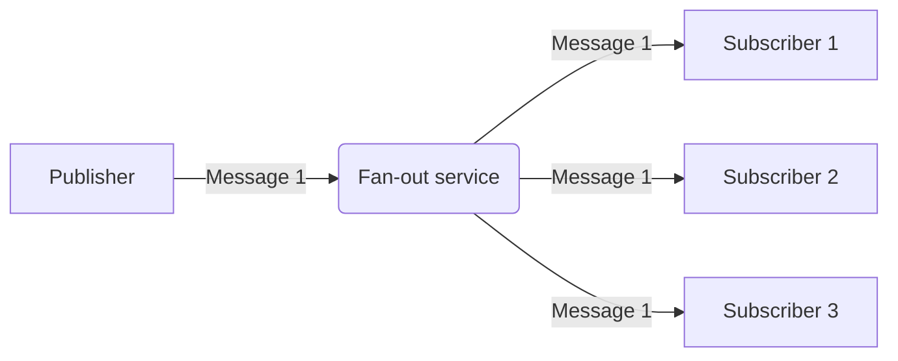

> "What kills the creative force is not age or lack of talent, but our own spirit, our own attitude."
> <cite>— Robert Greene</cite>

---

**Fan-out** is a pattern where a message from a **single source** is **spread or copied to many destinations**. In data engineering, fan-out is commonly used to send data from a microservice (publisher) to multiple subscribers (source: Concepts/Software Engineering/Fan-out.md).



## Common implementations

- **AWS SNS** — pub/sub fan-out to multiple SQS queues, Lambda, HTTP endpoints.
- **GCP [[../cloud/gcp/analytics/pubsub|Pub/Sub]]** — one topic, many subscriptions; each subscription gets its own copy.
- **Kafka** — multiple consumer groups subscribe to the same topic; each consumes independently.
- **Azure Event Grid** / **Service Bus topics** — pub/sub fan-out.

## Advantages

- **Decouple** producer from consumers — add/remove subscribers without touching the producer.
- **Parallel processing** — each subscriber handles messages independently.
- **Scale-out** — different consumers can scale at different rates.

## Disadvantages

- **Limited retry** if a subscriber is unavailable for a long time (fan-out service usually doesn't keep messages forever).
- **At-least-once** delivery — subscribers must be [[idempotence|idempotent]].
- **Order** is hard to guarantee across subscribers.

## Common combination: fan-out + queue per subscriber

```
[Publisher] → [Pub/Sub Topic] → [Subscription A] → [Service A]
                              → [Subscription B] → [Service B]
                              → [Subscription C] → [Service C]
```

If Service A goes down for 1 hour, its subscription buffers messages until recovery — without affecting B and C. This is the standard fan-out + persistent-queue pattern.

## When to use fan-out

- **Event-driven microservices** — order placed → email service + inventory + analytics + recommendation engine.
- **Notifications** — system event → email + SMS + push + Slack.
- **Logging + monitoring** — application logs → Splunk + S3 archive + ML anomaly detection.

## Anti-patterns

- **Synchronous fan-out** — blocking until all subscribers ack. Defeats the purpose; use async messaging.
- **One subscriber blocks all** — design per-subscriber error handling so a slow subscriber doesn't backlog the topic.

## Interview Questions

1. **Fan-out** vs **point-to-point** messaging.
2. How does Pub/Sub handle slow subscribers?
3. **Idempotence** + fan-out — why critical?
4. How would you guarantee **ordering** across subscribers?

## Related pages

> [!grid]
>
>> [!card] Sister patterns
>> [[publisher-subscriber-pattern|Pub/Sub Pattern]], [[claim-check-pattern|Claim Check]], [[idempotence|Idempotence]]
>
>
>> [!card] Products
>> [[../cloud/gcp/analytics/pubsub|GCP Pub/Sub]]
>
>
>> [!card] Guides
>> [[../guides/messaging-service-guide|Messaging Service Guide]]

