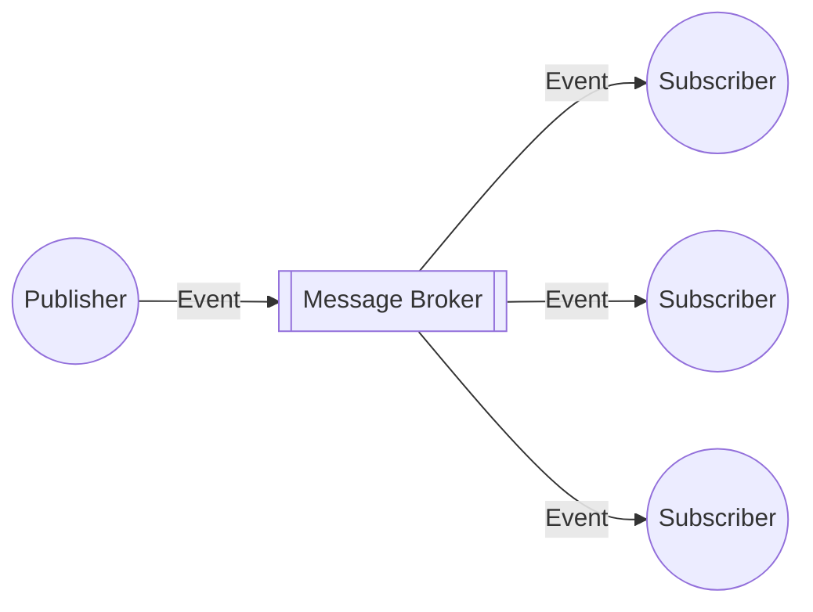

---

The **Publisher-Subscriber (Pub/Sub) Pattern** is an **asynchronous messaging pattern** that decouples sending events from one or more subscribers/consumers of those events (source: Concepts/Software Engineering/Publisher-Subscriber Pattern.md).

## Core concepts

- **Publisher** — emits events to a **topic**.
- **Topic** — named channel that holds messages.
- **Subscription** — durable consumer's view of the topic.
- **Subscriber** — application that processes messages.
- **Message Broker** — intermediary (Kafka, [[../../../gcp/analytics/pubsub|Pub/Sub]], RabbitMQ).

The publisher knows nothing about subscribers. Subscribers know nothing about publishers. Decoupling is the win.

## Advantages

- **Decouples software** — improves scalability via async sending and **independent scaling** of producers + consumers.
- **Push-based** delivery → low latency, no polling.
- **Simplifies integration** — many-to-many becomes one-to-many through the broker.

## Disadvantages

- **Message ordering** isn't guaranteed by default; messages can be **duplicated**. Subscribers must be [[idempotence|idempotent]].
- Subscribers may need **autoscaling** to keep up with rate.
- **Dead-letter handling** for poison messages.

(source: Concepts/Software Engineering/Publisher-Subscriber Pattern.md)

## Popular tools

- **Apache Kafka** — partitioned log with very high throughput.
- **[[../../../gcp/analytics/pubsub|GCP Pub/Sub]]** — managed, autoscaling, global.
- **AWS SNS** — pub/sub; **EventBridge** for event routing.
- **Azure Event Grid** / **Service Bus topics**.
- **Redis Pub/Sub** — lightweight (no durability by default).
- **RabbitMQ** — AMQP-based.
- **NATS** — high-performance, lightweight.

## Variants

### Topic vs Queue

- **Topic** (pub/sub) — **broadcast** to all subscribers.
- **Queue** (point-to-point) — **one subscriber** processes each message.

Modern brokers support both via different abstractions (Kafka consumer groups, SQS vs SNS, Pub/Sub subscriptions).

### Push vs Pull subscriptions

- **Push** — broker POSTs to subscriber endpoint.
- **Pull** — subscriber polls broker.

## Patterns built on pub/sub

- **[[fan-out|Fan-out]]** — one event → multiple subscribers.
- **[[event-sourcing-pattern|Event sourcing]]** — pub/sub log as source of truth.
- **CQRS** — commands + queries separated; events flow through pub/sub.
- **[[../data-architecture/kappa-architecture|Kappa architecture]]** — entire data architecture built on pub/sub log.
- **Microservices choreography** — services react to each other's events.

## Pitfalls

- **Tight coupling** sneaks in via **event schema**. Use schema registry (Avro, Protobuf).
- **Event soup** — too many fine-grained events = unmanageable.
- **No transactions** across producer and consumer — design for eventual consistency.
- **Replay storms** when reprocessing the entire log.

## Interesting Facts

- **Apache Kafka** was created at LinkedIn (2011) by Jay Kreps, Neha Narkhede, Jun Rao.
- **GCP Pub/Sub** evolved from Google's internal "Mustang" / "Granger" messaging.
- The pub/sub pattern dates back to **Smalltalk** (1980s) — the original observer pattern.

## Interview Questions

1. **Topic** vs **queue** — when each.
2. **Push** vs **pull** subscriptions — pros/cons.
3. Why is **idempotence** essential in pub/sub consumers?
4. **Kafka** vs **Pub/Sub** — choose-time considerations.
5. Walk through fan-out from one publisher to 10 consumers with different SLAs.

## Related pages

> [!multi-column]
>
>> [!card] Sister patterns
>> [[fan-out|Fan-out]], [[claim-check-pattern|Claim Check]], [[event-sourcing-pattern|Event Sourcing]], [[idempotence|Idempotence]]
>
>
>> [!card] Processing
>> [[../data-processing/stream-data-processing|Stream Processing]], [[../data-architecture/kappa-architecture|Kappa Architecture]]
>
>
>> [!card] Products
>> [[../../../gcp/analytics/pubsub|GCP Pub/Sub]]
>
>
>> [!card] People
>> [[../../../people/jay-kreps|Jay Kreps]], [[../../../people/martin-fowler|Martin Fowler]]

