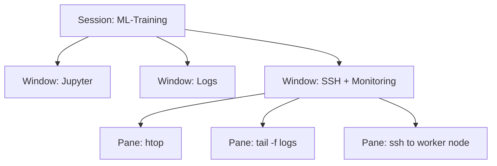

> "Tmux is a terminal multiplexer: it lets you switch easily between several programs in one
> terminal, detach them and reattach them to a different terminal."
> <cite>— Tmux README</cite>

---

<span class="at-kicker">Tools · Terminal · Productivity</span>

# Tmux

<p class="at-lead">
Tmux is a terminal multiplexer that transforms a single terminal window into a persistent,
multiplexed workspace. It lets you split screens into panes, manage multiple windows in a
single session, and — most importantly — detach from long-running processes without killing
them. For anyone who works on remote servers, runs training jobs overnight, or simply wants
to organise their terminal workflow, tmux is essential.
</p>

<span class="at-stat">persistent</span> &nbsp;·&nbsp; <span class="at-stat">multiplexed</span> &nbsp;·&nbsp; <span class="at-stat">detachable</span> &nbsp;·&nbsp; <span class="at-mark">never lose a session</span>

<span class="at-kicker">Concepts</span>

## Sessions, Windows, and Panes

| Level | Description | Analogy |
|-------|-------------|---------|
| **Session** | Top-level container; survives detachment | A workspace project |
| **Window** | A tab within a session; full-screen by default | A browser tab |
| **Pane** | A subdivision of a window; multiple panes per window | Split editor panels |



---

<span class="at-kicker">Core Commands</span>

## The Prefix Key

All tmux commands begin with the **prefix key**: `Ctrl+B` by default. After the prefix, press
the command key.

| Key | Action |
|-----|--------|
| `Ctrl+B %` | Split pane **vertically** |
| `Ctrl+B "` | Split pane **horizontally** |
| `Ctrl+B ↑↓←→` | Navigate between panes |
| `Ctrl+B c` | Create a new **window** |
| `Ctrl+B n` | Next window |
| `Ctrl+B p` | Previous window |
| `Ctrl+B ,` | Rename current window |
| `Ctrl+B $` | Rename current session |
| `Ctrl+B d` | **Detach** from session (keeps it running) |
| `Ctrl+B x` | Close current pane |
| `Ctrl+B &` | Close current window |
| `Ctrl+B [` | Enter scroll/copy mode |
| `Ctrl+B z` | **Zoom** pane (toggle full-screen) |
| `Ctrl+B r` | Reload configuration |

> [!tip] Rebind the prefix
> `Ctrl+B` conflicts with Vim's scroll-up. Many users rebind to `Ctrl+A` (in `~/.tmux.conf`):
> ```
> unbind C-b
> set -g prefix C-a
> bind C-a send-prefix
> ```

---

<span class="at-kicker">Sessions</span>

## Persistence and Reconnection

```bash
# Start a new named session
tmux new-session -s ml-training

# Detach (session keeps running)
Ctrl+B d

# List all sessions
tmux ls

# Reattach to a session
tmux attach -t ml-training

# Attach or create if not exists
tmux attach -t ml-training || tmux new-session -s ml-training

# Kill a session
tmux kill-session -t ml-training
```

> [!info] The killer feature
> Start a long training job inside tmux, detach, close your laptop, reopen it hours later,
> and reattach — the job never stopped. This is how remote ML training is done.

---

<span class="at-kicker">Configuration</span>

## Customising Tmux

Create `~/.tmux.conf` for persistent preferences:

```
# Better colours
set -g default-terminal "screen-256color"

# Mouse support (scroll, click panes)
set -g mouse on

# Start window/pane numbering at 1 (easier to reach)
set -g base-index 1
setw -g pane-base-index 1

# Rebind splits to intuitive keys
bind | split-window -h
bind - split-window -v

# Reload config with prefix + r
bind r source-file ~/.tmux.conf \; display "Config reloaded!"

# Status bar styling
set -g status-style bg=black,fg=white
set -g window-status-current-style bg=blue,fg=white,bold
```

---

<span class="at-kicker">Workflows</span>

## Tmux for Data Science

| Task | Tmux setup |
|------|-----------|
| **Overnight training** | Single pane: `python train.py`. Detach, sleep, check in morning. |
| **Log monitoring** | Two panes: left = `tail -f training.log`, right = `watch -n 5 nvidia-smi` |
| **Multi-server** | One window per server; each window has SSH + htop panes |
| **Jupyter remote** | Window 1: `jupyter lab --no-browser`. Window 2: experiment scripts. |
| **Pair programming** | Both attach to same session (`tmux attach -t pair`) — shared cursor |

> [!tip] Tmux + SSH = remote persistence
> SSH into a remote machine, start tmux, begin a job, detach, disconnect. The job continues
> even if your network drops. Reconnect and reattach — zero progress lost.

## Interesting facts

- Tmux was created in 2007 by Nicholas Marriott as a BSD-licensed alternative to GNU Screen
> (created 1987). Tmux's configuration syntax and feature set are considered more modern.
- The name "tmux" stands for "terminal multiplexer" — the 't' is for terminal.
- Tmux supports scripting via `tmux send-keys` and `tmux run-shell`, making it possible to
> automate complex multi-pane layouts for development environments.

## Interview questions

1. What is the difference between a tmux window and a pane?
2. How would you keep a long-running process alive after disconnecting from SSH?
3. Why might you rebind the tmux prefix from `Ctrl+B` to `Ctrl+A`?
4. How can two developers collaborate in the same terminal session?
5. What happens to your processes if you close the terminal without detaching from tmux first?

## Related pages

> [!grid]
>
>> [!card] CLI
>> [[shell-toolkit|Shell Toolkit]] · [[ssh|SSH & Tunneling]] · [[vim|Vim]]
>
>> [!card] Remote Work
>> [[../../machine-learning/mlops/mlops|MLOps]] · [[../../software-engineering/devops-sre|DevOps & SRE]]
>
>> [!card] Productivity
>> [[../../guides/sql-patterns|SQL Patterns]] · [[python/python-patterns|Python Patterns]]
